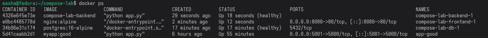
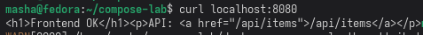
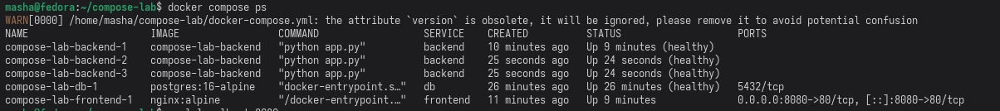

# Отчет по лабораторной. Осипова

---

## Блок 1. Вывод

Сети в Docker — это изолированные пространства с собственным встроенным DNS. Контейнеры в одной сети видят друг друга по имени без указания IP-адресов. Контейнеры из разных сетей по умолчанию не могут общаться друг с другом. Это обеспечивает изоляцию — сервисы взаимодействуют только с теми контейнерами, которые находятся в их общей сети.

---

## Блок 2. Вывод

Контейнеры временные. Когда контейнер удаляется, всё, что было внутри него пропадает навсегда.
Тома решают эту проблему. Они представляют собой отдельное хранилище, которое существует независимо от жизненного цикла контейнера. Когда я удалила контейнер с PostgreSQL, данные остались в томе `pgdata`. При запуске нового контейнера с тем же томом все таблицы и записи восстановились автоматически.
Значит тома — это способ отделить данные от приложения.
Тома на хост-машине (`/var/lib/docker/volumes/`).

---

## Блок 3. Вывод

docker-compose — это инструмент для управления приложениями, состоящими из нескольких контейнеров. Вместо того чтобы запускать каждый сервис отдельной командой с кучей параметров, можно описать всё в одном файле `docker-compose.yml` и поднять весь стек одной командой `docker compose up`.

- `depends_on` позволяет задать порядок запуска сервисов.
- `healthcheck` проверяет готовность сервиса к работе, а не только его «runtime»-статус.
- `docker compose up --scale backend=3` масштабирует сервис количеством экземпляров.
- Бэкенд получает информацию о БД (хост, имя, пользователь, пароль) из переменных среды.

---

## Блок 4. Вывод

- `docker compose down` останавливает и удаляет контейнеры, но тома остаются.
- Чтобы удалить тома тоже, необходимо `docker compose down -v`.
- `docker system prune -f` чистит неиспользуемые образы, сети и кэш.

---

## Нужно сдать преподавателю

1. Все три сервиса (`db`, `backend`, `frontend`) находятся в статусе `healthy` — это показывает, что стек запущен и все компоненты работают корректно.

2. Команда `curl localhost:8080/api/items` возвращает данные из базы данных в формате JSON. Этот запрос проходит через всю цепочку: Nginx (фронтенд) → Flask (бэкенд) → PostgreSQL (база данных), что доказывает корректное взаимодействие всех сервисов.

3. Дополнительный скриншот:

---

