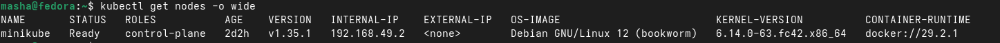
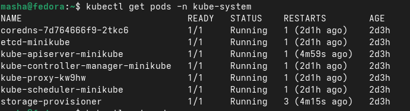
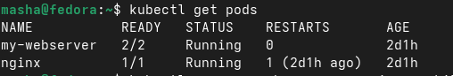
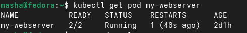

# Отчет по лабораторной. Осипова

## Блок 1
Кластер состоит из нод и системных компонентов. Все ноды должны быть в статусе Ready, а в пространстве имен kube-system всегда работают системные поды — это компоненты управления кластером (API-сервер, планировщик, контроллер, etcd, DNS). Без них кластер не сможет функционировать.

## Блок 2
Pod — это минимальная единица в Kubernetes, которая запускается на одной из нод. Внутри пода есть свое сетевое пространство (свой IP), свои переменные окружения и изолированные процессы. Можно зайти внутрь пода, посмотреть его логи и проверить что там работает.

## Блок 3
Разница между императивным созданием (через команду kubectl run) и декларативным (через YAML-файл): YAML позволяет точно описать что нужно: какие контейнеры запустить, сколько выделить ресурсов, настроить проверки работоспособности. В одном поде может быть несколько контейнеров, которые разделяют общее сетевое пространство и могут обмениваться данными через общие тома.

## Блок 4
Kubernetes может самовосстановливаться. Когда контейнер падает, kubelet автоматически его перезапускает. Pod при этом не удаляется, просто увеличивается счетчик перезапусков. Это обеспечивает отказоустойчивость приложений.

## Ответы на контрольные вопросы:

**Какие поды в kube-system всегда должны быть Running?**  
Это компоненты Control Plane: etcd (хранилище состояния), kube-apiserver (API сервер), kube-controller-manager (контроллеры), kube-scheduler (планировщик), coredns (DNS для сервисов) и kube-proxy (сетевой прокси).

**Отличие Pod от Container:** Pod — это минимальная единица развертывания в Kubernetes, которая может содержать один или несколько контейнеров. Container — это изолированная среда выполнения одного приложения, а Pod обеспечивает их совместную работу на одной ноде.