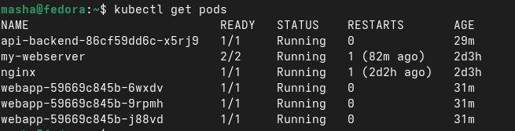
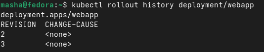
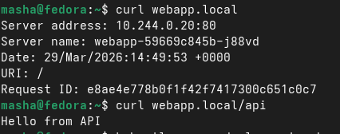

<strong>Отчет по лабораторной работе. Осипова</strong>

<strong>Блок 1 — Deployment</strong>

Deployment — это контроллер, который управляет подами через ReplicaSet. Он гарантирует, что нужное количество реплик приложения всегда работает. Сколько именно реплик мы указывали в файле deployment.yaml. RollingUpdate это чтобы "плавно" обновить приложения. Сначала создаются новые поды, потом удаляются старые. Параметры maxSurge и maxUnavailable контролируют, сколько дополнительных подов можно создать и сколько можно "потерять" во время обновления.

<strong>Блок 2 — Service и Rolling Update</strong>

Service типа NodePort открывает порт на каждой ноде кластера, через который можно снаружи получить доступ к приложению. При rolling update трафик не прерывается — запросы продолжают обрабатываться, пока поды обновляются. Rollout history хранит все ревизии деплоймента, что позволяет откатиться на предыдущую версию командой rollout undo.

<strong>Блок 3 — Ingress</strong>

Ingress — это маршрутизатор трафика на уровне HTTP/HTTPS. Он направляет запросы к разным сервисам в зависимости от пути или хоста. Ingress позволяет использовать один IP-адрес для доступа к нескольким сервисам, в отличие от NodePort, где каждый сервис требует свой порт.

<strong>Блок 4 — Типы Service</strong>

ClusterIP — это внутренний IP-адрес сервиса, доступный только изнутри кластера. Поды могут общаться друг с другом через ClusterIP. NodePort — это порт на каждой ноде кластера (диапазон 30000-32767), через который можно получить доступ к сервису внешне. LoadBalancer — это тип сервиса для "облачных" кластеров (AWS, Google Cloud, Azure). Когда создаёшь сервис с типом LoadBalancer, облачный провайдер автоматически создаёт настоящий внешний балансировщик нагрузки и выдаёт ему публичный IP-адрес. 

<strong>Контрольные вопросы</strong>

Разница между ClusterIP и NodePort: 
ClusterIP — для внутренней коммуникации, NodePort — для внешнего доступа.