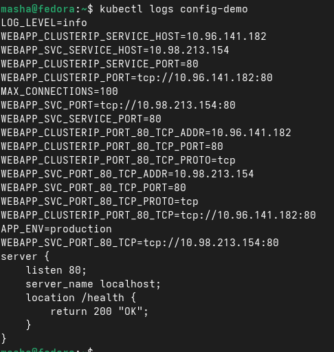
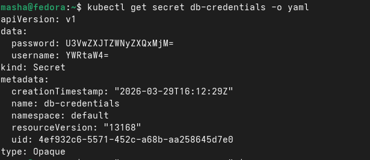
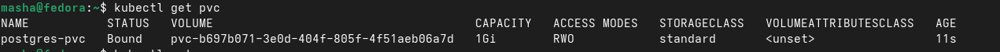

# Отчет по лабораторной работе

**Студент:** Осипова

## Блок 1: ConfigMap

ConfigMap нужен для хранения настроек отдельно от кода приложения. Это позволяет не пересобирать образ при изменении параметров. Конфигурацию можно передавать в под как переменные окружения или монтировать как файлы.

В логах отображаются переменные окружения (LOG_LEVEL=info, MAX_CONNECTIONS=100, APP_ENV=production), которые загрузились через envFrom из ConfigMap app-config. В конце выводится содержимое файла nginx.conf — это доказывает что volumeMounts успешно смонтировал ConfigMap nginx-conf как файл в директорию /etc/config. Таким образом все три способа передачи конфигурации работают корректно.

## Блок 2: Secret

Secret предназначены для чувствительных данных, но по умолчанию хранятся только в кодировке base64, а не в зашифрованном виде. Это значит, что без дополнительной настройки шифрования в etcd они небезопасны. Для реальной защиты нужно использовать EncryptionConfiguration или внешние хранилища вроде Vault.

Видно что Secret создан и данные находятся в поле data в кодировке base64 (password: U3VwZXJTZWNyZXQxMjM=, username: YWRtaW4=). Это доказывает что Secret по умолчанию не зашифрован — base64 это просто кодировка, которую легко декодировать обратно.

## Блок 3: PersistentVolumeClaim

PersistentVolumeClaim — это запрос на постоянное хранилище для пода. Поняла, что контейнеры временные, и без монтирования тома данные пропадут после удаления пода. На примере PostgreSQL увидела, что при правильном подключении PVC данные сохраняются даже после пересоздания пода. PVC автоматически привязывается к доступному PV, что обеспечивает сохранность состояния приложения. PV — это готовое место на диске в кластере. PVC — это запрос от приложения.

Bound — это статус привязки между PVC и PV.

## Итог

Конфигурацию выносят наружу для безопасности и удобства управления. Secret небезопасен по умолчанию из-за отсутствия шифрования. PersistentVolume нужен для приложений с состоянием, чтобы данные жили дольше чем под.