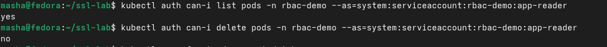
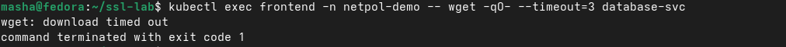
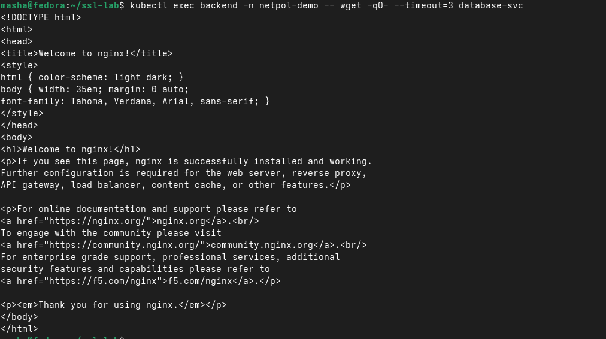
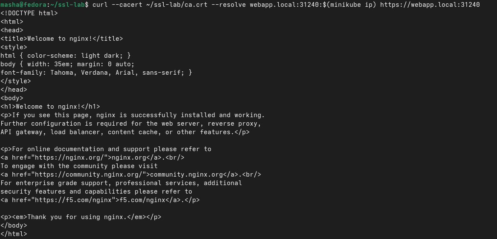

# ОТЧЁТ ПО ЛАБОРАТОРНОЙ РАБОТЕ

## Блок 1: RBAC

RBAC — это система управления правами доступа в Kubernetes. ServiceAccount — это учётная запись для подов. Role задаёт правила доступа (что можно делать с какими ресурсами), а RoleBinding привязывает ServiceAccount к Role. Права работают только в том namespace, где созданы, и нельзя выйти за его пределы без специальных разрешений.

## Блок 2: NetworkPolicy

NetworkPolicy — это как фаервол для подов. Они контролируют какой сетевой трафик разрешён между подами. По умолчанию без политик весь трафик разрешён, но если создать политику default-deny, то всё блокируется и нужно явно разрешать нужные соединения. Политики работают через метки подов (labels) и селекторы. 

## Блок 3: TLS Сертификаты

Из этого блока я поняла, что TLS сертификаты нужны для шифрования трафика. CA (Certificate Authority) — это удостоверяющий центр, который подписывает сертификаты. CSR (Certificate Signing Request) — это запрос на подпись сертификата. SAN (Subject Alternative Names) позволяет указать дополнительные имена и IP-адреса в сертификате. Ingress может использовать TLS сертификаты для HTTPS соединений. Главное, что я усвоила: цепочка доверия работает когда клиент проверяет сертификат через CA, и openssl может это проверить даже если curl ругается на self-signed сертификаты.

## Ответы на контрольные вопросы

**RBAC:** ServiceAccount отличается от обычного аккаунта тем, что предназначен для подов и процессов, а не для людей. Role задаёт права в одном namespace, ClusterRole — во всём кластере.

**NetworkPolicy:** Без CNI который поддерживает политики (Calico, Cilium), NetworkPolicy не работают. По умолчанию весь трафик разрешён, но после создания default-deny политики всё блокируется.

**TLS:** Самоподписанный сертификат подходит для тестов, но в production нужен сертификат от доверенного CA. SAN нужен чтобы указать дополнительные доменные имена и IP в одном сертификате.