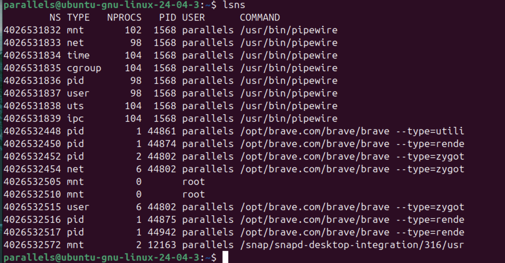
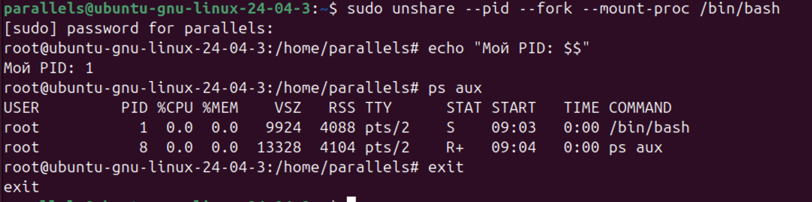
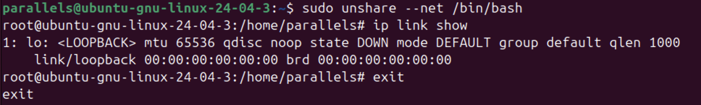
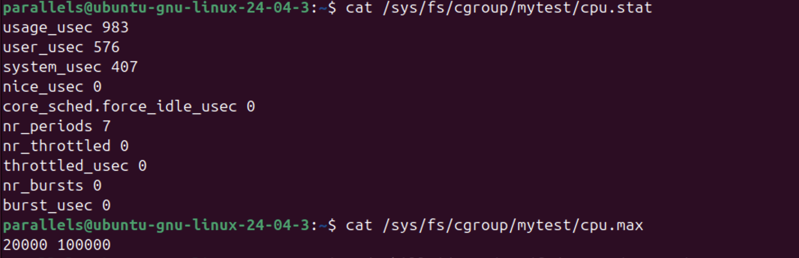
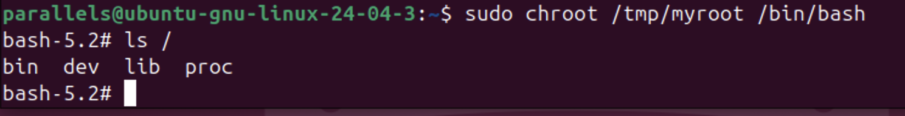

Задание 1. Просмотр существующих пространств имен 

Команда выводит список всех активных пространств имен (namespaces) в системе. 

На скриншоте видны типы mnt, net, pid, user, uts и ірс. 

Большое количество записей для браузера Brave и процессов Ріpewire подтверждает, что современные приложения активно используют изоляцию для безопасности. 

2. Изоляция процессов (PID Namespace) 

После создания нового PID-пространства текущая оболочка получила PID 1. 

Команда pѕ aux внутри изоляции показывает только два процесса: саму оболочку (bash) и саму команду pѕ. 

Процессы основной системы стали невидимы. 

3. Изоляция сети (Network Namespace) 

В новом сетевом пространстве имен отсутствует доступ к физическим сетевым интерфейсам хоста. 

Команда ip link show отображает только петлевой интерфейс 1o (loopback) в состоянии DOWN. 

Это означает, что процесс полностью отрезан от сети. 

4. Ограничение ресурсов (Cgroups) 

Корень файловой системы ( / ) был успешно изменен на /tmp/myroot. 

Команда 1s / показывает только те директории (bin, dev, lib, proc), которые были предварительно созданы и наполнены необходимыми библиотеками вручную. 

5. Изоляция файловой системы (Chroot)

Корень файловой системы (/) был успешно изменен на /tmp/myroot. 
Команда ls / показывает только те директории (bin, dev, lib, proc), которые 
были предварительно созданы и наполнены необходимыми библиотеками 
вручную

Ответы на Контрольные вопросы 

1. Почему после exit процессы хоста остались нетронутыми? 

Пространства имен работают по принципу виртуализации представления. 

Когда вы используете unshare, процессы хоста не перемещаются в новое место, а создается для нового процесса «маска», через которую он видит мир. 

Процесс внутри unshare видит себя как PID 1, но для основной системы (хоста) он остается процессом с обычным высоким номером (например, PID 45000). 

При выполнении exit изолированное окружение просто уничтожается, а процессы хоста продолжают работать в своем исходном пространстве имен, которое никогда не менялось. 

2. Что произойдёт, если лимит памяти превысить? (ООМ-killer)

Когда группа процессов в cgroup пытается потребить больше оперативной памяти, чем указано в лимите, срабатывает механизм ядра (Out Of Memory Killer). 

Ядро анализирует процессы внутри данной конкретной группы. 

Выбирается «самый плохой» процесс (обычно тот, который потребляет больше всего памяти и чья гибель нанесет меньше ущерба системе). 

Ядро принудительно завершает этот процесс, чтобы освободить ресурсы и предотвратить зависание всей операционной системы.