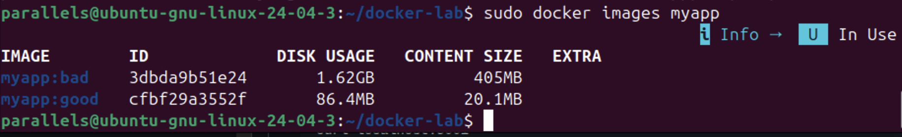
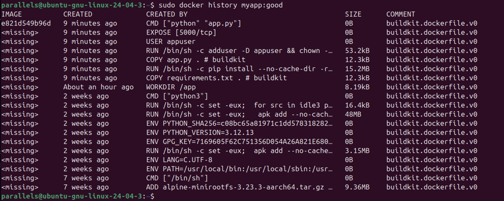
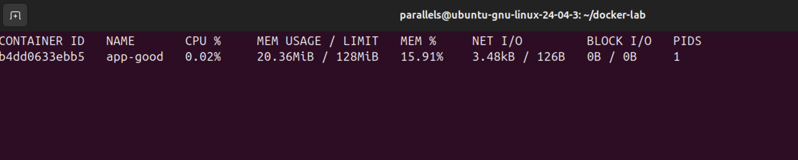
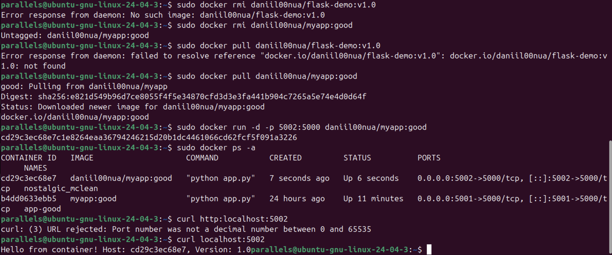

Выполнил: Рязапов Даниил Максимович

1. Сравнение образов

В начале работы был собран базовый образ myapp:bad на основе полного дистрибутива Python 3.12. Затем, используя Multistage build и легковесный образ Alpine, я собрал оптимизированную версию myapp:good.

Результат команды docker images:

myapp:bad: ~405 MB (в распакованном виде — более 1.6 GB)

myapp:good: ~20.1 MB (на диске занимает всего 86.4 MB)

Ответ на контрольный вопрос: Почему образ myapp:bad такой большой?
Образ python:3.12 по умолчанию базируется на Debian Linux. Он включает в себя полный набор системных библиотек, компиляторов (GCC), заголовочных файлов и инструментов сборки, которые нужны только на этапе установки пакетов, но совершенно не требуются для работы готового Python-скрипта. Плюс, в него попадает кэш pip, который мы не чистили.

2. Исследование слоев образа

С помощью команды docker history я проанализировал структуру слоев "хорошего" образа.

Вывод docker history myapp:good:
В оптимизированном образе видно, что основные тяжелые операции (установка зависимостей) вынесены в отдельный этап, а в финальный образ попали только необходимые бинарные файлы и сам код приложения.

Слой с кодом (app.py) весит всего ~12 KB.

Слой с установленными библиотеками занимает ~15 MB.

3. Запуск контейнера с ограничениями ресурсов

Для проверки стабильности и управления ресурсами, контейнер app-good был запущен с лимитами по оперативной памяти (128MB) и процессорному времени (0.5 CPU).

Вывод docker stats app-good:

Контейнер потребляет всего около 20 MB памяти (15.91% от лимита) и практически не нагружает процессор (0.02%). Это подтверждает, что для микросервиса на Flask такие ограничения более чем адекватны.

4. Публикация на Docker Hub

Образ был успешно тегирован и загружен в публичный репозиторий под учетной записью daniil00nua.

Проверка работоспособности:

После удаления локального образа и выполнения docker pull, приложение успешно запустилось на порту 5002 и ответило на запрос curl:
Hello from container! Host: cd29c3ec68e7, Version: 1.0

URL моего образа: https://hub.docker.com/r/daniil00nua/myapp

Вывод по работе

В ходе выполнения заданий я научился:

Использовать Multistage build, что позволило уменьшить размер образа в 4.5 раза (с 400МБ до 86МБ).

Настраивать .dockerignore, чтобы мусорные файлы (типа __pycache__) не раздували слои.

Безопасно запускать приложение от имени пользователя appuser, а не от root.

Работать с Docker Hub в условиях ARM-архитектуры и прокси-серверов.