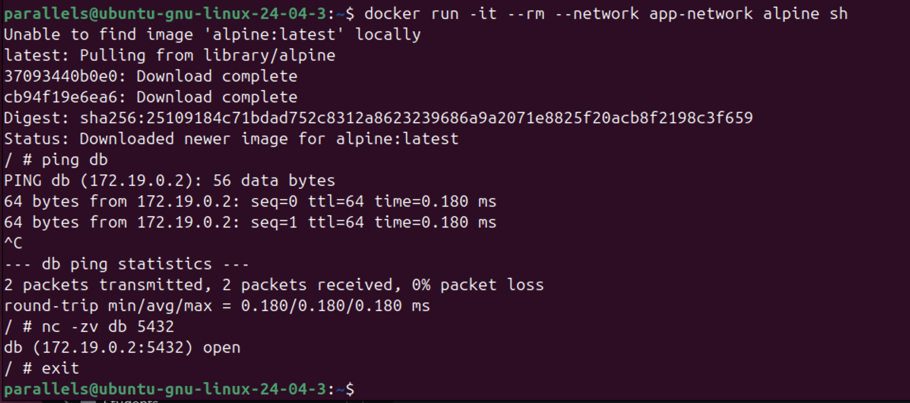
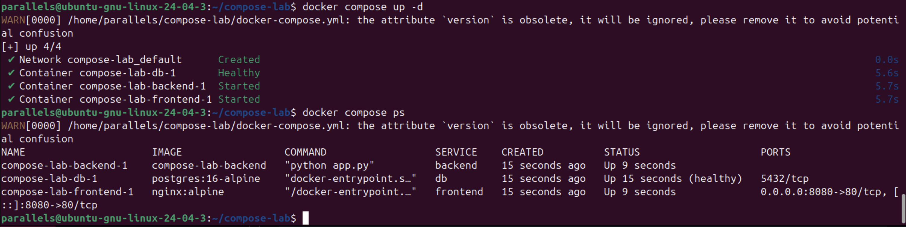
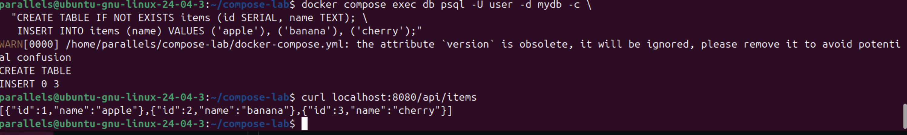
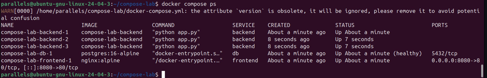

(Блок 1)

Для начала я создал собственную изолированную bridge-сеть app-network и запустил в ней базу данных PostgreSQL. Чтобы убедиться, что контейнеры внутри одной сети видят друг друга, я поднял временный контейнер alpine.

Команда ping db показала, что встроенный DNS Докера работает отлично — имя контейнера без проблем разрешается в его внутренний IP-адрес (172.19.0.2). Заодно я проверил доступность порта утилитой nc -zv db 5432: порт открыт, база слушает подключения. Вывод простой: в одной пользовательской сети контейнерам не нужны IP-адреса, они легко находят друг друга по именам.

2. Поднимаю стек через docker-compose (Блок 3)

Здесь я запустил сразу всё наше приложение (базу, бэкенд на Flask и фронтенд на Nginx) одной командой docker compose up -d.

Если посмотреть на вывод docker compose ps, видно, что все сервисы чувствуют себя отлично. Контейнер db получил статус Up (healthy) значит, что база успешно прошла проверку здоровья (healthcheck) и полностью готова. Бэкенд и фронтенд тоже запустились в правильном порядке благодаря настройке depends_on.
(Кстати, предупреждение в консоли про устаревший атрибут version — это нормальное поведение для новых версий Docker Compose, на саму работу стека это никак не влияет).

3. Наполняю базу и проверяем связь (Блок 3)

При первом запуске база данных абсолютно пустая. Поэтому я подключился к контейнеру db через docker compose exec и выполнил SQL-запрос, чтобы создать таблицу items и закинуть туда несколько тестовых записей (apple, banana, cherry).

Самый важный момент — проверка всей цепочки. Я сделал запрос curl localhost:8080/api/items со своей машины и получил в ответ красивый JSON со списком фруктов. Это значит, что приложение работает как единый организм: Nginx ловит запрос на 8080 порту, проксирует его в контейнер бэкенда на Flask, а тот уже успешно ходит в PostgreSQL, забирает данные и отдает их обратно.

4. Масштабирую бэкенд (Блок 3)

Ну и напоследок. С помощью команды docker compose up -d --scale backend=3 я буквально в один клик увеличил количество контейнеров с бэкендом до трех штук.

На скрине docker compose ps видно, что теперь у нас параллельно крутятся три экземпляра compose-lab-backend (под номерами 1, 2 и 3). В реальных проектах это супер-полезная фича для отказоустойчивости и балансировки нагрузки: если один контейнер с бэкендом вдруг упадет, пользователи этого даже не заметят, так как Nginx продолжит отправлять запросы на два оставшихся.

Краткий итог:
В ходе работы я на практике разобрался, как поднимать многоконтейнерные приложения через docker-compose. Научился изолировать их в отдельной виртуальной сети, сохранять данные в БД с помощью volumes (чтобы они выживали после перезапуска) и масштабировать отдельные сервисы под нагрузку.