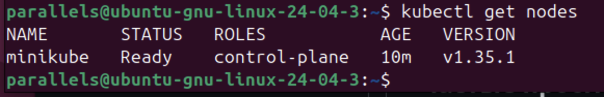
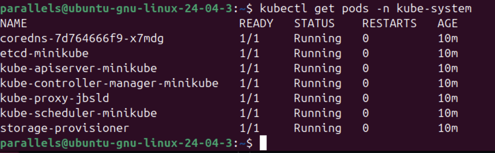
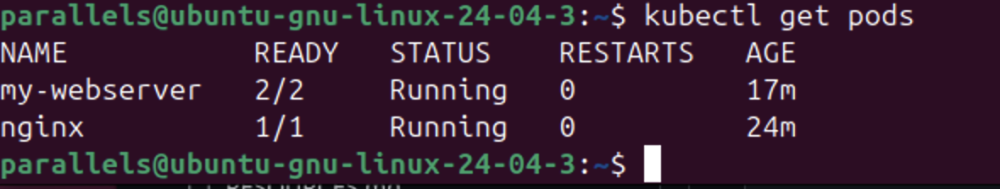
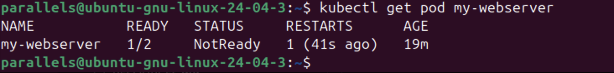

Шаг 1: Проверка состояния кластера

Запустил кластер через minikube. Проверил, что нода готова к работе, а системные компоненты запущены.

Скриншот 1 ()

Статус ноды Ready.

Скриншот 2 ()

Все поды в kube-system (apiserver, etcd, scheduler и др.) в статусе Running.

Шаг 2: Создание и запуск подов

Запустил первый под nginx (императивно) и создал второй под my-webserver через YAML-манифест с двумя контейнерами внутри.

Скриншот 3 ()

В списке два пода. У my-webserver статус READY 2/2, что подтверждает запуск обоих контейнеров (основного и sidecar).

Шаг 3: Тест самовосстановления (Self-healing)

Зашел внутрь контейнера и убил основной процесс командой kill 1. Проверил реакцию Kubernetes.

Скриншот 4 ()

Видно, что колонка RESTARTS увеличилась до 1. Kubernetes автоматически перезапустил упавший контейнер.

Ответы на контрольные вопросы

1. Какие поды в kube-system всегда должны быть Running?
Обязательно должны работать: kube-apiserver (связующее звено), etcd (база данных), kube-scheduler (планировщик), kube-controller-manager и сетевые компоненты (kube-proxy, coredns).

2. Почему Pod не удалился, а перезапустился? Кто за это отвечает?
За это отвечает агент kubelet. Он следит за состоянием контейнеров на ноде. Так как в конфиге стоит политика restartPolicy: Always (по умолчанию), при падении процесса kubelet просто запускает новый контейнер внутри того же пода.

3. В чем отличие Pod от Container ?
Контейнер — это сам изолированный процесс (например, Docker). Под (Pod) — это объект Kubernetes, который объединяет один или несколько контейнеров в общую сеть и дает им общий IP-адрес.