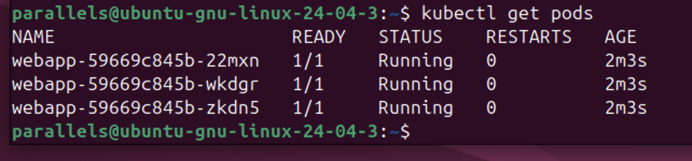
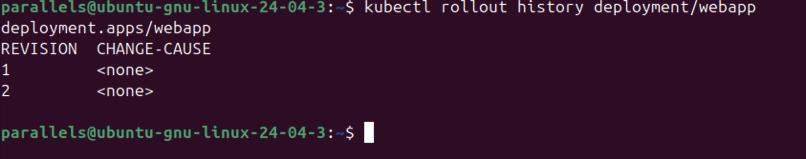
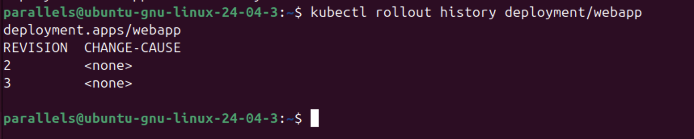
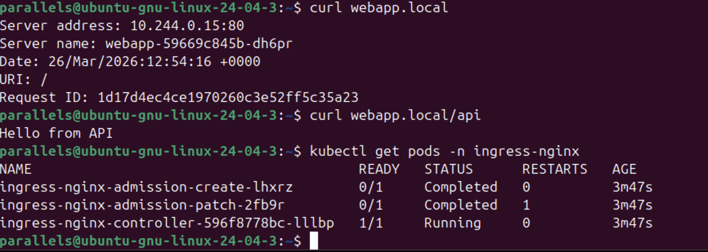
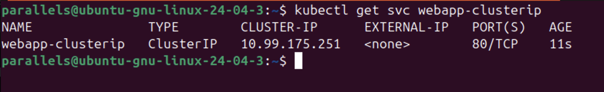
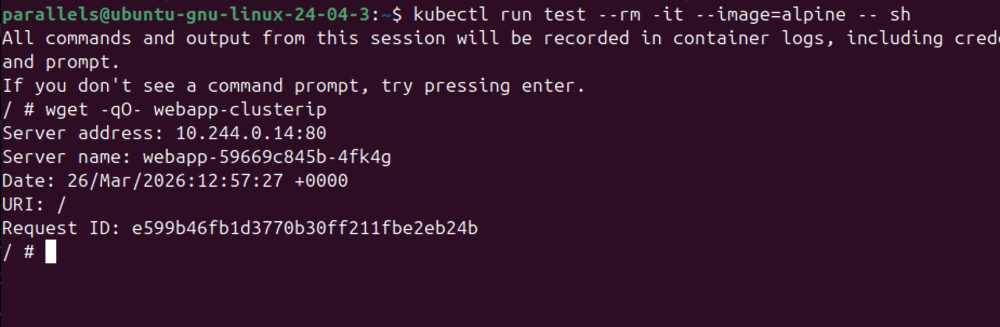
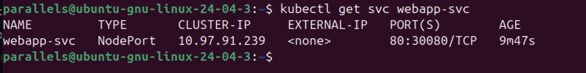

Шаг 1. Развертывание и проверка состояния подов

Я подготовил манифест для деплоймента webapp с тремя репликами. После его применения я проверил список запущенных ресурсов.

Результат  Я убедился, что в кластере поднялись три пода (с именами webapp-...), все они находятся в статусе Running и готовы к работе.

Шаг 2. Управление версиями и обновление (Rollout)

Я протестировал механизм обновления приложения и возможность отката к предыдущей стабильной версии.

Результат 

Сначала я проверил историю ревизий (скриншот 2_5), где были видны версии 1 и 2. После выполнения команды kubectl rollout undo я убедился (скриншот 3_5), что история обновилась и произошел переход к следующей ревизии, что подтверждает успешный откат.

Шаг 3. Настройка доступа через Service и Ingress

Я настроил внешний доступ к приложению через сервис NodePort и организовал маршрутизацию по путям через Ingress.

Результат 
Я создал сервис webapp-svc типа NodePort на порту 30080. Далее я настроил Ingress и проверил его работу через curl: основной путь webapp.local открывает главную страницу, а путь /api возвращает ответ от бэкенда. Также я проверил работоспособность самого Ingress-контроллера в системе (скриншот 4_5).

Шаг 4. Внутренняя связность через ClusterIP

Для организации взаимодействия между компонентами внутри кластера я создал сервис типа ClusterIP.

Результат 

Я создал сервис webapp-clusterip (скриншот 5_5). Чтобы убедиться в его доступности, я запустил временный контейнер alpine и успешно выполнил запрос wget к сервису по его внутреннему имени скрин. Ответ сервера подтвердил корректную работу внутренней сети (скриншот 6_5). NodePort — порт на каждой ноде, видим NodePort 30080. (скриншот 7_5)

Ответ на контрольный вопрос: В чем разница между ClusterIP, NodePort и LoadBalancer?

ClusterIP: Это тип сервиса по умолчанию. Он создает виртуальный IP, доступный только внутри кластера. Это основной способ общения подов друг с другом.

NodePort: Этот тип открывает порт на каждом узле (ноде) кластера. Вы можете обратиться к сервису извне, используя IP_любой_ноды:Port. Это самый простой способ дать внешний доступ без облачных инструментов.

LoadBalancer: Используется в облачных инфраструктурах. Он автоматически создает внешний балансировщик (например, в AWS или GCP), который получает свой статический внешний IP и перенаправляет трафик в кластер.