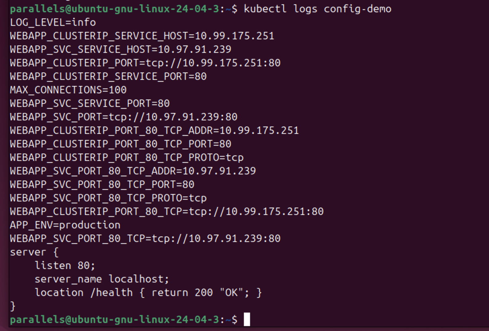
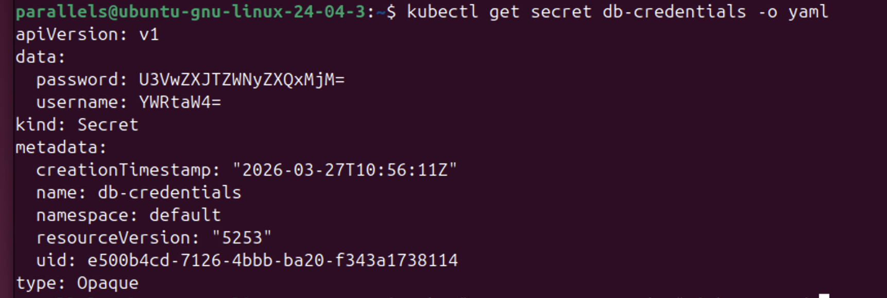
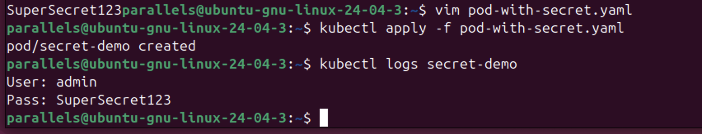
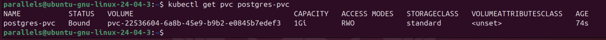
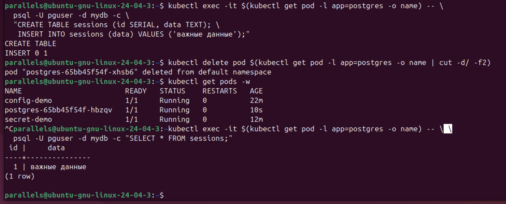

### 1. Работа с ConfigMap

Был создан ConfigMap app-config с переменными окружения и nginx-conf на основе файла конфигурации. Для проверки работы был запущен под config-demo, который использует три способа подключения конфигурации: через envFrom, через конкретные ключи env и через монтирование тома (Volume).

Скриншот №1 

На скриншоте виден вывод логов пода config-demo.

Переменные LOG_LEVEL, MAX_CONNECTIONS и APP_ENV успешно переданы в окружение контейнера.

Содержимое файла nginx.conf корректно отображается через команду cat из примонтированной директории /etc/config.

Вывод: ConfigMap позволяет гибко управлять настройками приложения без пересборки Docker-образа.

### 2. Работа с Secrets

Был создан секрет db-credentials для хранения учетных данных базы данных.

Скриншот №2

Данные (password и username) представлены в формате base64.

Важное замечание: Секреты в K8s по умолчанию не являются зашифрованными, а лишь закодированными, что требует дополнительных мер безопасности (например, шифрования в etcd или использования внешних хранилищ).

Скриншот №3 

Запущен под secret-demo, который считывает данные из секрета. Логи подтверждают, что Kubernetes автоматически декодировал значения из base64 и передал их в под как обычный текст (User: admin, Pass: SuperSecret123).

### 3. PersistentVolume и работа с базой данных

Для обеспечения постоянного хранения данных PostgreSQL был создан запрос на дисковое пространство (PersistentVolumeClaim).

Скриншот №4 

Команда kubectl get pvc postgres-pvc показывает статус Bound. Это означает, что Kubernetes успешно выделил виртуальный диск объемом 1Gi с использованием StorageClass standard.

Скриншот №5 
Демонстрация жизненного цикла данных:

В базе данных PostgreSQL была создана таблица sessions и вставлена запись "важные данные".

Под с базой данных был принудительно удален командой kubectl delete pod.

После того как Deployment автоматически пересоздал новый под, была выполнена проверка командой SELECT.

Данные остались на месте, так как хранились на PersistentVolume, а не внутри эфемерной файловой системы контейнера.

## Общий вывод

ConfigMap — для открытых настроек.

Secret — для конфиденциальных данных (пароли, ключи).

PersistentVolumeClaim — для хранения состояния (state) приложений.

Это позволяет реализовать подход 12-factor app, делая приложения переносимыми, масштабируемыми и устойчивыми к сбоям инфраструктуры.