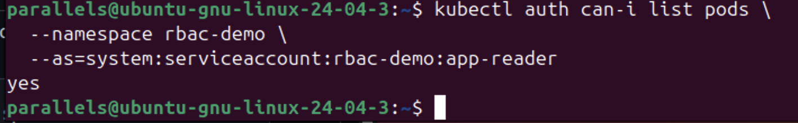
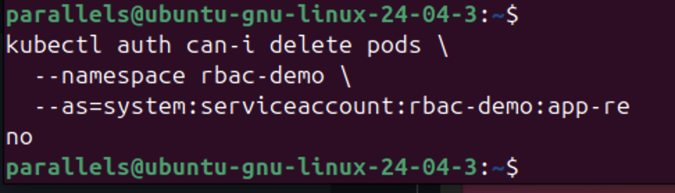
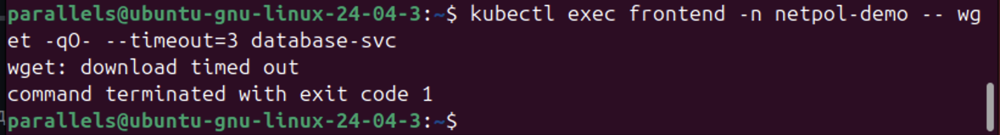
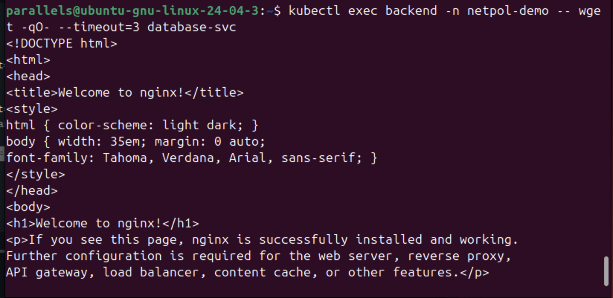
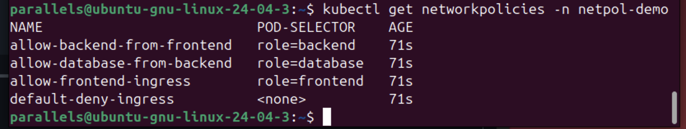
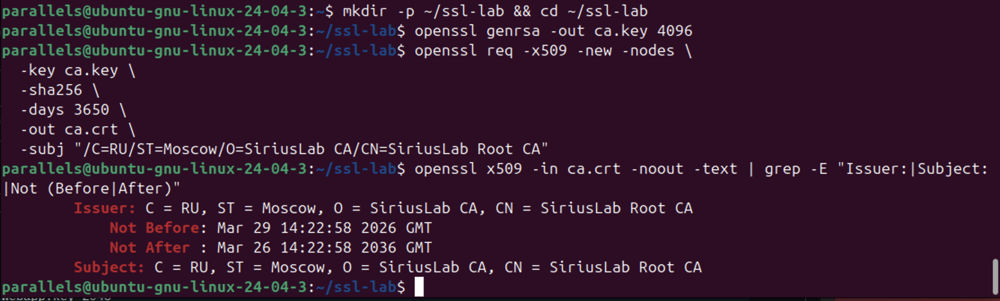
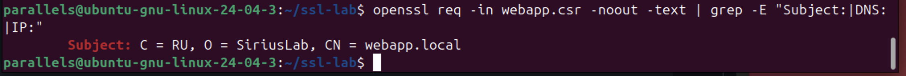
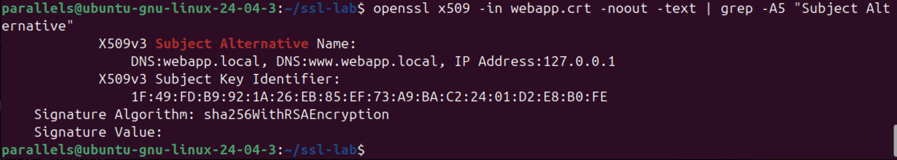
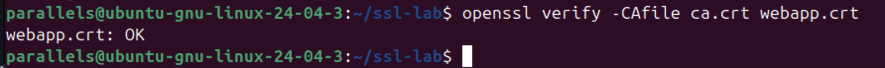
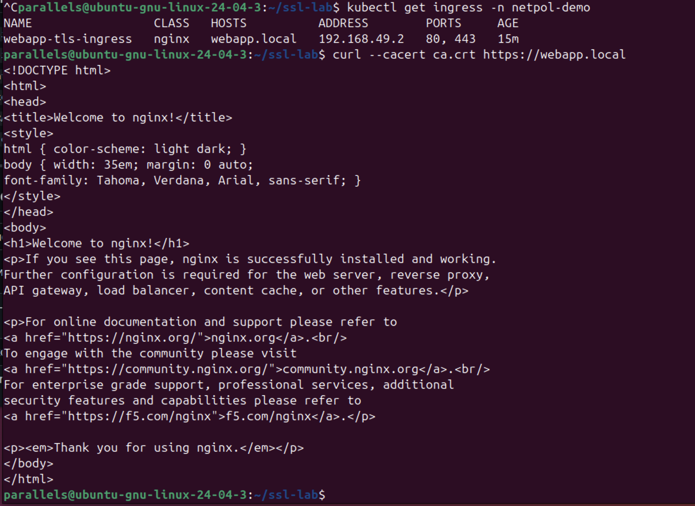

# Отчет по лабораторной работе №7: Безопасность Kubernetes
Рязапов Даниил Максимович  к0409-24/2

## 1.

Начал с настройки ролевой модели. Идея в том, чтобы у приложения были права только на чтение подов и ничего больше. Создал ServiceAccount `app-reader` и привязал его к роли `pod-reader`.

Сначала я жестко тупанул и пытался проверить права, просто вбивая команды exec, забыв указать неймспейс. Кубер логично слал меня лесом с ошибкой. 

Здесь видно, что проверка прав через `auth can-i` прошла успешно: читать список подов нам разрешено.

А тут я убедился, что безопасность работает: попытка удалить под через тот же аккаунт выдает четкое `no`. Минимальные привилегии в действии.

## 2.

Самый потный этап. Нужно было изолировать базу данных так, чтобы в нее мог ходить только бэкенд, а фронтенд курил в сторонке.

Тут я знатно приуныл, потому что сначала применил все политики, а трафик продолжал летать как ни в чем не бывало. Фронтенд видел базу, база видела всех — короче. Оказалось, мой стандартный сетевой плагин в Minikube просто не умеет обрабатывать NetworkPolicy. Пришлось сносить кластер и пересоздавать его с поддержкой Calico. Только после этого политики реально заработали.

Фронтенд пытается достучаться до базы и ловит `timed out`. Политика `default-deny-ingress` работает.

При этом бэкенд спокойно получает ответ от базы, потому что для него я сделал исключение.

Список всех примененных политик в моем неймспейсе `netpol-demo`.

## 3.

В этой части я работал с OpenSSL. Выпустил свой корневой сертификат (CA) и подписал им сертификат для нашего веб-приложения.

Генерация моего собственного CA. Теперь я сам себе доверенная сторона.

Создание запроса на подпись (CSR). Тут важно было правильно прописать `webapp.local`.

Проверка сертификата. Видно, что прописаны альтернативные имена (SAN), чтобы кубер и браузеры не ругались.

Финальная проверка цепочки доверия через `openssl verify`. Статус OK, значит я нигде не накосячил с ключами.

## 4. Финальная проверка Ingress

Самый конец лабы. Нужно было пробросить всё это через Ingress и проверить `curl`.

Я опять поймал тупняка, когда `curl` начал выдавать `Failed to connect`. Минут пять проверял конфиги, пока не сообразил, что я просто не включил аддон ingress в миникубе. Как только сделал `addons enable`, всё включилось.

Итоговая проверка. Делаю запрос к `https://webapp.local`, подсовываю свой `ca.crt`, и сервер отдает мне HTML-код. TLS настроен верно, сертификат валиден.

## Вывод
Работа показала, что в Kubernetes мало просто написать YAML-конфиг. Нужно еще понимать, поддерживает ли твой кластер эти фичи (привет, Calico) и включены ли нужные контроллеры. Теперь я умею ограничивать доступ на уровне API, на уровне сети и защищать трафик сертификатами.