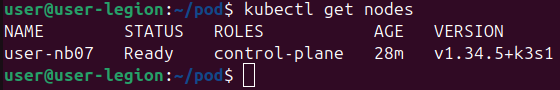
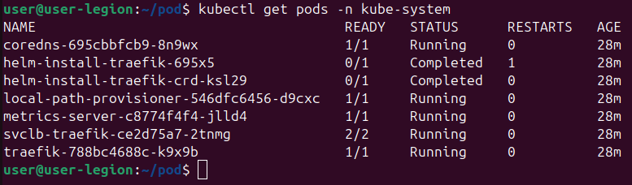
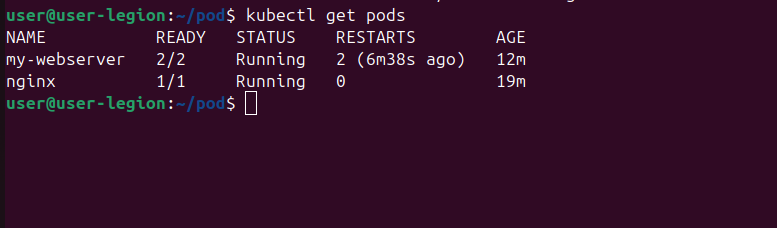
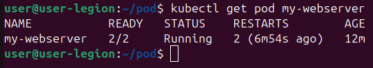

    Проверка состояния нод (Скриншот 1): Команда kubectl get nodes демонстрирует, что единственная нода кластера (user-nb07) находится в статусе Ready и успешно выполняет роль управляющей ноды (control-plane).

    Проверка системных компонентов (Скриншот 2): Вывод команды kubectl get pods -n kube-system показывает состояние служебного пространства имен. Основные системные компоненты кластера k3s (coredns, metrics-server, traefik, local-path-provisioner) функционируют штатно и имеют статус Running. Поды инициализации (helm-install-...) завершили работу со статусом Completed, что является нормальным поведением после завершения установки.

    Пользовательские поды и проверка самовосстановления (Скриншоты 3 и 4): Команды kubectl get pods и kubectl get pod my-webserver подтверждают успешный запуск тестовых подов в пространстве имен default. У многоконтейнерного пода my-webserver запущены оба контейнера (Ready 2/2). Зафиксировано 2 перезапуска (Restarts: 2), что подтверждает корректную отработку механизмов самовосстановления (self-healing) кластера после принудительного завершения основного процесса в контейнере.

    Ответы на контрольные вопросы

Вопрос 1: Какие поды в kube-system всегда должны быть Running?
В классическом кластере Kubernetes в статусе Running постоянно должны находиться компоненты Control Plane (kube-apiserver, kube-scheduler, kube-controller-manager, etcd), сетевые плагины (CNI), kube-proxy и coredns. В используемом дистрибутиве k3s основные управляющие компоненты объединены в единый системный процесс, поэтому в kube-system статус Running должны иметь coredns (внутренний DNS), metrics-server, провайдер локального хранилища и Ingress-контроллер (traefik).

Вопрос 2: Почему Pod не удалился, а перезапустился? Кто за это отвечает?
Pod не удалился, так как архитектура Kubernetes направлена на поддержание желаемого состояния объектов; по умолчанию для подов действует политика restartPolicy: Always. За мониторинг состояния контейнеров и их автоматический перезапуск отвечает агент kubelet, работающий на рабочем узле. Обнаружив падение процесса, kubelet инициирует повторный запуск контейнера и увеличивает счетчик RESTARTS.

Задание: Отличие Pod vs Container
Pod — это минимальная единица развертывания в Kubernetes, представляющая собой логическую оболочку, которая может содержать один или несколько тесно связанных контейнеров (Containers). В то время как контейнер изолирует само приложение и его программные зависимости, Pod предоставляет общую сеть (единый IP-адрес) и общее хранилище данных (Volumes) для всех работающих внутри него контейнеров.