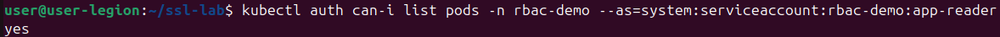
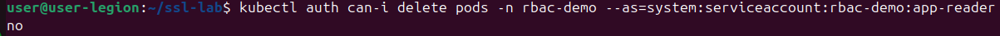
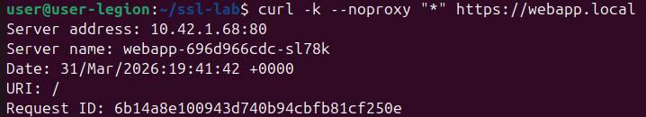
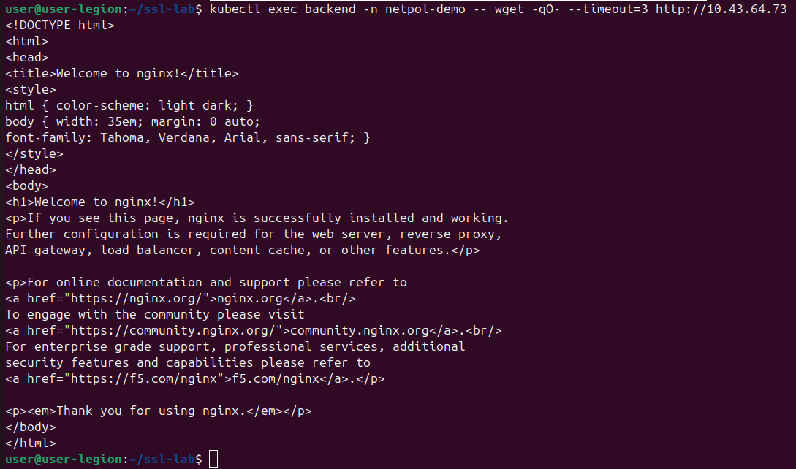
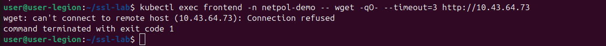

1. Проверка RBAC (Управление доступом на основе ролей)

    Скриншоты 1 и 2: Демонстрируют работу принципа минимальных привилегий. Созданный сервисный аккаунт (app-reader) имеет права на просмотр списка подов (list pods выдает yes), но ему строго запрещено их удалять (delete pods выдает no).
    
    

2. Проверка работы Ingress и TLS

    Скриншот 3: Успешная проверка защищенного соединения через кастомный TLS-сертификат. Команда curl подключилась к локальному домену https://webapp.local и успешно получила ответ от Ingress-контроллера (маршрутизация работает штатно).
    

3. Проверка NetworkPolicy (Сетевая изоляция)

    Скриншот 4 (Backend): Подтверждает, что политика разрешает легитимный трафик. Запрос от пода backend успешно достигает сервиса базы данных (в ответ приходит HTML-код страницы).
    

    Скриншот 5 (Frontend): Подтверждает работу сетевой блокировки. При попытке прямого обращения от пода frontend к базе данных соединение моментально сбрасывается (Connection refused). Изоляция работает корректно.
    