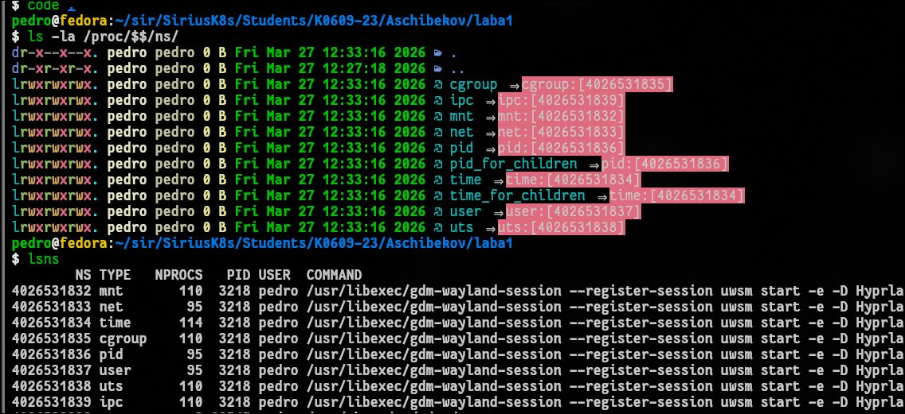
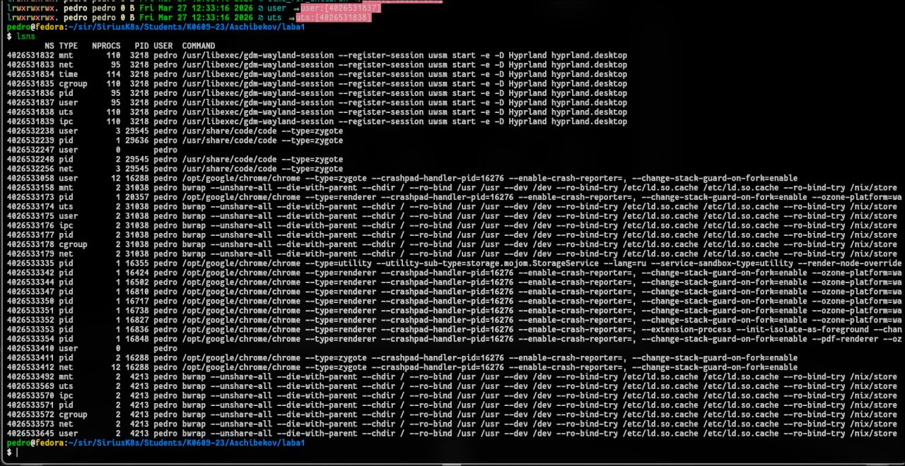
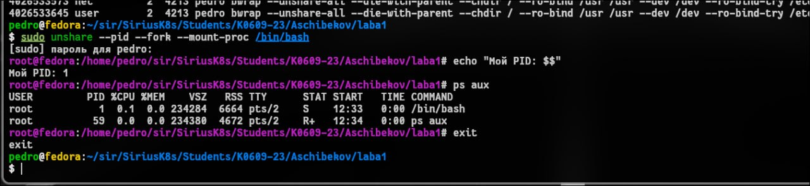
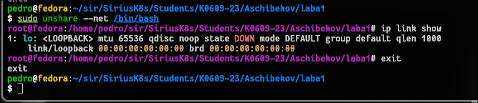
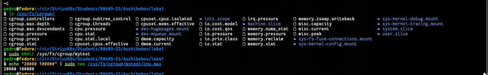
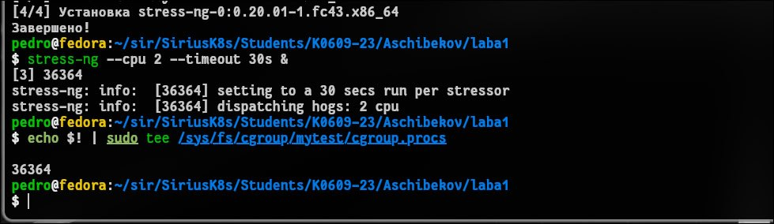
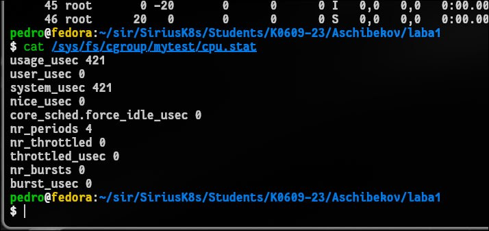
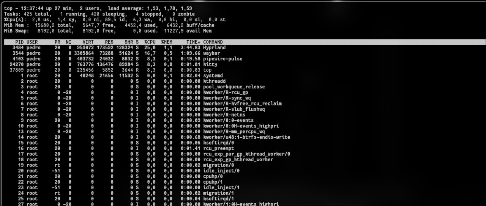
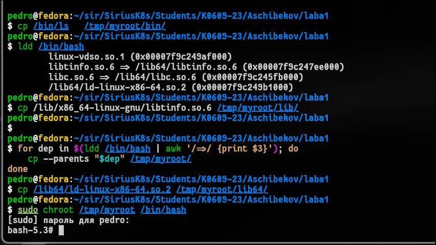
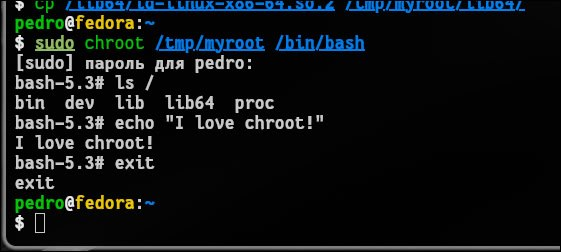

# 1. Чему научился
Я научился запускать процессы в изолированных пространствах имен (PID и NET namespaces), а также успешно ограничивать потребление процессорного времени утилитой stress-ng до 20% с помощью контрольных групп (cgroups v2)

# 2. Возникшие проблемы и их решения
При попытке снять нагрузку возникла ошибка kill: not enough arguments. Причина: процесс stress-ng уже завершился по таймауту, файл cgroup.procs опустел, и kill был вызван без PID. Проблема элегантно решается передачей вывода через xargs -r, чтобы предотвратить запуск команды при пустом файле.
При настройке chroot утилиты падали из-за нехватки библиотек (например, libselinux.so.1 для ls и libtinfo.so.6 для bash), а виртуальная библиотека linux-vdso.so.1 выдавала ошибки при копировании. Решением стала автоматизация: использование цикла for в связке с ldd и awk для точного и полного копирования всех реальных зависимостей бинарников прямо в rootfs.

#   3. Ответы на контрольные вопросы
Чем namespace отличается от cgroup: Namespaces ограничивают видимость (процесс думает, что он один в системе, видит только свой PID=1 или свою сеть). Cgroups ограничивают потребление ресурсов (жесткие лимиты на CPU, память, ввод-вывод).

Почему после exit процессы хоста остались нетронутыми: Изолированный namespace создает собственное замкнутое дерево процессов. Команда exit завершает сеанс оболочки и убивает только дочерние процессы внутри этого изолированного «пузыря», не имея физического доступа к процессам родительского хоста.

Что произойдет, если превысить лимит памяти: Ядро Linux задействует механизм OOM-killer (Out-Of-Memory Killer), который принудительно «убьет» процесс-нарушитель, чтобы защитить остальную систему от нехватки памяти.

