# 1. Чему научились
На этой паре я закрепил навыки тегирования и публикации образов на Docker Hub. Главным новым опытом стало освоение многоэтапной сборки (Multistage build). Научился правильно разделять сборку: компилировать зависимости на первом этапе (builder) и переносить в финальный образ только необходимое, отсекая весь сборочный мусор.

# 2. Проблемы и их решение
При запуске myapp:good контейнер уходил в цикл перезагрузки (Restarting), а curl выдавал ошибку подключения. Выявились две архитектурные проблемы в Dockerfile: конфликт прав доступа (пакеты из /root/.local оказались недоступны для непривилегированного appuser) и несовместимость системных библиотек (сборка зависимостей в slim с glibc, а запуск в alpine с musl). Проблему решил, переведя оба этапа на использование slim, внедрив виртуальное окружение (venv) и корректно передав права через COPY --chown.

# 3. Контрольные вопросы и результаты
Почему образ такой большой? «Плохой» образ основан на тяжелом python:3.12, в котором лежат системные компиляторы, утилиты и кэши. Разница в docker images огромная: "bad" образ весит около 1 ГБ, тогда как "good" (благодаря multistage и легкому базовому образу) "худеет" в несколько раз, оставляя только нужный рантайм приложения (около 130-150 МБ).

Ограничения: Лимиты ресурсов работают корректно, docker stats app-good подтверждает, что контейнер ограничен 0.5 CPU и 128MB RAM.

URL на Docker Hub: yapedro/flask-demo (или https://hub.docker.com/r/yapedro/flask-demo).

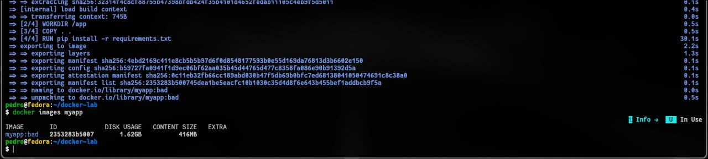

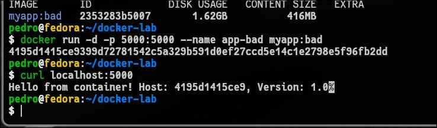

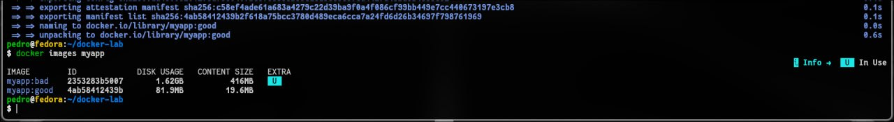

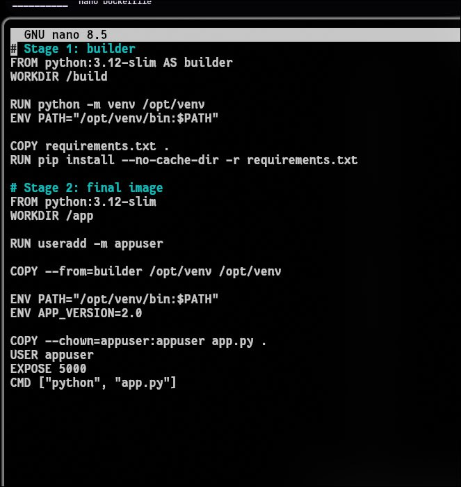

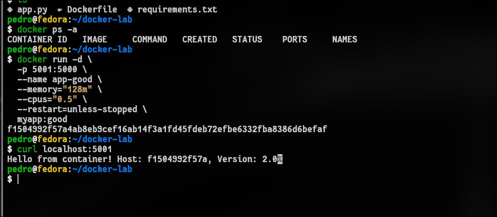

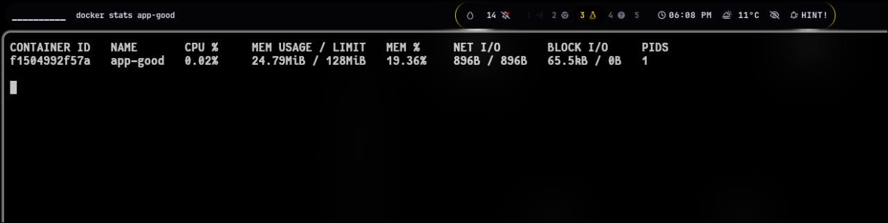

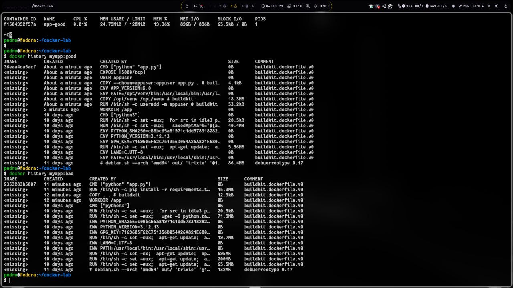

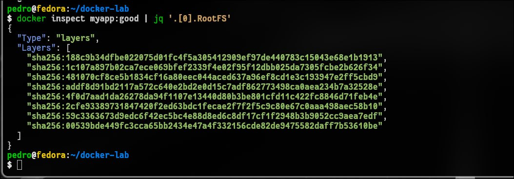

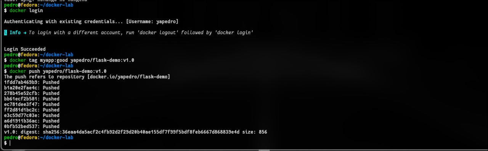

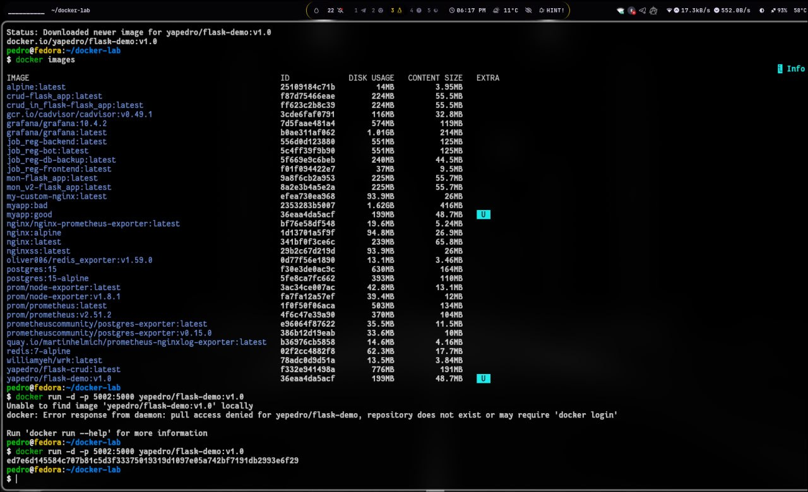

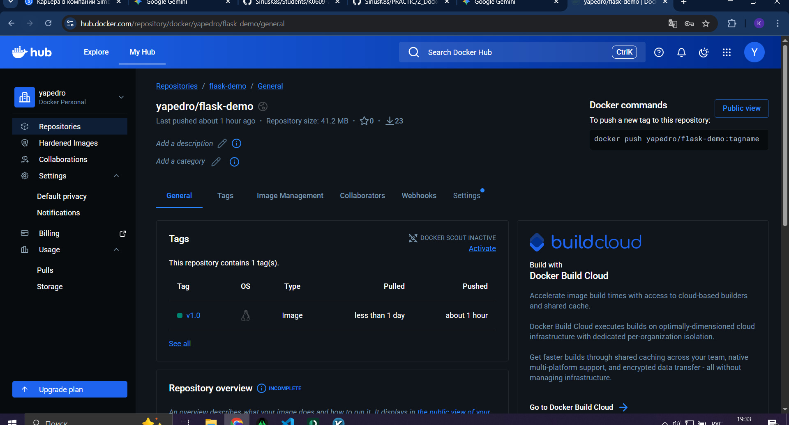