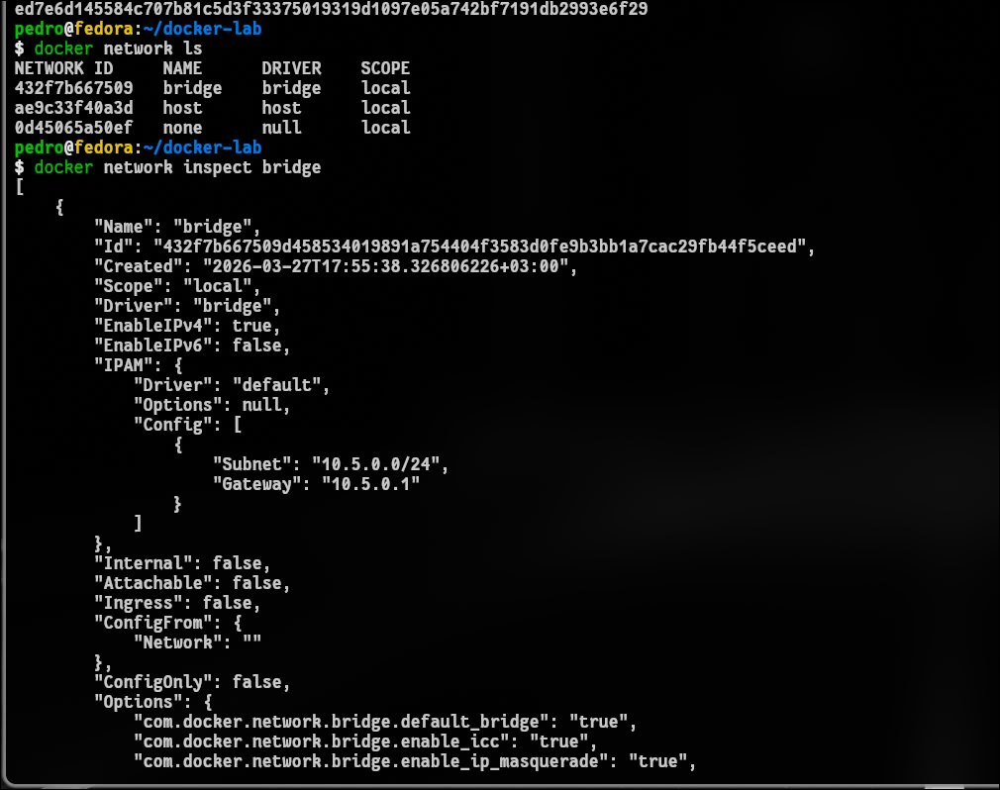
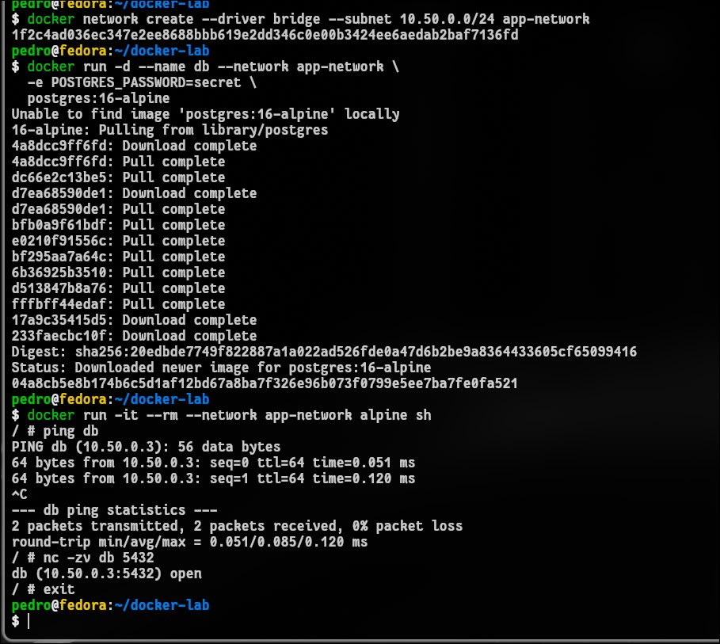
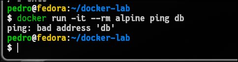
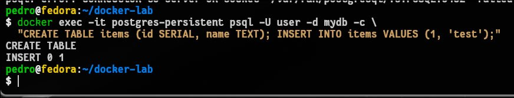
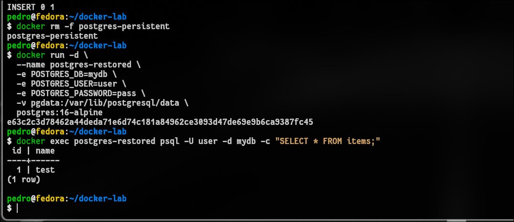
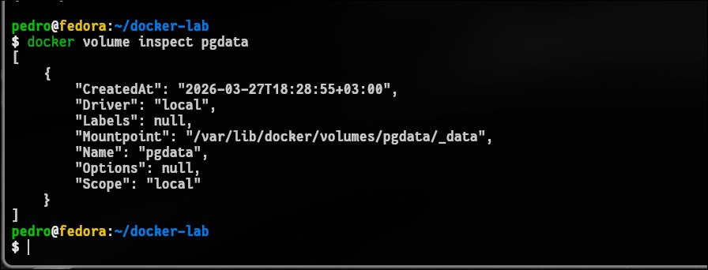
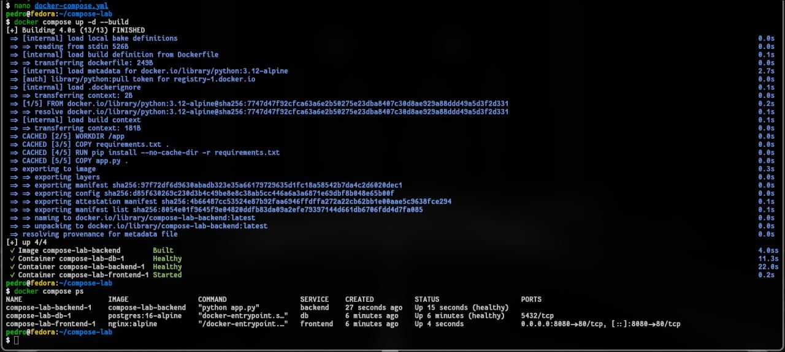
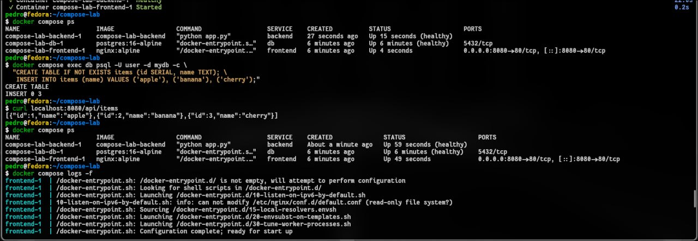
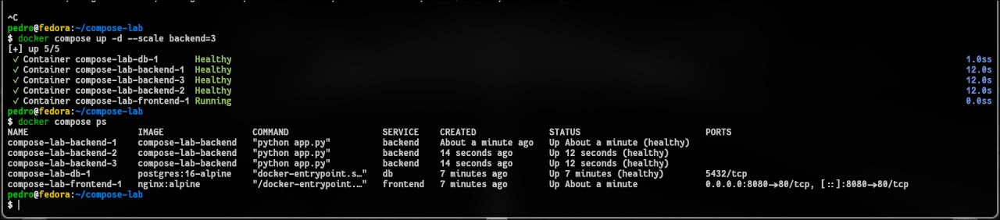
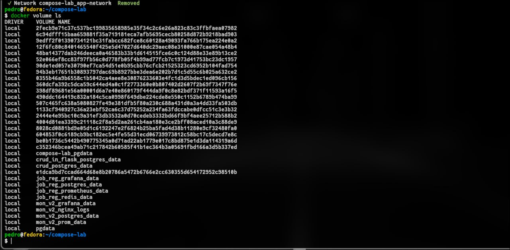

# 1. Чему научились
Освоил оркестрацию многоконтейнерных приложений через Docker Compose, включая связку Frontend (Nginx), Backend (Flask) и DB (Postgres). Научился работать с persistent volumes для сохранения данных и настраивать healthchecks для контроля готовности сервисов. Закрепил навыки управления сетями и динамического масштабирования сервисов (--scale backend=3) для распределения нагрузки.

# 2. Проблемы и их решение
Ошибка подсетей (subnetted): Docker не мог автоматически выделить IP. Решено ручным описанием сети app-network с конкретным диапазоном 172.20.0.0/24.

Отказ БД при старте: Бекенд пытался подключиться к базе, пока та еще инициализировалась. Решено через depends_on с условием service_healthy.

Unhealthy статус в Alpine: Утилита nc в Alpine не поддерживает флаг -z. Исправлено заменой команды проверки на однострочник python -c, проверяющий открытие сокета.

# 3. Контрольные вопросы и сети
Разница сетей: * Bridge: Виртуальная сеть внутри одного хоста (стандарт для Compose). Контейнеры изолированы, но видят друг друга по именам.

Host: Контейнер использует сетевой стек хоста напрямую (нет изоляции портов, но выше скорость).

Overlay: Используется для связи контейнеров на разных физических хостах (в Docker Swarm или кластерах).

Итог проверки: Сервисы перешли в healthy, данные из базы успешно отдаются через Nginx (curl localhost:8080/api/items), а команда масштабирования успешно подняла 3 экземпляра бекенда.

