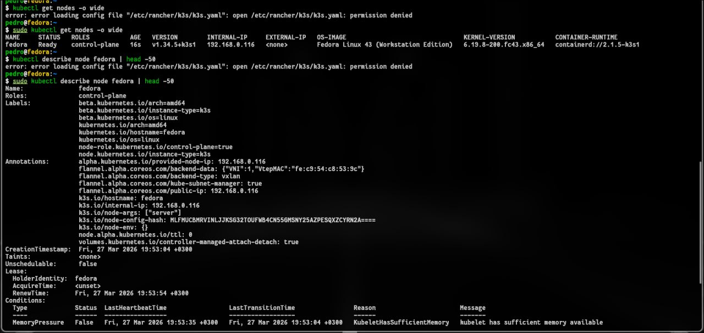
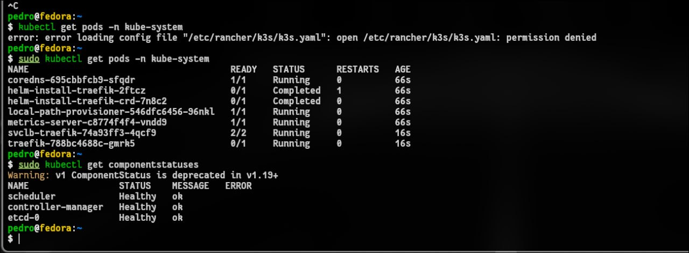
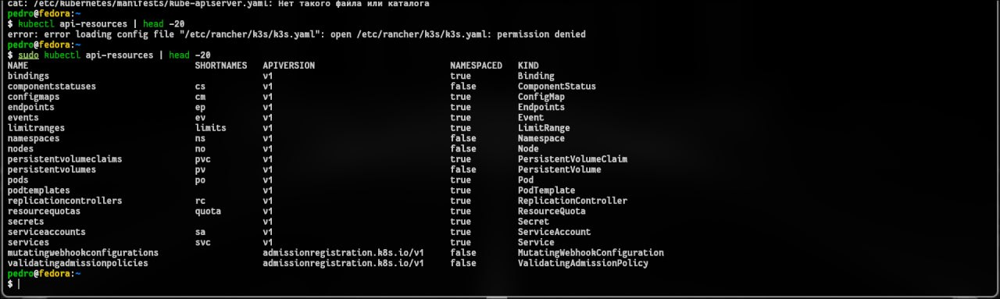
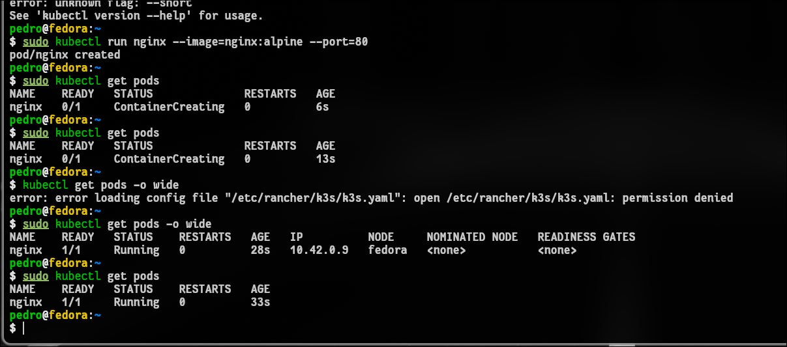
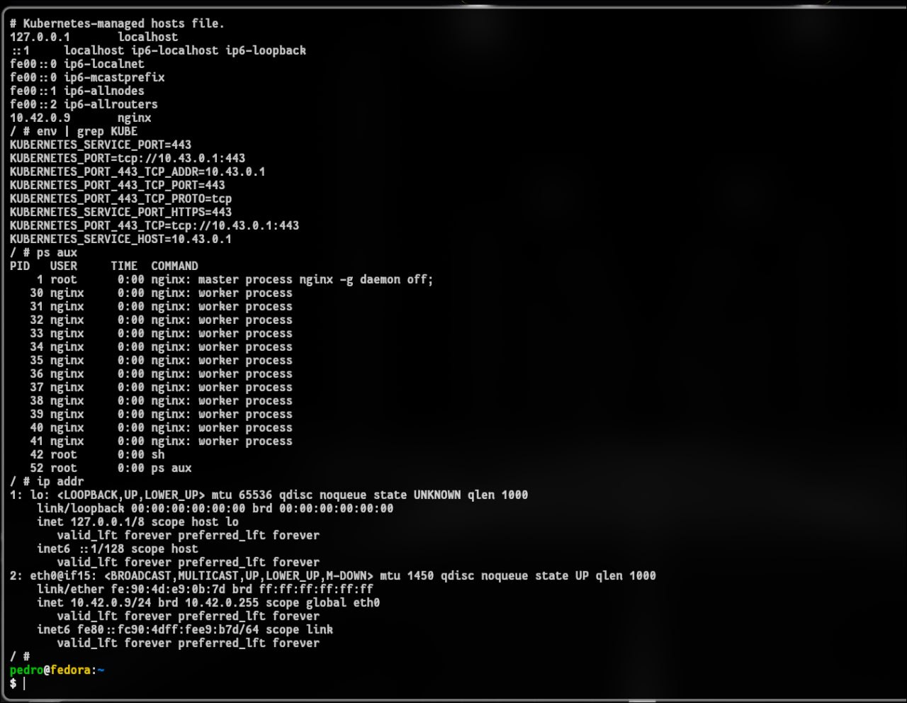
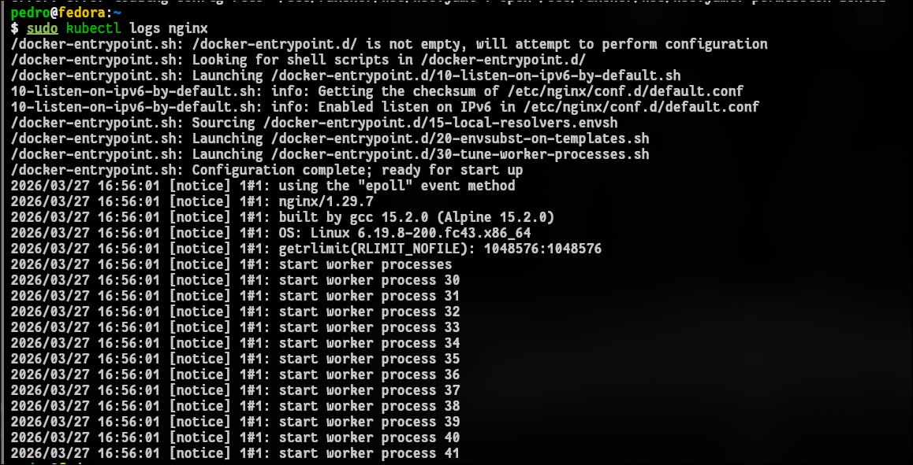
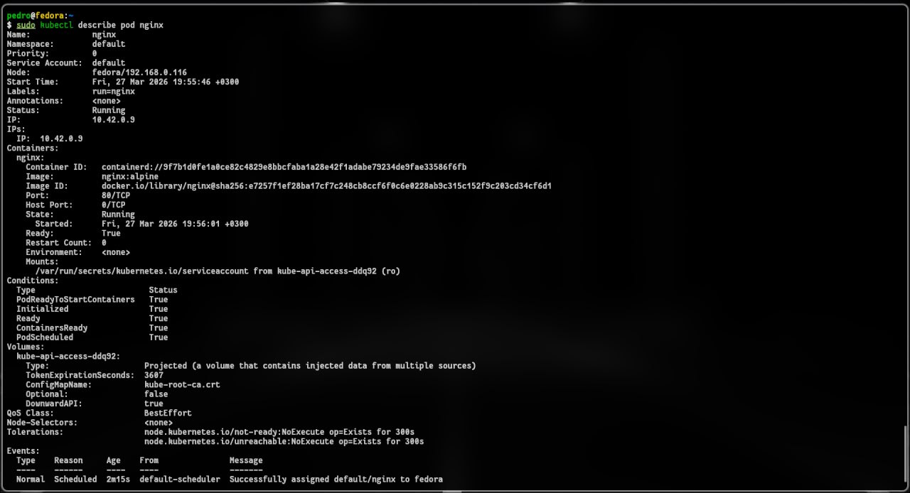
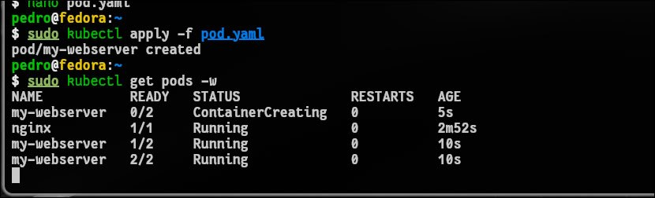
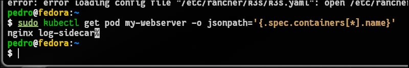
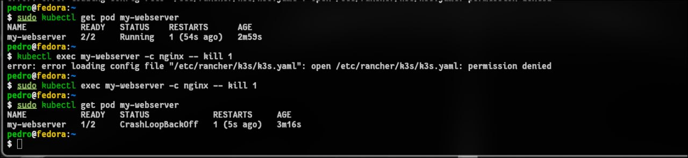

# 1. Чему научились
Диагностика кластера: научились проверять статус нод (Ready) и состояние системных компонентов через kubectl get nodes и kubectl get cs.

Работа с Control Plane: изучили состав системного пространства имен kube-system, а также расположение манифестов статических подов в /etc/kubernetes/manifests/.

Управление жизненным циклом Pod: освоили запуск подов как императивным методом (kubectl run), так и декларативным (через YAML-манифесты).

Инспекция ресурсов: научились просматривать логи, заходить внутрь контейнеров через exec, изучать сетевое окружение (IP, DNS) и переменные среды внутри пода.

Sidecar-паттерн: на практике применили запуск нескольких контейнеров в одном поде с общим томом (emptyDir) для логирования.

# 2. Проблемы и их решение
В процессе выполнения лабораторной работы технических проблем и ошибок не возникло. Кластер и объекты развернулись в штатном режиме, согласно методическим указаниям.

# 3. онтрольные вопросы
Pod — это минимальная единица развертывания в Kubernetes, которая может содержать один или несколько контейнеров, разделяющих общие сетевые ресурсы и хранилища. Container — это конкретный изолированный процесс (например, Docker), запущенный внутри пода и выполняющий код приложения.

Какие поды в kube-system всегда должны быть Running?
Для корректной работы кластера в статусе Running должны находиться основные компоненты Control Plane:

kube-apiserver — точка входа для всех запросов.

etcd — база данных кластера.

kube-scheduler — отвечает за назначение подов на ноды.

kube-controller-manager — следит за состоянием ресурсов.

kube-proxy — обеспечивает сетевую связность.

DNS-сервис (например, coredns) — для работы имен внутри кластера.

Почему Pod не удалился, а перезапустился? Кто за это отвечает?
Pod не удалился, потому что Kubernetes следит за «желаемым состоянием» (Desired State). За перезапуск контейнеров внутри пода отвечает агент kubelet, который запущен на каждой ноде. Если основной процесс контейнера завершается с ошибкой или принудительно убивается, kubelet видит несоответствие текущего состояния заданному и перезапускает контейнер согласно политике restartPolicy (по умолчанию Always).

