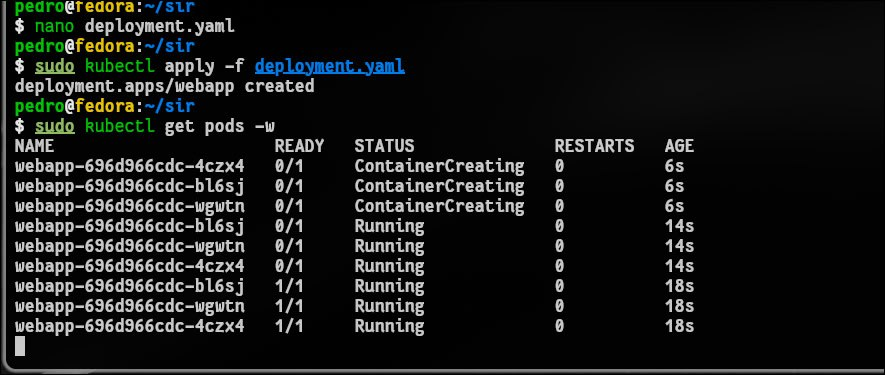
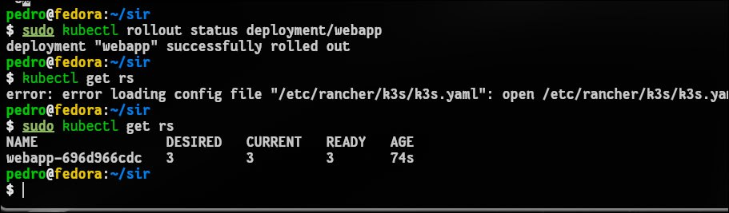
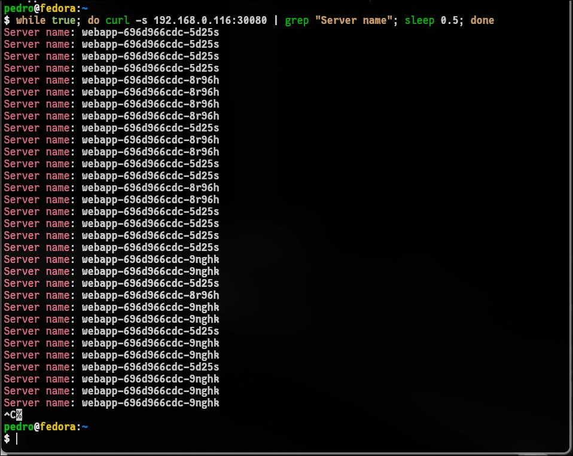
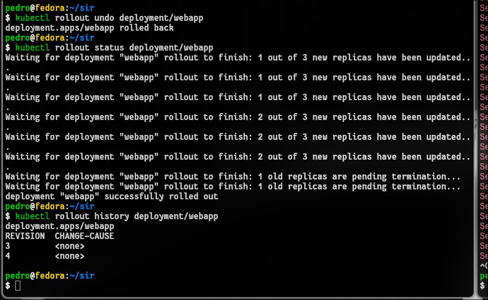
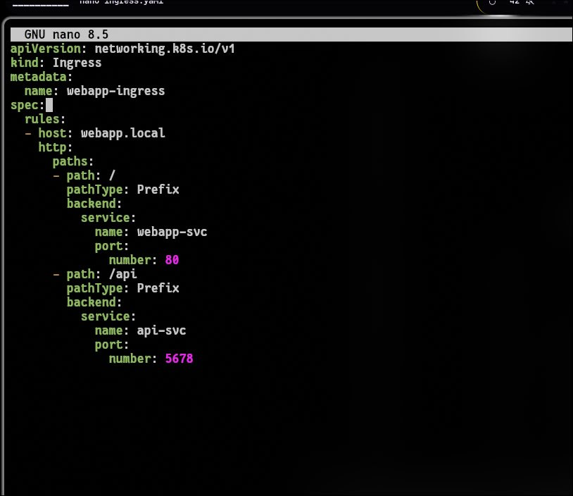
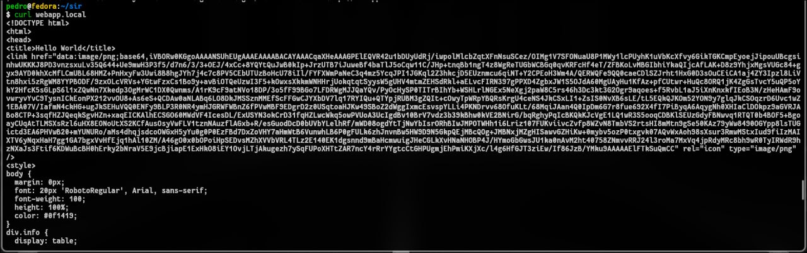
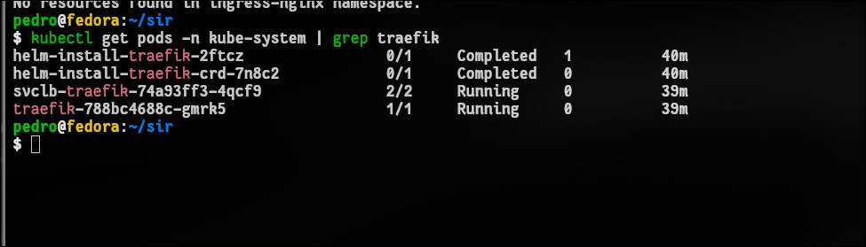
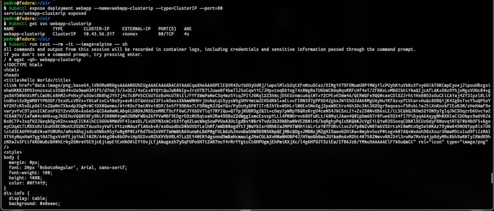

# 1. Чему научились
В ходе работы научился разворачивать отказоустойчивые приложения через Deployment и выполнять обновления без даунтайма (Rolling Update) с возможностью отката версий. Успешно создал сервисы типов ClusterIP и NodePort для организации доступа к подам. Также вспомнил и закрепил на практике настройку Ingress-контроллера с правилами (rules) для маршрутизации трафика по разным путям (/ на frontend и /api на backend).
Скриншоты с работающими подами, историей ревизий и корректными ответами от curl по обоим путям прикреплены к отчету.

# 2. Проблемы и как решили
Так как работа выполнялась в среде k3s на ОС Fedora (а не в minikube), возник ряд специфичных проблем:

Ошибка permission denied к k3s.yaml: Решено копированием системного конфига в ~/.kube/config и выдачей прав текущему пользователю, чтобы не использовать sudo для каждой команды.

Не работала команда minikube ip: Получил реальный IP-адрес ноды через kubectl get nodes и вручную прописал его для webapp.local в /etc/hosts.

Ошибка 404 от Ingress: В k3s по умолчанию работает Traefik, а не Nginx. Решилось удалением из манифеста ingressClassName: nginx и специфичных Nginx-аннотаций.

Ошибка 502 Bad Gateway: Встроенный фаервол Fedora блокировал внутреннюю сеть контейнеров k3s. Решено добавлением интерфейсов cni0 и flannel.1 в доверенную зону firewalld и включением маскарадинга.

# 3. Контрольные вопросы
Разница между ClusterIP, NodePort и LoadBalancer:

ClusterIP: Делает сервис доступным только внутри кластера. Используется для внутренних компонентов (например, базы данных), к которым не должно быть доступа извне.

NodePort: Открывает статический порт (обычно 30000–32767) на каждом физическом узле (ноде) кластера. Позволяет достучаться до приложения извне по IP ноды и этому порту. Является надстройкой над ClusterIP.

LoadBalancer: Используется в облачных средах (AWS, Yandex Cloud и т.д.). Автоматически создает внешний облачный балансировщик, который выдает публичный IP-адрес и распределяет трафик по нодам. Является надстройкой над NodePort.

