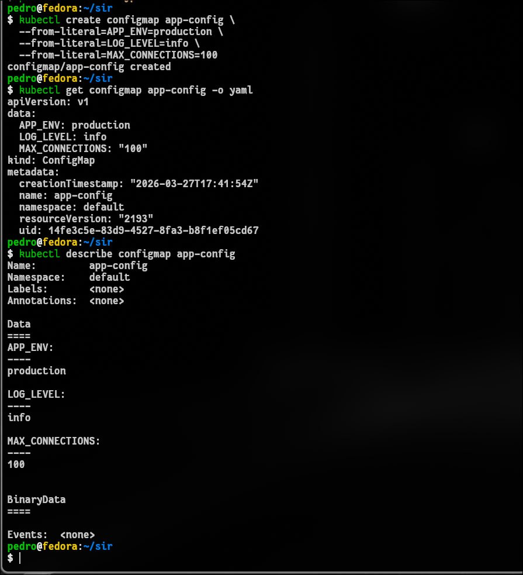
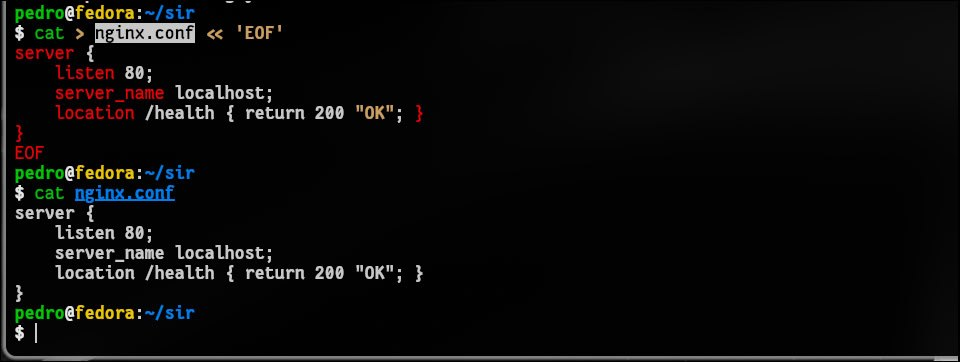
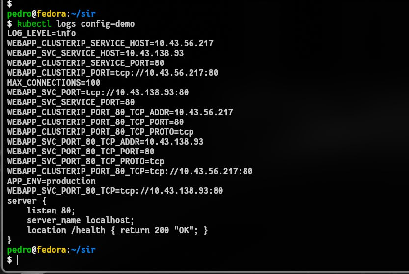
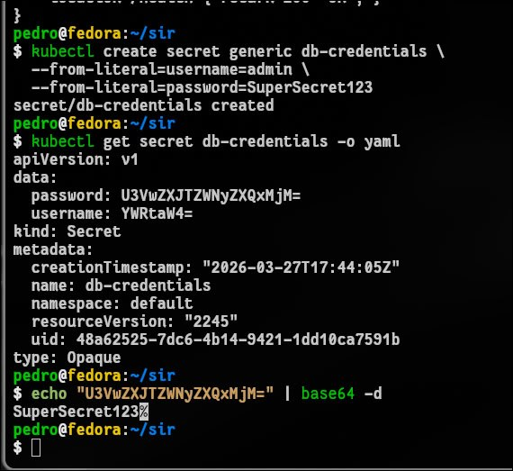
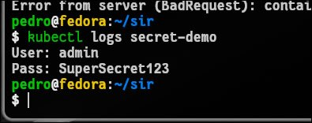
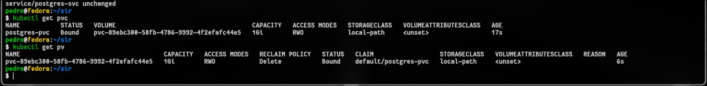
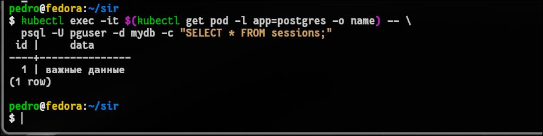

# 1. Чему я научился
Управление конфигурацией: Вспомнил, как создавать ConfigMap и передавать его в Pod тремя способами: как переменные окружения (env), массово через envFrom и в виде монтируемых файлов.

Persistent Storage: Научился разворачивать PostgreSQL с использованием PersistentVolumeClaim (PVC).

Обеспечение персистентности: На практике доказал, что данные сохраняются даже после полного удаления Пода, так как жизненный цикл PVC не зависит от цикла Пода.

Работа с секретами: Понял механизм работы Secret и способы их подключения к приложению.

# 2. Проблемы и их решение
## Проблема: PVC в статусе Pending.

Причина: В манифесте был указан storageClassName: standard, который отсутствовал в локальном кластере на Fedora.

Решение: Провел диагностику через kubectl describe pvc, выявил отсутствие StorageClass и заменил его на доступный в системе (например, local-path).

## Проблема: Ошибка path "postgres-pv.yaml" does not exist.

Причина: Ошибка в имени файла при попытке применить манифест (файл назывался postgres-pvc.yaml).

Решение: Проверил содержимое директории и применил корректный файл.

## Проблема: Internal error: container not found ("postgres").

Причина: Попытка выполнить kubectl exec до того, как Под перешел в статус Running. Под висел в Pending из-за не привязанного PVC.

Решение: Пересоздал PVC с правильным StorageClass, дождался статуса Bound и перехода Пода в Running.

# 3. Контрольный вопрос
Почему Secret небезопасен по умолчанию и что делать?

Почему это опасно: По умолчанию Kubernetes хранит секреты в etcd в виде обычного текста (plain text). То, что мы видим в YAML-выводе — это всего лишь кодировка Base64, которая не является шифрованием и легко декодируется командой base64 -d. Любой, кто имеет доступ к API Kubernetes или базе etcd, может прочитать пароли.

Что делать:

Включить Encryption at Rest (шифрование в etcd) через EncryptionConfiguration.

Использовать внешние хранилища секретов, такие как HashiCorp Vault, AWS Secrets Manager или Azure Key Vault.

Строго ограничивать доступ к секретам через RBAC (Role-Based Access Control).

