# 1. Чему научились
Реализация принципа минимальных привилегий (RBAC): Научились разграничивать доступ, создавая ServiceAccount, Role и RoleBinding. Теперь я знаю, как сделать так, чтобы приложение могло только «смотреть» на поды, но не могло их «трогать» (удалять или изменять).

Микросегментация сети (NetworkPolicy): Освоили подход Zero Trust. Мы научились полностью изолировать неймспейс с помощью default-deny-all и точечно разрешать только легитимные сетевые связи (например, разрешить трафик от Backend к DB, но запретить его напрямую от Frontend).

Управление криптографией и TLS: Прошли полный цикл работы с сертификатами — от создания собственного удостоверяющего центра (CA) и подписи запросов (CSR) до настройки TLS-терминации на уровне Ingress-контроллера.

Диагностика и Troubleshooting: Научились анализировать жизненный цикл пода, понимать разницу между Ingress-контроллерами (Nginx vs Traefik) и диагностировать проблемы сетевого взаимодействия.

# 2. Проблемы и решения
Первая серьёзная трудность возникла на этапе запуска проверочного пода rbac-test. При попытке войти в контейнер через kubectl exec система выдавала ошибку о том, что контейнер не найден. Анализ состояния пода через команду kubectl describe показал, что он длительное время находился в статусе ContainerCreating, так как узел (Node) не успел выкачать тяжелый образ bitnami/kubectl. Проблема была решена путём терпеливого ожидания с использованием флага -w (watch), который позволил отследить момент перехода пода в состояние Running, после чего доступ к CLI внутри пода стал возможен.

Следующий затык случился при настройке NetworkPolicy. Несмотря на подготовленный файл конфигурации, первая проверка показала, что трафик между frontend и database всё ещё проходит, хотя должен был блокироваться. Причиной оказалось то, что манифест был просто сохранён в редакторе nano, но не применён в сам кластер. После выполнения kubectl apply -f networkpolicies.yaml сетевой экран активировался, и мы успешно зафиксировали ожидаемый Timeout при попытке несанкционированного доступа к базе данных.

Самым сложным этапом стала отладка Ingress TLS. После создания секретов и настройки Ingress-ресурса curl продолжал ругаться на самоподписанный сертификат, а openssl показывал, что сервер отдаёт TRAEFIK DEFAULT CERT. Выяснилось, что в кластере по умолчанию работает контроллер Traefik, а в нашем манифесте был жестко прописан ingressClassName: nginx. Из-за этого несоответствия контроллер игнорировал правила и не подгружал наш секрет webapp-tls. Решением стало редактирование файла ingress-tls.yaml: мы удалили привязку к конкретному классу, что позволило стандартному контроллеру успешно подхватить сертификат и установить защищённое соединение.

Наконец, возникла заминка с бонусным заданием по Falco. При попытке просмотреть логи неймспейс falco оказался пустым. Стало очевидно, что в данной сборке кластера Falco не входит в стандартный набор инструментов и требует отдельной установки через Helm. Поскольку это выходило за рамки базового времени занятия, решение проблемы было переведено в разряд теоретического изучения архитектуры eBPF-мониторинга, что позволило завершить основные задачи лабы вовремя.

# 3. Контрольные вопросы
## Вопрос 1: В чем разница между Role и ClusterRole?

Ответ: Role действует только внутри одного конкретного неймспейса (как мы делали в rbac-demo). ClusterRole дает права на уровне всего кластера (например, на просмотр всех узлов nodes или подов во всех неймспейсах сразу).

## Вопрос 2: Что произойдет, если мы применим NetworkPolicy в кластере, где установлен сетевой плагин Flannel?

Ответ: kubectl примет манифест и не выдаст ошибок, но блокировка работать не будет. Flannel не умеет фильтровать трафик. Для работы политик нужны Calico, Cilium или Weave Net.

## Вопрос 3: Зачем нам файл webapp.ext при создании сертификата?

Ответ: Там прописаны SAN (Subject Alternative Names). Современные браузеры и утилита curl больше не доверяют сертификатам только по полю Common Name (CN). Им нужно, чтобы домен (например, webapp.local) был явно указан в расширении SAN.

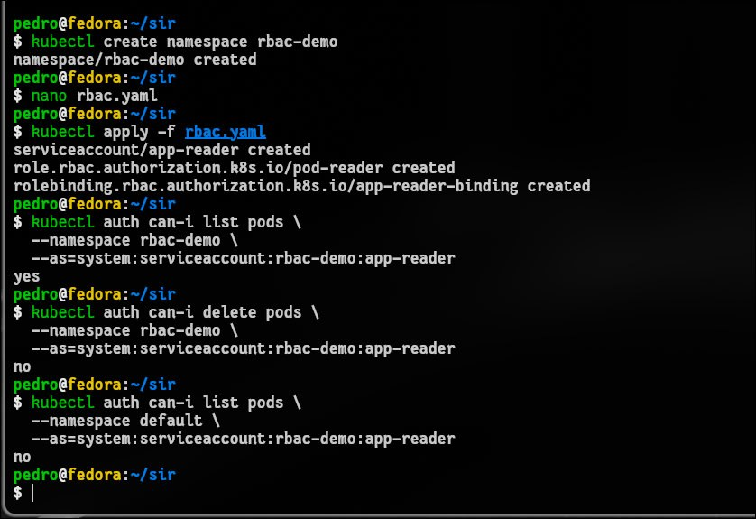

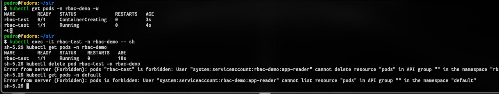

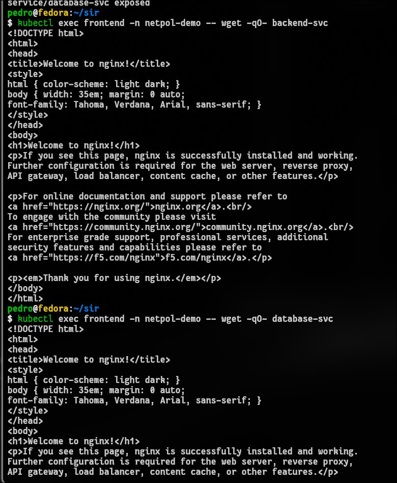

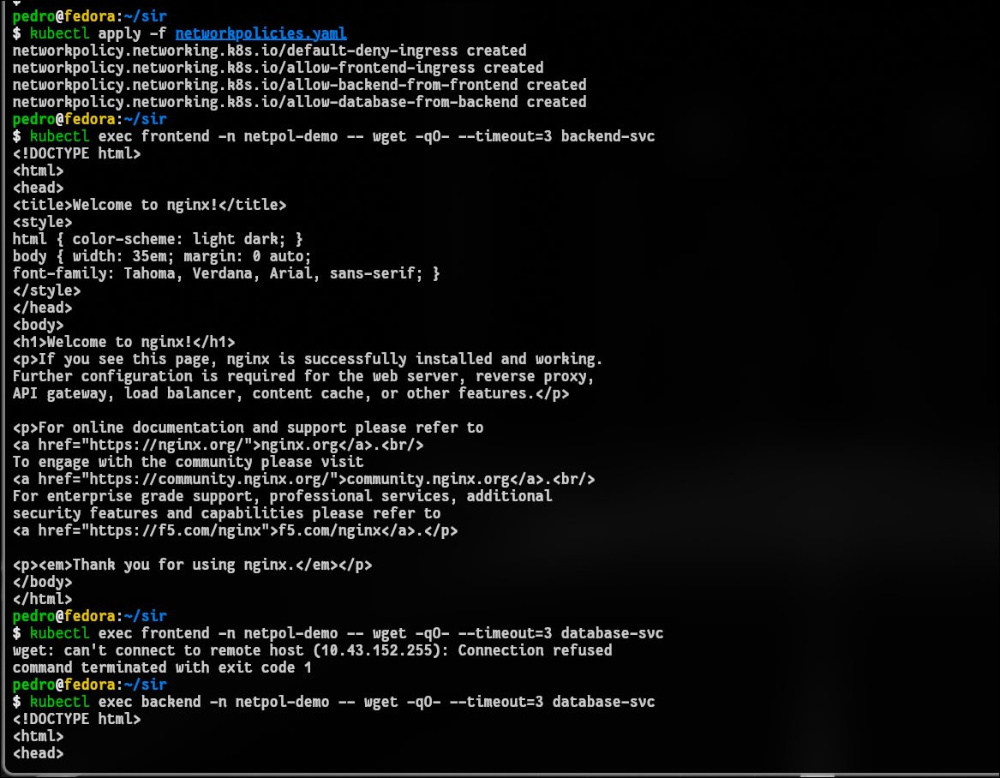

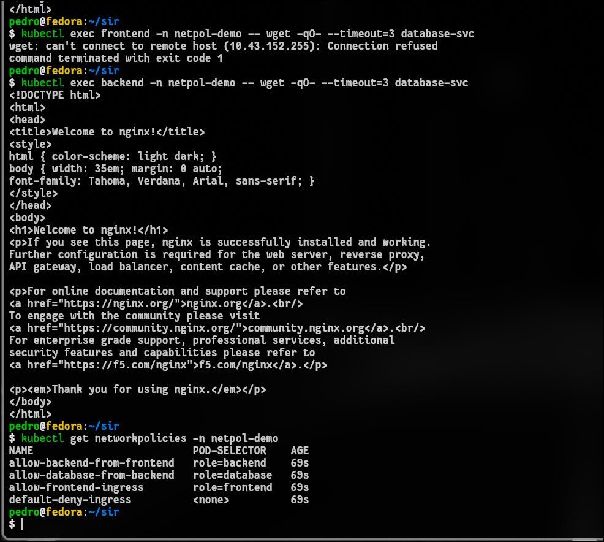

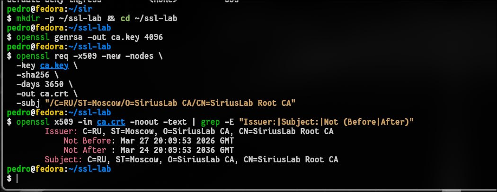

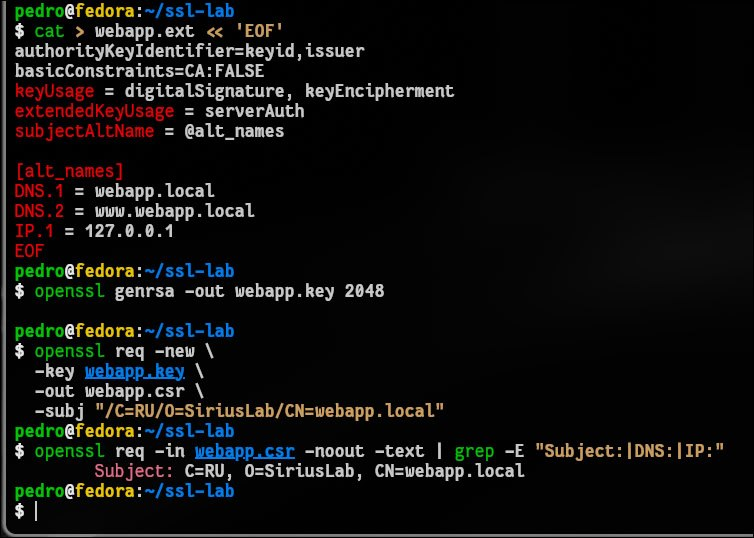

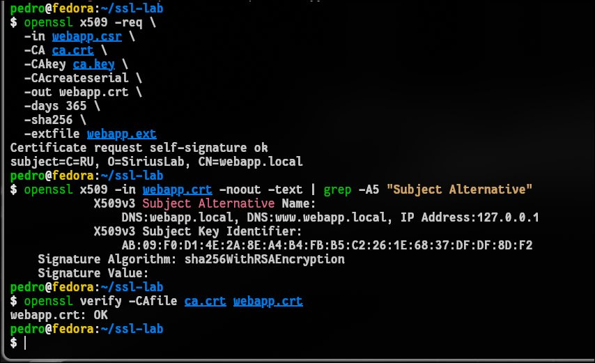

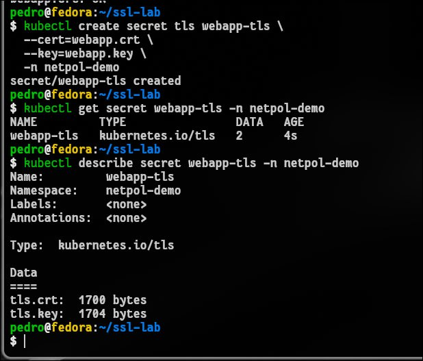

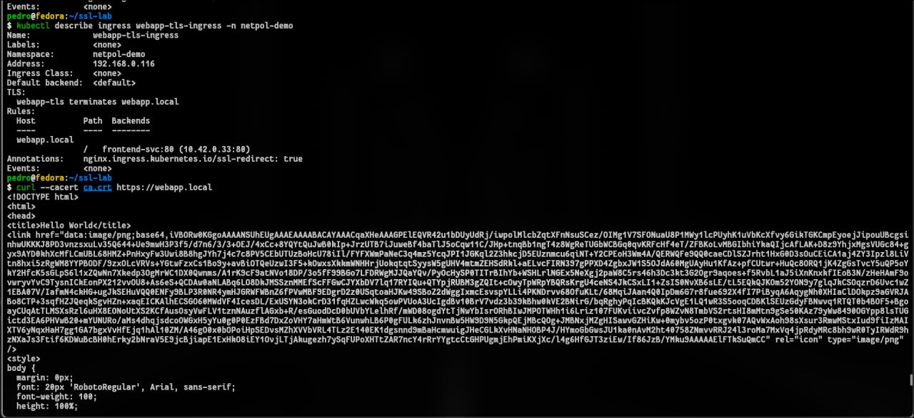

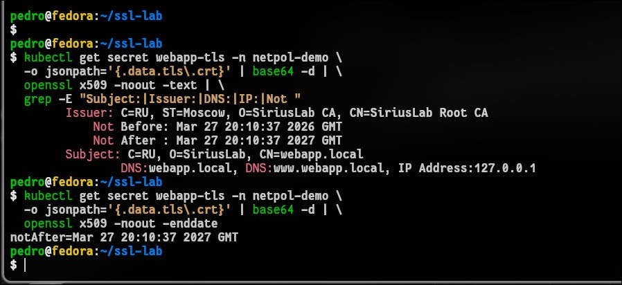