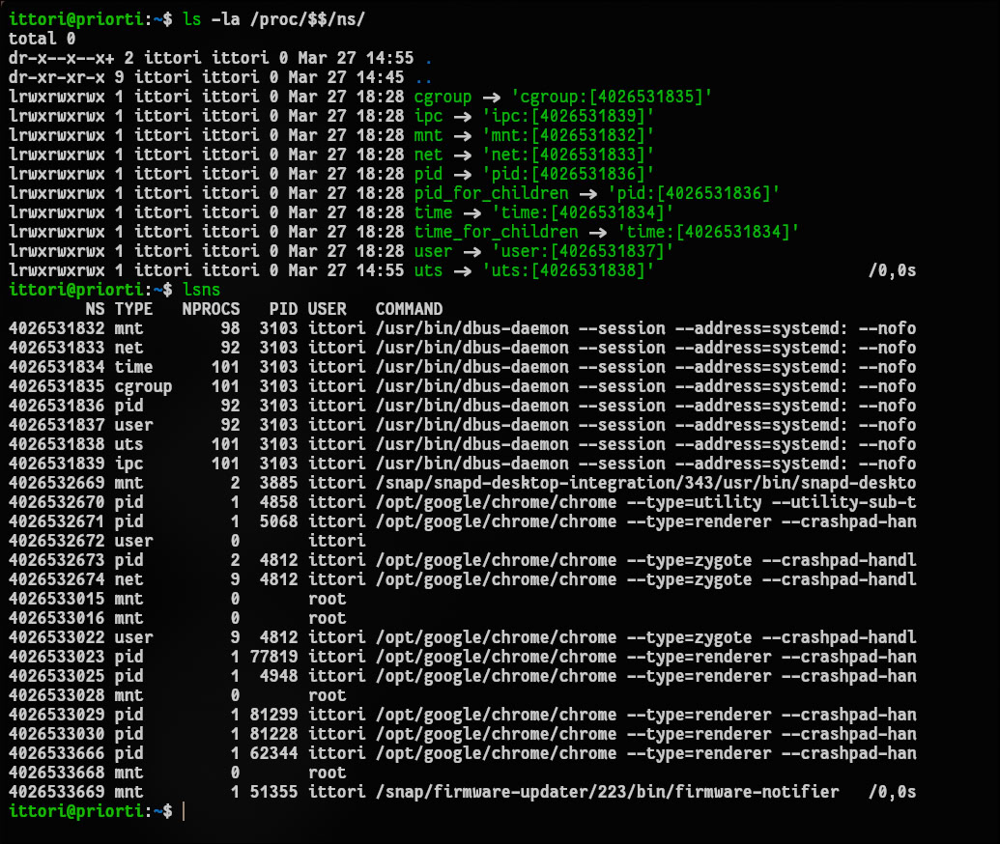
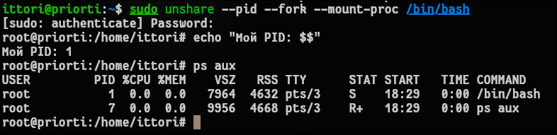
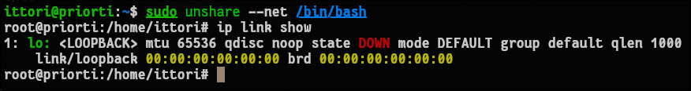
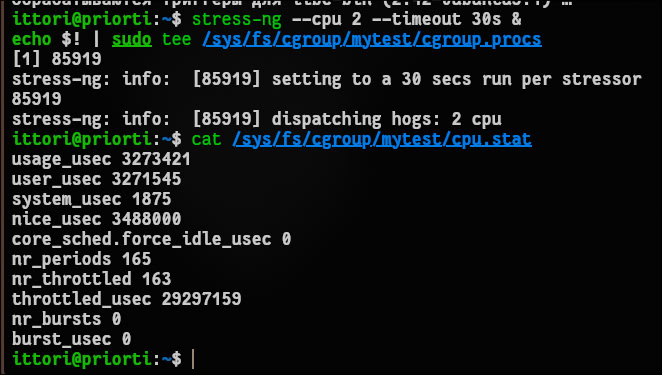
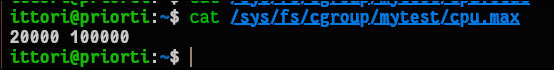

# Отчет по лабораторной работе №1: Основы контейнеризации в Linux

## 1. Чему научился (Результаты работы)
В ходе выполнения лабораторной работы были освоены базовые механизмы изоляции процессов в ОС Linux. 
* Получен практический опыт работы с пространствами имен (**namespaces**), в частности, успешный запуск процессов в изолированных PID и NET пространствах. 
* Изучен механизм контрольных групп (**cgroups v2**). Было успешно настроено ограничение потребления процессорного времени для утилиты `stress-ng` на уровне 20%.

## 2. Возникшие проблемы и способы их решения

* **Проблема с передачей пустого аргумента команде `kill`:** При попытке снять нагрузку и завершить процессы внутри cgroup возникла ошибка отсутствия аргументов (`kill: not enough arguments`). Это произошло из-за того, что процесс `stress-ng` уже завершился по таймауту, файл `cgroup.procs` опустел, и команда `kill` была вызвана без передачи PID.
  **Решение:** Проблема была устранена путем маршрутизации вывода через утилиту `xargs` с флагом `-r` (`xargs -r sudo kill`), что предотвращает запуск команды при пустом стандартном вводе.

* **Отсутствие разделяемых библиотек в `chroot`-окружении:**
  При настройке изолированного корня (`chroot`) базовые утилиты завершались с ошибкой из-за нехватки динамических библиотек (например, `libselinux.so.1` для команды `ls` и `libtinfo.so.6` для `bash`). Кроме того, попытка прямого копирования виртуальной библиотеки ядра `linux-vdso.so.1` приводила к ошибкам.
  **Решение:** Процесс был автоматизирован с помощью скрипта. Использование цикла `for` в связке с утилитами `ldd` и `awk` позволило отфильтровать виртуальные зависимости и точно скопировать все реальные разделяемые библиотеки бинарных файлов напрямую в `rootfs`.

## 3. Ответы на контрольные вопросы

**Вопрос 1: Чем namespace отличается от cgroup?**
* **Namespaces (пространства имен)** ограничивают *видимость*. Они изолируют системные ресурсы так, что процесс "думает", что он находится в системе один (например, видит только свой собственный PID=1 или имеет полностью изолированный сетевой стек).
* **Cgroups (контрольные группы)** ограничивают *потребление*. Они устанавливают жесткие физические лимиты на использование вычислительных ресурсов (квоты на процессорное время, объем оперативной памяти, пропускную способность ввода-вывода).

**Вопрос 2: Почему после `exit` процессы хоста остались нетронутыми?**
Изолированный PID namespace создает собственное, замкнутое дерево процессов, отделенное от основной системы. Команда `exit` завершает текущий сеанс оболочки и рекурсивно убивает только те дочерние процессы, которые находились внутри этого изолированного «пузыря». Физического доступа к таблице процессов родительского хоста у этого пространства имен нет.

**Вопрос 3: Что произойдет, если превысить лимит памяти?**
Если процесс внутри cgroup попытается выделить больше памяти, чем разрешено установленным лимитом, ядро Linux задействует защитный механизм **OOM-killer** (Out-Of-Memory Killer). Он принудительно завершит (убьет) процесс-нарушитель, чтобы защитить стабильность остальной операционной системы от нехватки ресурсов.

