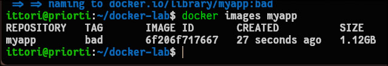
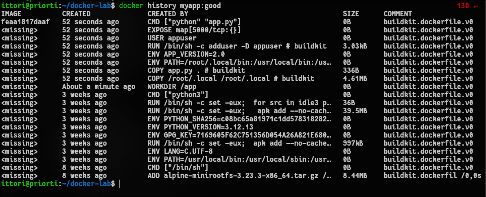
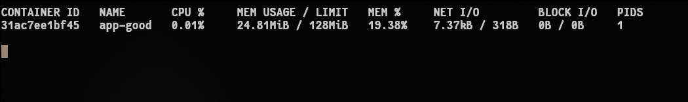
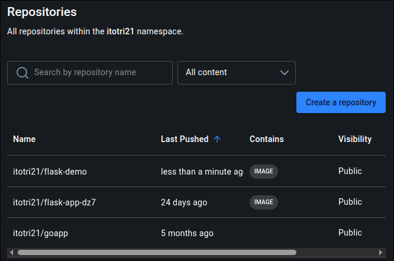

# Отчет по лабораторной работе №2: Docker: образы, Dockerfile, запуск

## 1. Чему научился (Результаты работы)
В ходе выполнения лабораторной работы были освоены принципы создания, оптимизации и публикации Docker-образов. 
* Получен практический опыт написания `Dockerfile` для Python-приложения (Flask).
* Изучена архитектура слоев файловой системы (Union FS) и успешно применен подход многоэтапной сборки (multistage build), что позволило кардинально уменьшить итоговый размер образа.
* Отработан запуск изолированных контейнеров с жесткими ограничениями по ресурсам (CPU и RAM).
* Успешно выполнена публикация собранного и протестированного образа в публичный реестр Docker Hub.

## 2. Возникшие проблемы и способы их решения

* **Проблема с путями и архитектурами при Multistage сборке:** В финальном образе приложение падало с ошибкой `ModuleNotFoundError: No module named 'flask'`. Это произошло по двум причинам. Во-первых, пакеты устанавливались от имени `root` в `/root/.local`, куда у созданного пользователя `appuser` не было прав доступа. Во-вторых, первый этап сборки использовал образ `debian` (с библиотекой `glibc`), а второй — `alpine` (с `musl libc`), что приводило к бинарной несовместимости скомпилированных зависимостей Python.
  **Решение:** Был переписан `Dockerfile`. В качестве базового образа для обоих этапов стал использоваться идентичный `python:3.12-slim`. Проблема с путями была решена путем создания и копирования виртуального окружения Python (`venv`), что является лучшей практикой (best practice) для изоляции библиотек внутри контейнеров.

* **Конфликт имен контейнеров:** При попытке перезапустить контейнер возникла ошибка `Conflict. The container name "/app-good" is already in use`. 
  **Решение:** Старый зависший контейнер был принудительно удален командой `docker rm -f app-good` перед новым запуском.

* **Ошибка доступа (denied) при отправке образа в Docker Hub:** Команда `sudo docker push` завершалась отказом в доступе к ресурсу. 
  **Решение:** Ошибка возникла из-за использования чужого пространства имен в теге образа и отсутствия активной сессии аутентификации под пользователем `root`. Проблема решена выполнением `sudo docker login` и перевешиванием тега (`docker tag`) на корректный личный Docker ID.

## 3. Ответы на контрольные вопросы

**Вопрос 1: Почему базовый образ (`myapp:bad`) такой большой?**
Образ получается огромным (более 1 ГБ), поскольку в качестве базы используется полный образ `python:3.12`, который содержит в себе полноценную операционную систему Debian со множеством предустановленных системных утилит, компиляторов (gcc) и заголовочных файлов, которые абсолютно не нужны для простой работы Flask-приложения в production-среде. Кроме того, сборка в один этап оставляет в итоговом образе все временные файлы, кэши пакетного менеджера `pip` и исходники зависимостей.

