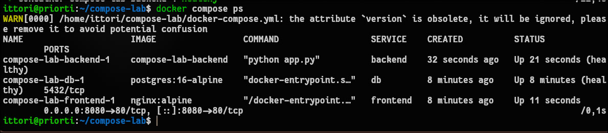
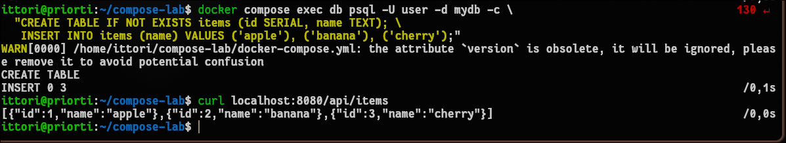
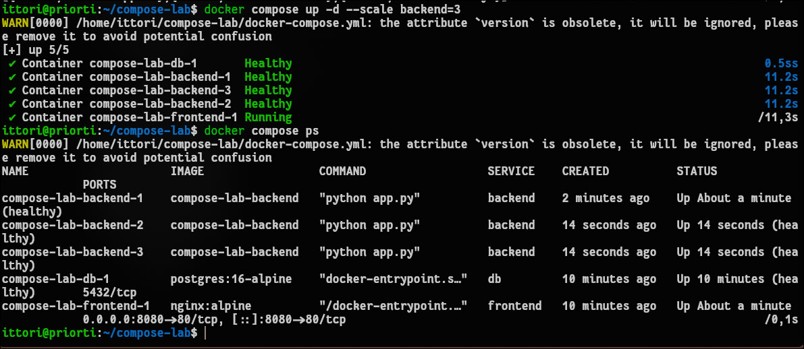

# Отчет по лабораторной работе №3: Docker: сети, volumes, docker-compose

## 1. Чему научился (Результаты работы)
В ходе выполнения лабораторной работы были освоены принципы работы с виртуальными сетями, томами данных и оркестрацией многоконтейнерных приложений с помощью Docker Compose.
* Успешно созданы и протестированы изолированные сети (driver: bridge), проверена работа внутреннего DNS Docker для связи контейнеров по их именам.
* Настроено персистентное хранилище (Volumes) для базы данных PostgreSQL, что гарантировало полную сохранность данных даже после принудительного удаления и пересоздания контейнера СУБД.
* Написан конфигурационный файл `docker-compose.yml` для автоматического развертывания трехуровневого веб-приложения (фронтенд Nginx, бэкенд Flask, база данных PostgreSQL).
* Настроены жесткие зависимости порядка запуска через `depends_on` и проверки жизнеспособности контейнеров (`healthcheck`).
* Отработан механизм горизонтального масштабирования: backend-сервис был успешно расширен до 3 параллельно работающих реплик (`--scale backend=3`).

## 2. Возникшие проблемы и способы их решения

* **Проблема с проверкой жизнеспособности (healthcheck) бэкенда:** Контейнер `backend` успешно запускался, но регулярно проваливал healthcheck с ошибкой `Connection refused`, из-за чего зависимый контейнер `frontend` отказывался стартовать. Утилита `wget` внутри образа Alpine Linux пыталась разрешить адрес `localhost` в IPv6 (`::1`), в то время как Flask-приложение прослушивало только IPv4 интерфейсы.
  **Решение:** В файле `docker-compose.yml` тестовый адрес был изменен с `localhost` на явный `127.0.0.1`. Дополнительно была использована директива `"CMD-SHELL"` для корректной обработки кодов возврата утилиты `wget` оболочкой контейнера.

* **Синтаксическая ошибка YAML при запуске стека:** При попытке поднять проект командой `docker compose up` парсер выдавал ошибку `mapping values are not allowed in this context` с указанием на строку конфигурации healthcheck.
  **Решение:** Ошибка была вызвана нарушением строгой структуры отступов и переносов в формате YAML (параметр `interval: 10s` случайно оказался на одной строке с массивом `test`). Проблема устранена корректным переносом параметров на новые строки с соблюдением двухуровневых пробельных отступов.

## 3. Ответы на контрольные вопросы

**Вопрос 1: В чем разница между сетями bridge, host и overlay?**
* **Bridge (мост):** Сетевой драйвер по умолчанию. Создает изолированную приватную подсеть внутри одного физического хоста. Контейнеры, подключенные к одной bridge-сети, могут безопасно обмениваться трафиком и резолвить друг друга по внутренним DNS-именам, оставаясь недоступными извне (если порты явно не проброшены).
* **Host:** Полностью убирает сетевую изоляцию между контейнером и хост-машиной. Контейнер начинает использовать сетевой стек сервера напрямую (например, порт 80 контейнера физически занимает порт 80 самого сервера-хоста).
* **Overlay (оверлейная сеть):** Распределенная виртуальная сеть, объединяющая несколько физических серверов (Docker-хостов) в единую подсеть. Позволяет контейнерам, физически расположенным на разных машинах, обмениваться зашифрованным трафиком так, как если бы они работали на одном узле (активно применяется в кластерах Docker Swarm).

