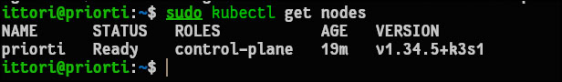
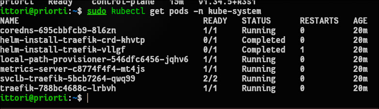
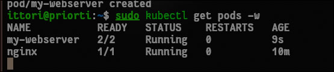
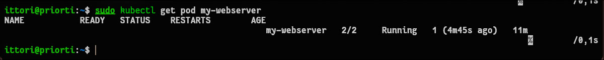

# Отчет по лабораторной работе №4: Kubernetes: установка кластера, первые поды

## 1. Чему научился (Результаты работы)
В ходе выполнения лабораторной работы были освоены базовые принципы работы с оркестратором Kubernetes и его основными объектами.
* Проведено исследование состояния кластера: проверены статусы узлов (`nodes`) и изучены системные компоненты Control Plane (`kube-system`).
* Отработан императивный запуск пода (Nginx) с последующим подключением внутрь контейнера через `exec` для исследования пространств имен (hostname, переменные окружения K8s, сеть).
* Успешно создан многоконтейнерный Pod (веб-сервер и sidecar-контейнер для логов) с использованием декларативного подхода через YAML-манифест, в котором были заданы лимиты ресурсов (requests/limits) и пробы жизнеспособности (liveness/readiness probes).
* На практике проверен механизм самовосстановления (self-healing) Kubernetes: после принудительного завершения процесса контейнера зафиксировано автоматическое увеличение счетчика `RESTARTS`.

## 2. Возникшие проблемы и способы их решения

* **Проблема с отсутствием манифестов Control Plane:** При выполнении команды просмотра статических подов `ls /etc/kubernetes/manifests/` система выдала ошибку отсутствия директории. Также наблюдались конфликты при попытке запуска `minikube`.
  **Решение:** Анализ показал, что на сервере уже развернут и успешно функционирует легковесный кластер `K3s`. Архитектурная особенность K3s заключается в том, что компоненты Control Plane скомпилированы в единый бинарный файл (работающий как процесс `systemd`), а не запускаются в виде статических подов, поэтому папка `manifests` не используется. Лабораторная работа была успешно продолжена на базе кластера K3s.

* **Запрет на отправку сигнала завершения (kill 1):** При попытке выполнить команду `kubectl exec my-webserver -c nginx -- kill 1` для тестирования самовосстановления была получена ошибка `Permission denied`. 
  **Решение:** Ошибка связана с современными механизмами безопасности среды выполнения контейнеров (`containerd`), которые блокируют прямую отправку сигналов завершения главному процессу (PID 1) из второстепенных терминалов. Для имитации падения процесс Nginx был жестко завершен со стороны хостовой операционной системы командой `sudo pkill -9 -f "nginx: master process"`, что успешно спровоцировало Kubelet на перезапуск контейнера.

## 3. Ответы на контрольные вопросы

**Вопрос 1: Какие поды в `kube-system` всегда должны быть Running?**
Для обеспечения работоспособности кластера всегда должны работать основные системные компоненты: `kube-apiserver` (точка входа API), `etcd` (база данных состояния), `kube-scheduler` (планировщик) и `kube-controller-manager` (контроллер состояний). Кроме того, обязательны сетевые плагины (например, CoreDNS и Flannel/Traefik), без которых невозможна маршрутизация трафика между подами.

**Вопрос 2: В чем отличие Pod от Container?**
Контейнер — это изолированная среда (со своим процессом, файловой системой и зависимостями), в которой работает конкретное приложение. Pod — это минимальная логическая и развертываемая единица в Kubernetes, которая служит "оберткой" и может объединять в себе один или несколько контейнеров, тесно связанных между собой и разделяющих общее пространство имен сети (IP-адрес) и тома хранения.

**Вопрос 3: Почему Pod не удалился, а перезапустился? Кто за это отвечает?**
За поддержание желаемого состояния отвечает системный агент `kubelet`, работающий на каждом узле. Когда он обнаруживает, что главный процесс контейнера завершился, он сверяется с манифестом. Поскольку стратегия перезапуска пода по умолчанию (`restartPolicy`) установлена в `Always`, `kubelet` не удаляет сам Pod, а автоматически пересоздает упавший контейнер внутри него, увеличивая счетчик рестартов.

