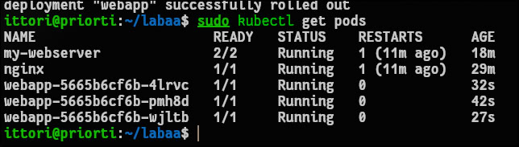
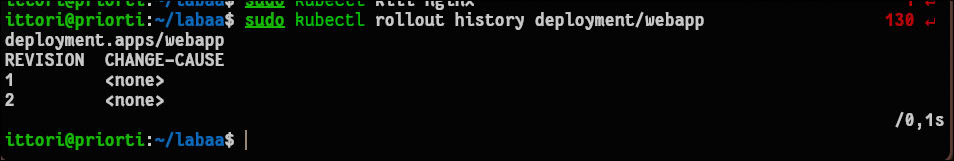
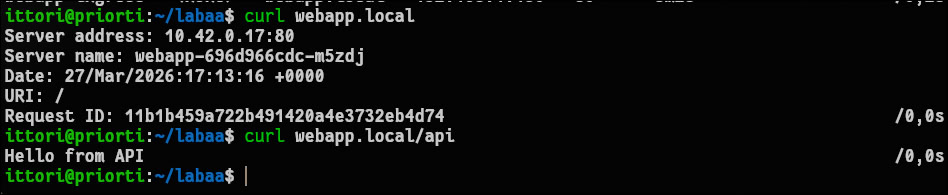

# Отчет по лабораторной работе №5: Kubernetes: Deployment, Service, Ingress

## 1. Чему научился (Результаты работы)
В ходе выполнения лабораторной работы были освоены механизмы развертывания, обновления и сетевой маршрутизации приложений в Kubernetes.
* Успешно создан ресурс `Deployment` для управления множеством реплик (3 пода) веб-приложения.
* На практике отработан механизм бесшовного обновления (Rolling Update) без простоев (без даунтайма) и механизм отката на предыдущую рабочую версию через `rollout undo`.
* Созданы ресурсы `Service` (типов ClusterIP и NodePort) для организации балансировки трафика между подами приложения.
* Настроена L7-маршрутизация с помощью ресурса `Ingress`, обеспечено распределение входящего трафика по путям (маршрутизация `/api` на бэкенд и `/` на фронтенд).

## 2. Возникшие проблемы и способы их решения

* **Ошибка прав доступа к конфигурации кластера:** При попытках применить манифесты (например, `kubectl apply -f deployment.yaml`) возникала ошибка `error loading config file: permission denied` к файлу `/etc/rancher/k3s/k3s.yaml`.
  **Решение:** Ошибка связана с тем, что используется дистрибутив K3s, конфигурация которого хранится в системной директории, недоступной обычному пользователю. Проблема решена добавлением префикса `sudo` перед всеми командами `kubectl` для получения прав суперпользователя.

* **Нерабочий Ingress и ошибка подключения (Failed to connect):** При попытке выполнить `curl webapp.local` соединение сбрасывалось, а колонка `ADDRESS` у Ingress оставалась пустой. Это произошло по двум причинам. Во-первых, команда из методички `echo "$(minikube ip) webapp.local"` записала в `/etc/hosts` неверный IP-адрес `192.168.49.2`, так как утилита `minikube` не управляет текущим кластером. Во-вторых, манифест `ingress.yaml` требовал контроллер Nginx (`ingressClassName: nginx`), тогда как в K3s по умолчанию встроен контроллер Traefik.
  **Решение:** Произведена адаптация окружения. В файле `/etc/hosts` адрес домена был жестко привязан к локальному хосту (`127.0.0.1`). Из файла `ingress.yaml` были удалены спецификации и аннотации, жестко привязанные к Nginx, что позволило встроенному контроллеру Traefik автоматически подхватить и применить правила маршрутизации.

## 3. Ответы на контрольные вопросы

**Вопрос 1: В чем разница между сервисами ClusterIP, NodePort и LoadBalancer?**
* **ClusterIP:** Тип сервиса по умолчанию. Предоставляет доступ к приложению только по внутреннему IP-адресу в пределах самого кластера. Из внешней сети недоступен.
* **NodePort:** Открывает статический порт (обычно в диапазоне 30000–32767) на каждом узле (ноде) кластера. Позволяет обращаться к сервису извне, отправляя запрос на IP-адрес любой ноды и указанный порт.
* **LoadBalancer:** Используется преимущественно в управляемых облачных средах (AWS, GCP, Azure). Автоматически выделяет внешний облачный балансировщик нагрузки, который принимает внешний трафик и перенаправляет его в кластер.

