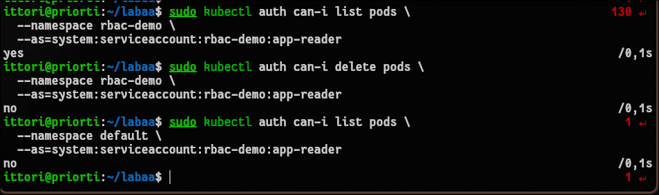
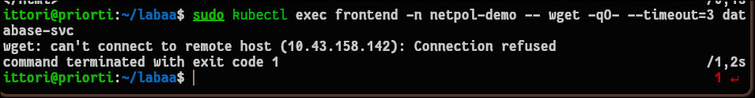
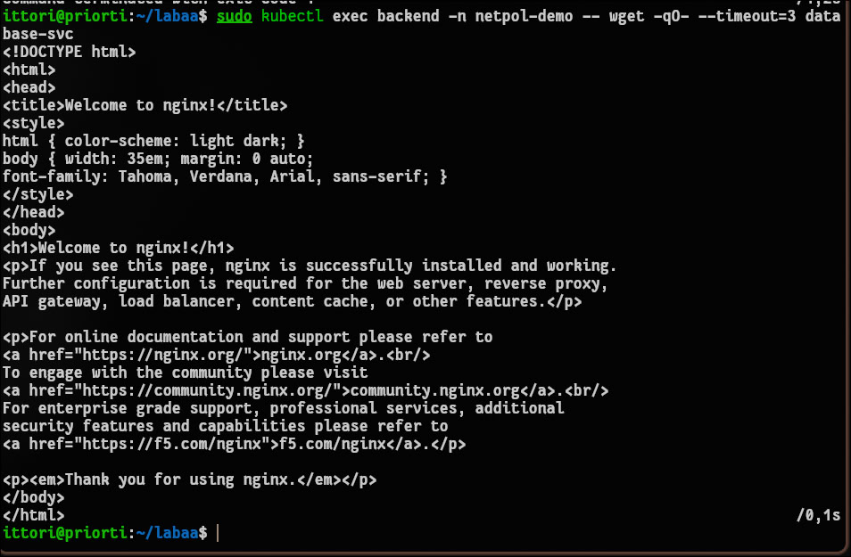
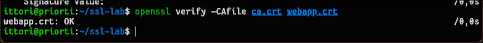
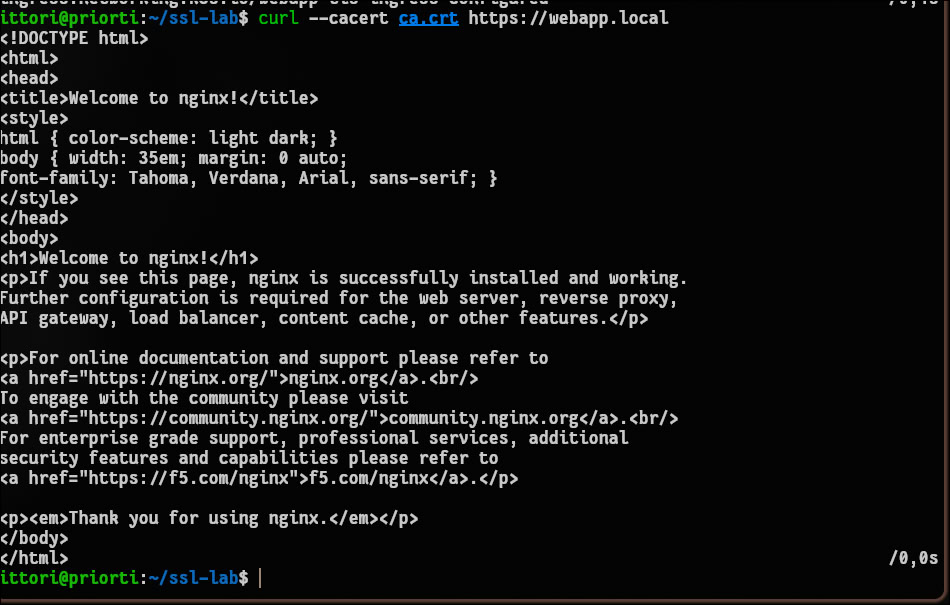

# Отчет по лабораторной работе №7: Безопасность Kubernetes: RBAC, NetworkPolicy, TLS

## 1. Чему научился (Результаты работы)
В ходе выполнения лабораторной работы были освоены базовые механизмы защиты кластера Kubernetes на основе принципа минимальных привилегий (least privilege) и сетевой изоляции.
* Изучена подсистема контроля доступа на основе ролей (RBAC). Успешно созданы объекты `ServiceAccount`, `Role` и `RoleBinding`, ограничивающие права приложения исключительно чтением (`get`, `list`, `watch`) подов в конкретном пространстве имен.
* Механизм ограничения прав проверен на практике встроенной утилитой авторизации `kubectl auth can-i`, которая подтвердила запрет на удаление подов и доступ к другим пространствам имен.
* Настроена сетевая изоляция с помощью `NetworkPolicy`. Реализован подход "запрещено всё, что не разрешено явно" (default-deny-all), после чего точечно разрешен трафик по цепочке: внешний Ingress → Frontend → Backend → Database. Работа политик проверена утилитой `wget`.
* Выполнена полная цепочка генерации SSL/TLS сертификатов с помощью утилиты `openssl`. Создан собственный корневой удостоверяющий центр (CA), сгенерирован запрос на подпись (CSR) и выпущен сертификат для веб-сервера.
* Сертификаты успешно импортированы в кластер как TLS-Secret и подключены к Ingress-контроллеру для обеспечения работы HTTPS-соединения.

## 2. Возникшие проблемы и способы их решения

* **Ошибка скачивания образа (ImagePullBackOff) и недоступность контейнера:** При попытке зайти внутрь тестового пода командой `kubectl exec` возвращалась ошибка `container not found`. Анализ статуса пода показал состояние `ImagePullBackOff` из-за невозможности загрузить образ `bitnami/kubectl:latest` (вероятно, из-за сетевых ограничений или лимитов Docker Hub).
  **Решение:** Был применен обходной маневр. Манифест пода был переписан: в качестве базового образа использован легковесный `alpine`, а бинарный файл `kubectl` скачивался напрямую с официального сервера `dl.k8s.io` с помощью утилиты `wget` прямо при старте контейнера (`command: ["/bin/sh", "-c", ...]`).

* **Ошибка проверки SSL-сертификата (self-signed certificate):** При выполнении команды `curl --cacert ca.crt https://webapp.local` утилита возвращала ошибку доверия сертификату. 
  **Решение:** Проблема имела комплексный характер, связанный с особенностями кластера K3s:
  1. DNS-маршрутизация: в `/etc/hosts` был ошибочно записан IP-адрес от утилиты `minikube` (`192.168.49.2`) вместо локального `127.0.0.1`.
  2. Конфликт Ingress-контроллеров: манифест запрашивал класс `nginx` (`ingressClassName: nginx`), из-за чего встроенный в K3s контроллер Traefik игнорировал переданный TLS-секрет и отдавал свой стандартный дефолтный сертификат, который логично не проходил проверку нашим CA. После удаления Nginx-специфичных строк из YAML-файла и исправления `/etc/hosts` безопасное HTTPS-соединение было успешно установлено.

## 3. Ответы на контрольные вопросы

**Вопрос 1: Как работает проверка прав `kubectl auth can-i`?**
Эта команда позволяет сделать запрос к API-серверу Kubernetes для проверки прав доступа без реального выполнения действия. Использование флага `--as=system:serviceaccount:<namespace>:<name>` позволяет временно имперсонировать (принять роль) указанного сервисного аккаунта и проверить, разрешат ли действующие правила RBAC (Role и RoleBinding) выполнить конкретное действие (например, `delete pods`) в конкретном `namespace`.

**Вопрос 2: Почему фронтенд не смог получить доступ к базе данных после применения политик?**
Потому что в кластере была применена базовая политика `default-deny-ingress`, которая отсекает любой входящий трафик ко всем подам. Доступ к базе данных был явно разрешен отдельной политикой (`allow-database-from-backend`) только для подов, имеющих метку `role: backend`. Так как фронтенд имел метку `role: frontend`, сетевой плагин кластера сбросил его пакеты по таймауту.

