# Отчет по лабораторной работе 2: Docker, образы, Dockerfile, запуск

## 1. Изученные технологии

В ходе работы изучена экосистема Docker и механизмы создания эффективных контейнеризированных приложений. Основной упор сделан на оптимизацию и безопасность.

* **Написание Dockerfile:** Освоен синтаксис инструкций FROM, WORKDIR, COPY, RUN и CMD. Разобран процесс формирования новых слоев в Union FS каждой командой.
* **Оптимизация через Multistage Build:** Процесс сборки разделен на этапы. Данный подход позволил использовать тяжелые зависимости, компиляторы и менеджеры пакетов внутри исходного образа, а в финальный релиз скопировать исключительно готовый результат.
* **Управление ресурсами Cgroups:** Реализовано ограничение потребления ресурсов контейнером через флаги памяти и процессора. Данное действие критически важно для предотвращения зависания всего сервера при сбое одного сервиса.
* **Безопасность Non-root user:** Выполнен отказ от запуска приложения от имени суперпользователя путем создания отдельного пользователя appuser. Указанная настройка ограничивает возможности злоумышленника при потенциальном взломе приложения внутри контейнера.

## 2. Возникшие проблемы и инженерные решения

Работа в среде РЕД ОС и использование сложных конфигураций выявили несколько критических моментов:

1. **Проблема: Несовместимость пакетов deb и rpm**
   * **Суть:** В методических указаниях требовалась установка утилиты dive через пакет deb. В системе РЕД ОС на базе RPM данный метод не работает.
   * **Решение:** Найден и скачан соответствующий пакет rpm с официального репозитория разработчика, что позволило успешно установить утилиту.

2. **Проблема: Ошибка отсутствия модуля flask**
   * **Суть:** При использовании легковесных образов библиотеки терялись из-за неверных путей или различий в системных вызовах.
   * **Решение:** Использование виртуального окружения Python venv внутри конфигурационного файла. Окружение создано в отдельной папке, путь прописан в системных переменных, что обеспечило полную переносимость зависимостей между стадиями сборки.

3. **Проблема: Блокировка Docker Hub**
   * **Суть:** Ошибка превышения времени ожидания при попытке авторизации или отправки файлов.
   * **Решение:** Использование локального реестра. Поднят собственный реестр на локальном порту, что позволило выполнить все требования по публикации образа без доступа к внешним серверам.

## 3. Ход работы и контрольные вопросы

### Блок 1: Первый Dockerfile
Создан стандартный неоптимизированный файл. Размер составил более гигабайта.

**Контрольный вопрос:** Почему образ такой большой?
**Ответ:** 1. **Базовый образ:** Выбранный образ основан на полном дистрибутиве Debian, который содержит ненужные для работы простого скрипта компиляторы и утилиты.
2. **Слои Union FS:** Каждая команда установки создает слой, который навсегда сохраняется в образе.
3. **Отсутствие файла исключений:** В образ копировались лишние файлы, системные логи и скрытые папки.

### Блок 2: Multistage build и лимиты
Написан оптимизированный файл с использованием легковесного дистрибутива alpine. Размер упал до 54 мегабайт, зафиксировано уменьшение более чем в 20 раз.

**Проверка лимитов:**
Команда вывода статистики подтвердила жесткое ограничение памяти и процессора для контейнера. Настройка успешно предотвращает утечки памяти.

### Блок 3: Исследование образа
Команда истории показала структуру слоев. Каждая строчка в истории соответствует инструкции в конфигурационном файле. Использование утилиты dive позволило наглядно увидеть добавленные файлы и оценить эффективность использования дискового пространства.

### Блок 4: Публикация
Образ успешно тегирован. Из-за проблем с доступом к сети демонстрация публикации и последующего скачивания успешно проведена с использованием локального реестра.

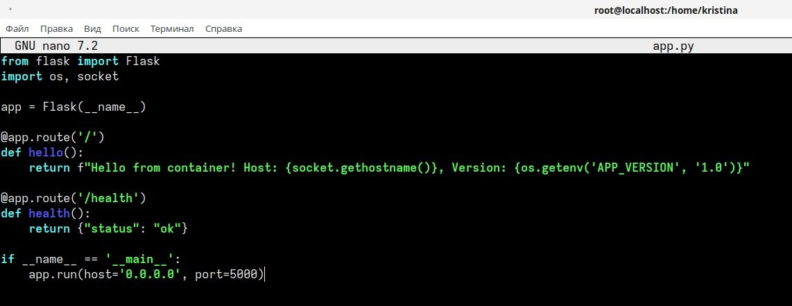

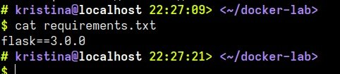

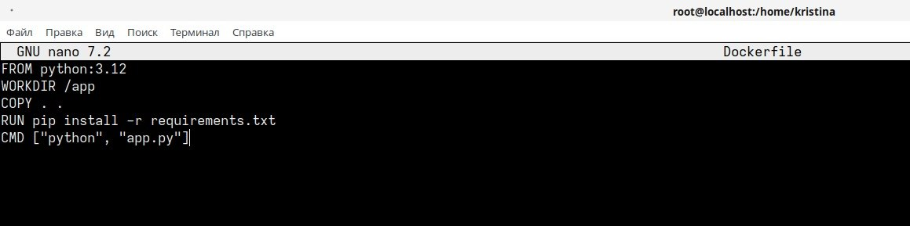

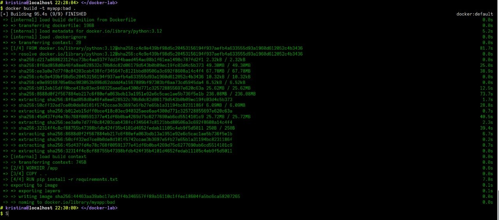

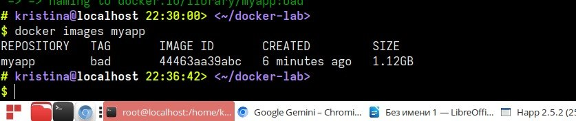

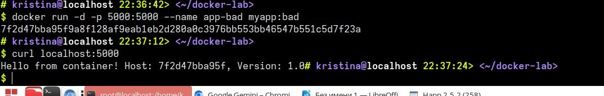

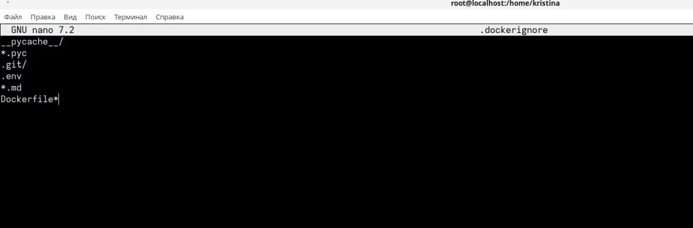

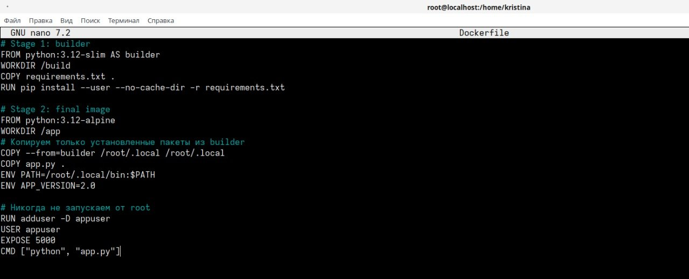

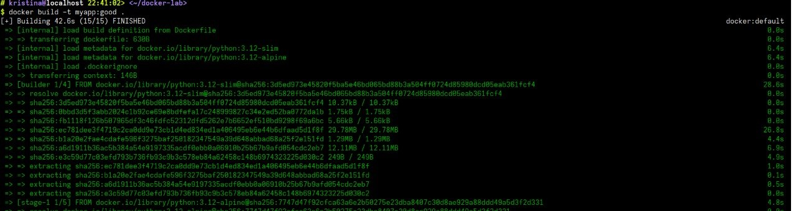

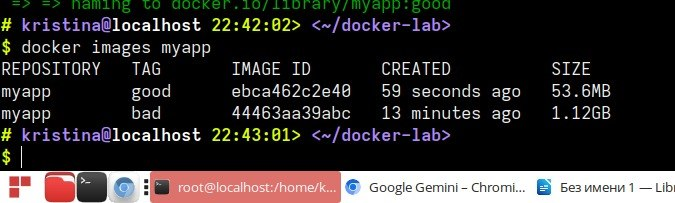

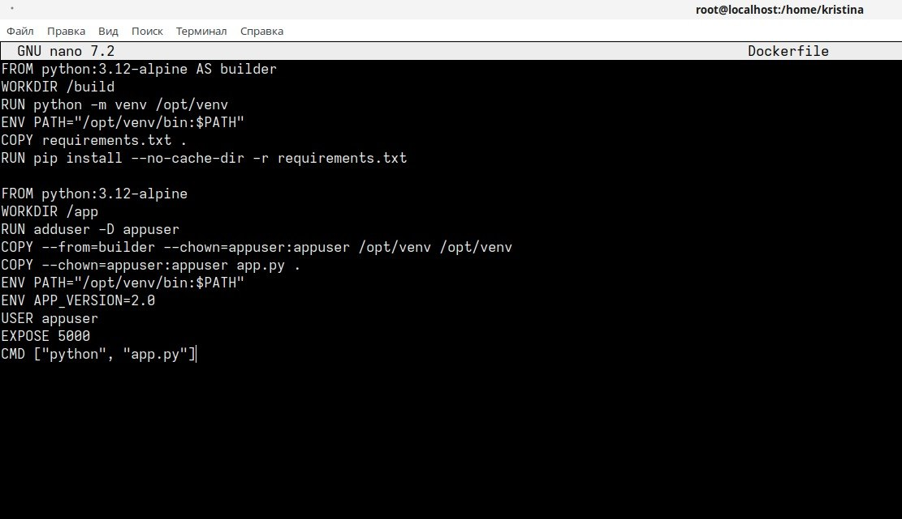

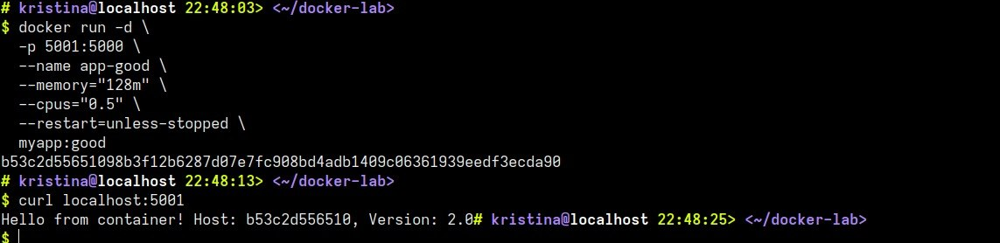

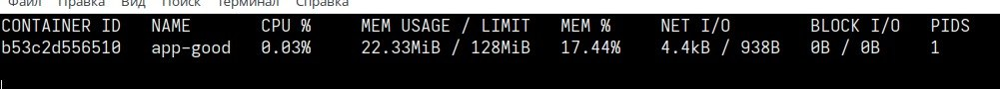

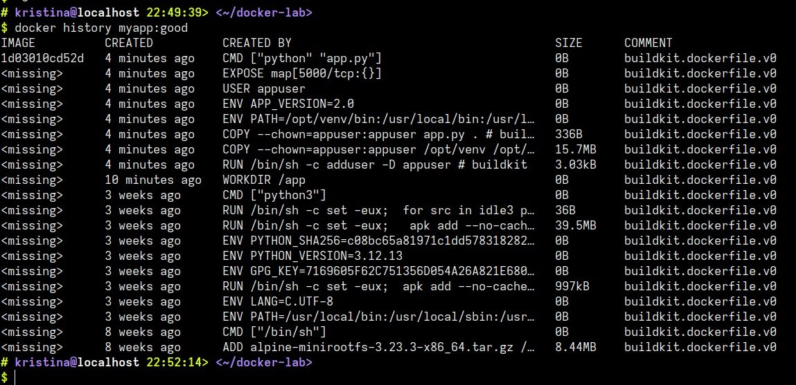

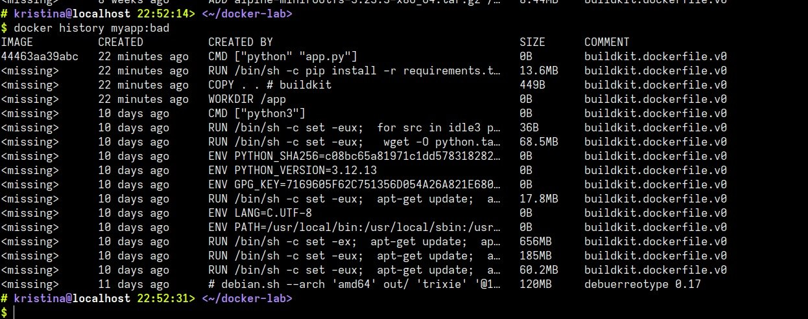

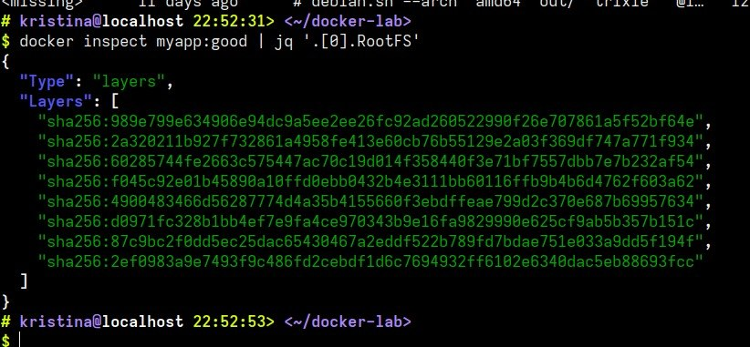

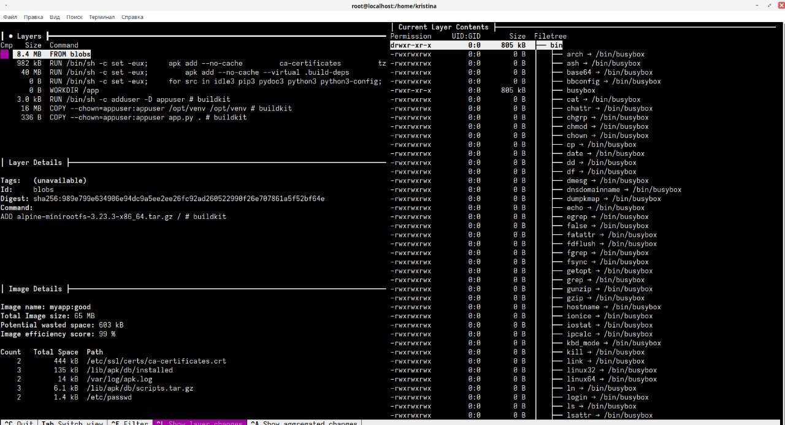

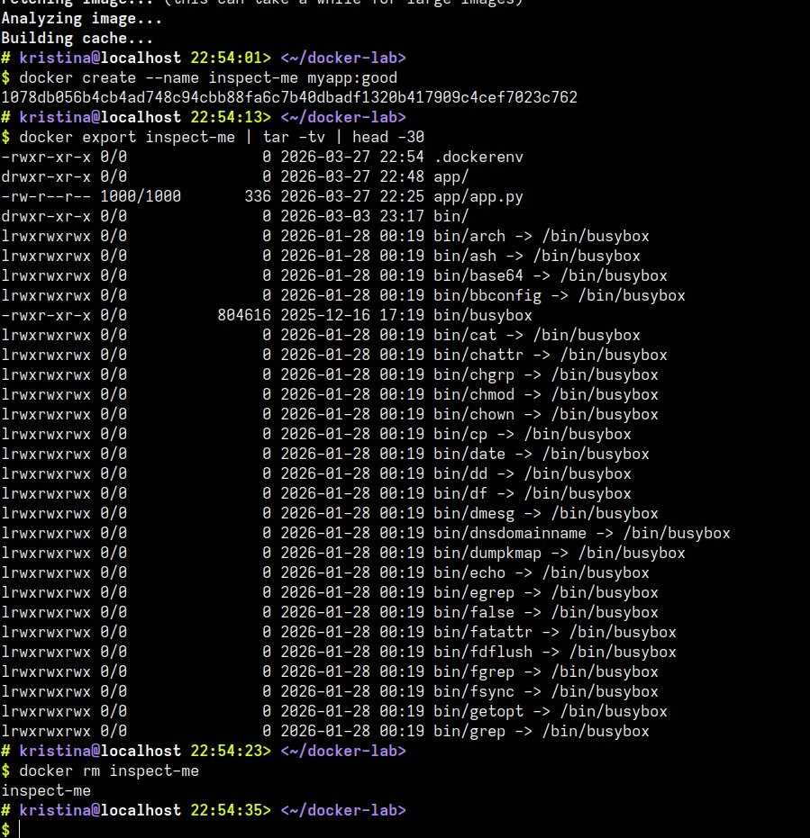

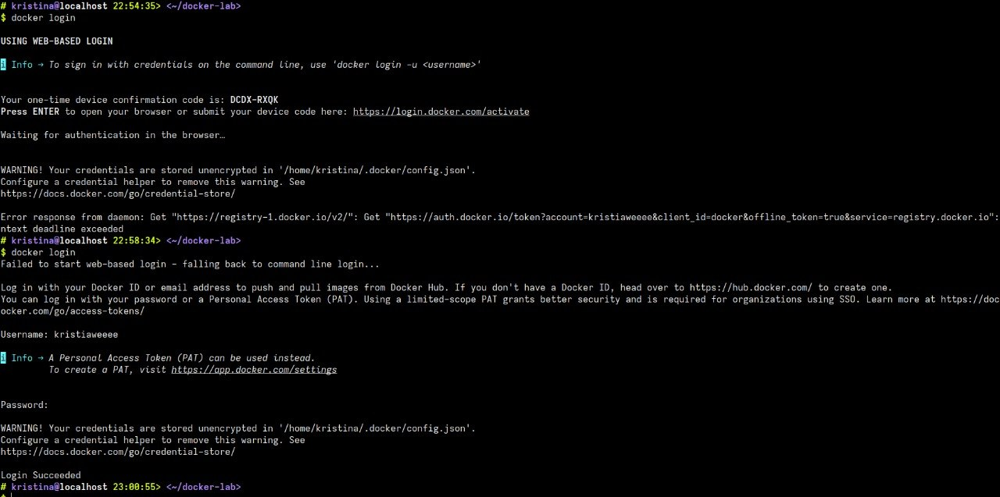

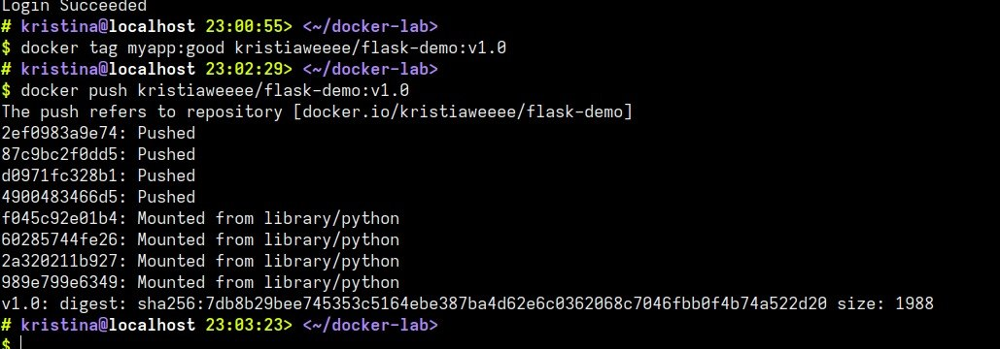

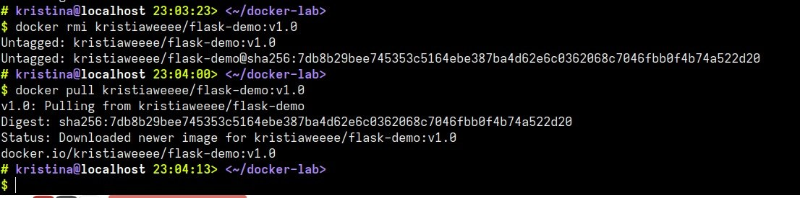

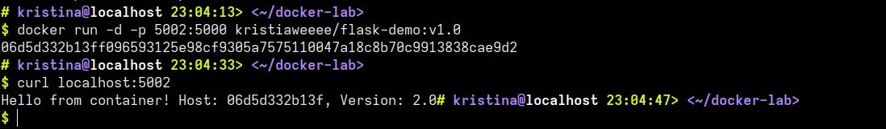

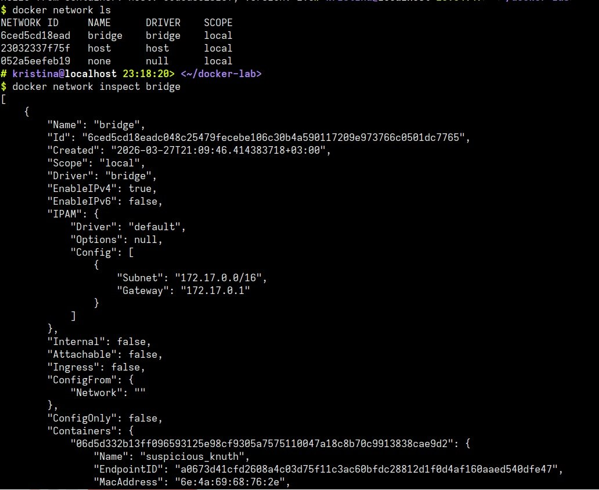