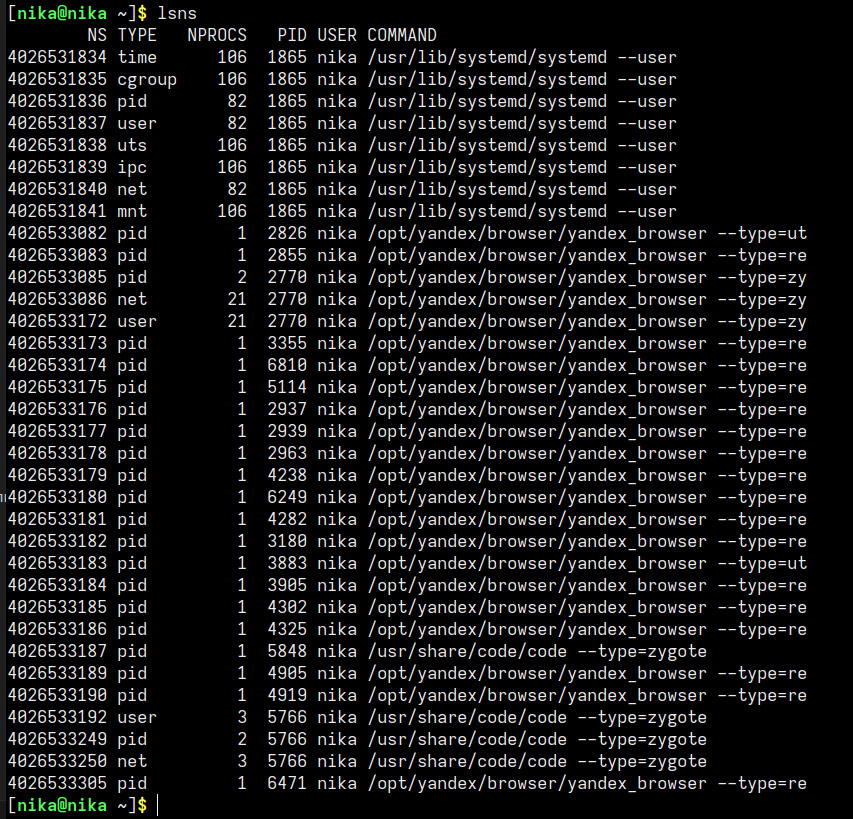
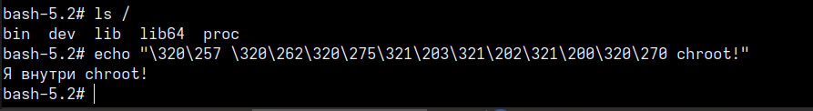

# Отчет по лр "Linux"

## 1. навыки и знания
в ходе выполнения работы я научилась:
- просматривать namespace процессов через '/proc/$$/ns' и команду 'lsns', 
- создавать процессы в изолированных namespace с помощью 'unshare', 
- создавать cgroup  и ограничивать CPU для группы процессов
- мониторить изменения нагрузки через 'top' и проверять лимиты через 'сpu.stat',
- запускать 'chroot' и проверять, что процесс видит только изолированную файловую систему

- 'namespace' - это механизм ядра, который изолирует и виртуализирует ресурсы системы для процессов. например, в новом pid namespace процесс видит себя как pid 1 и не видит процессы хоста 
- 'cgroup' - это механизм ядра для ограничения использования ресурсов хоста для группы процессов. если процесс превышает лимит, ядро может принудительно его завершить
- 'chroot' - смена корневой папки для процесса, ограничивающая его видимость за пределами директории. внутри chroot процесс не имеет доступа к остальной файловой системе хоста

## 2. проблемы и их решения
- при выполнении комадны stress-ng выводилась ошибка 'command not found'. установка команды была произведена 'sudo dnf install stress-ng -y'
- в 'chroot' команда 'ls' выводила ошибку 'no such file or dir'. проблема была решена копированием необходимх библиотек, которые выводятся командой ldd /bin/ls, в каталог 'chroot' в необходимые папки

## 3. ответы на вопросы

**почему после `exit` процессы хоста остались нетронутыми?**
процесс работал в изолированном PID namespace - это отдельное пространство, созданное командой 'unshare'. завершился только сам процессс внутри этого пространства. на хост это никак не повлияло, потому что пространства имет независимы друг от друга

**что произойдёт если лимит памяти превысить?**
ядро линукс вызовет OOM-killer (Out-of-memory killer), который принудительно завершит процесс. это делается для того, чтобы один процесс не мог поломать всю систему, исчерпав глобальную память. остальные процессы не пострадают, если глобальной памяти достаточно

