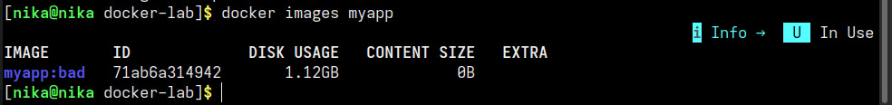
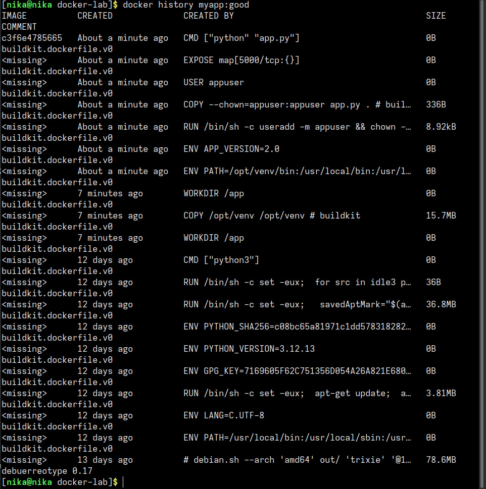
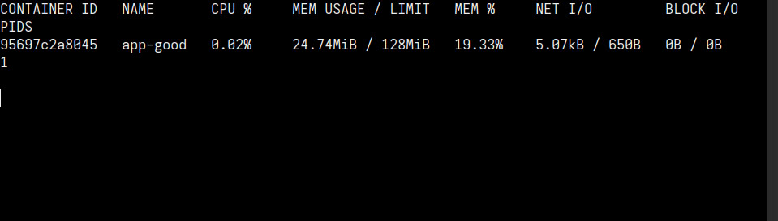

# Оочёт по лр «Docker_run»

## 1. навыки и знания

в ходе выполнения работы я научилась:

- писать Dockerfile для Python-приложения (Flask)
- собирать образы и запускать контейнеры
- использовать multistage build для уменьшения размера образа
- запускать контейнеры с ограничениями по CPU и памяти
- просматривать слои образа через `docker history` и `docker inspect`
- создавать файл `.dockerignore`
- тегировать и публиковать образы на Docker Hub
---
- **Docker-образ** - набор слоёв, каждый из которых - результат выполнения инструкции в Dockerfile
- **Multistage build** - техника, позволяющая разделить сборку и финальный образ: в первом этапе устанавливаются зависимости, во второй копируется только нужное
- **.dockerignore** исключает ненужные файлы из контекста сборки (ускоряет и уменьшает образ)

## 2. проблемы и их решения

- Dockerfile из методички не собрался. в alpine linux отсутствуют некоторые системные библиотеки, необходимые для работы python. также команда 'adduser -D' отличается от стандартной 'useradd'. чтобы решить проблемы я изменила dockerfile: использовала финальный образ на python:alpine, вместо установки в --user создала виртуальное окружение через `python -m venv /opt/venv` и скопировала его, команда создания пользователя `useradd -m appuser`. сборка прошла успешно после изменений

https://hub.docker.com/repository/docker/nikanikanika/flask-demo/general
