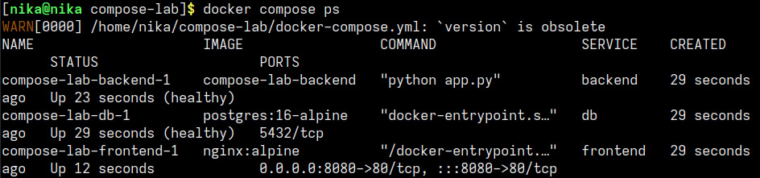
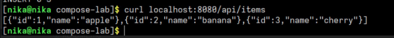
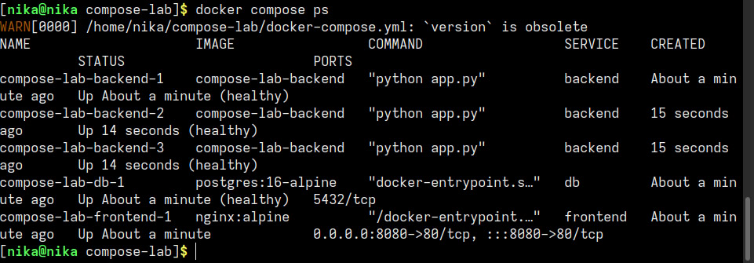

# отчет по лр "Docker_net_vol"

## 1. навыки и знания

В ходе выполнения работы я научилась:

- создавать и управлять bridge-сетями в Docker
- проверять связь между контейнерами через DNS имена внутри сети
- создавать и монтировать volumes для сохранения данных контейнера
- проверять, что данные переживают удаление и пересоздание контейнера
- писать `docker-compose.yml` для многоконтейнерного приложения (nginx + flask + postgres)
- масштабировать сервисы через `docker compose up --scale`
- настраивать healthcheck для сервисов

- **Volume** - механизм хранения данных вне контейнера. данные не теряются при удалении контейнера
- **docker-compose** - инструмент для описания и запуска многоконтейнерных приложений

## 2. проблемы и их решения

- backend не создавался, потому что не проходил проверку healthcheck. в строке `test: ["CMD", "wget", "-qO-", "http://localhost:5000/health"]` система не понимала слово localhost. я заменила localhost на 127.0.0.1, после чего backend успешно прошел проверку healthcheck и весь стек поднялся 

