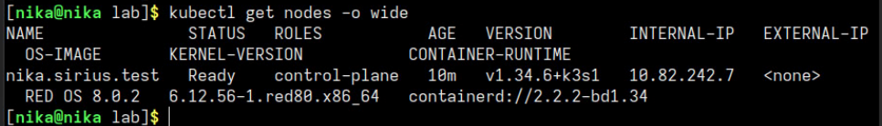
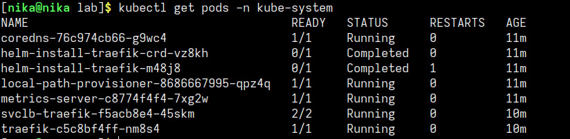
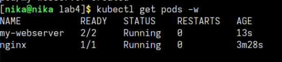
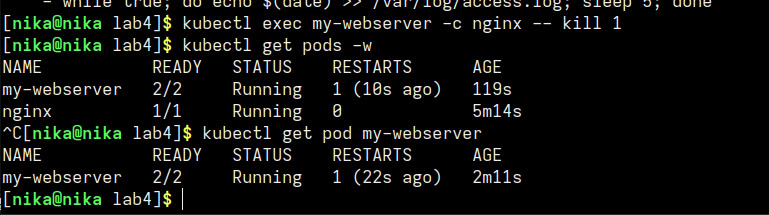

# Отчет по ЛР "kube_init"

## 1. навыки и знания

В ходе выполнения работы я научилась:

- проверять состояние кластера через `kubectl get nodes` и `kubectl get pods -n kube-system`
- настраивать доступ к кластеру через kubeconfig файл
- запускать поды императивно через `kubectl run`
- заходить внутрь пода через `kubectl exec -it`
- смотреть логи контейнеров через `kubectl logs`
- создавать поды через YAML-манифесты
- описывать под с несколькими контейнерами (nginx + sidecar)
- использовать probes (livenessProbe и readinessProbe) для проверки здоровья
- наблюдать самовосстановление подов после убийства процесса
- просматривать системные поды control plane

- **Pod** — минимальная единица в Kubernetes, которая содержит один или несколько контейнеров. контейнеры внутри одного пода разделяют network namespace и volumes
- **kube-system** — namespace, где живут системные поды control plane
- **ReadinessProbe** — проверяет, готов ли контейнер принимать трафик. если нет — его исключают из service
- **kubelet** — агент на каждой ноде, отвечает за запуск и перезапуск подов

## 2. проблемы и их решения

- При первой попытке использовать `kubectl` возникла ошибка `permission denied` при чтении файла `/etc/rancher/k3s/k3s.yaml`. Это произошло потому, что файл конфигурации был доступен только для root
я скопировала конфиг в домашнюю директорию и выставила правильные права:
```bash
mkdir -p ~/.kube
sudo cp /etc/rancher/k3s/k3s.yaml ~/.kube/config
sudo chown $(whoami):$(whoami) ~/.kube/config
export KUBECONFIG=~/.kube/config
```
После этого kubectl заработал корректно

## 3. ответы на вопросы

**Какие поды в `kube-system` всегда должны быть Running??**
в кластере k3s всегда running должны быть поды coredns, traefik (если используется ingress), local-path-provisioner, metrics-server

**Почему Pod не удалился, а перезапустился? Кто за это отвечает?**

за перезапуск отвечает kubelet — агент на каждой ноде. Когда процесс падает, kubelet видит, что контейнер не отвечает, и перезапускает его согласно политике restartPolicy (по умолчанию — Always). Pod как объект остается на месте, меняется только статус контейнера и увеличивается счетчик RESTARTS









