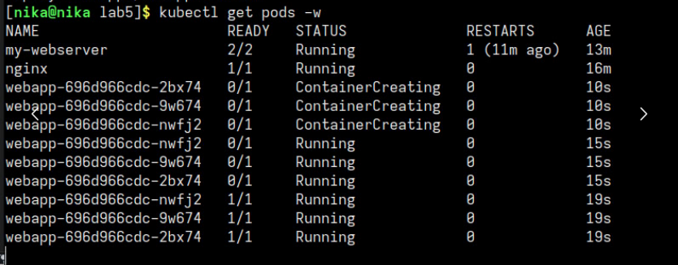
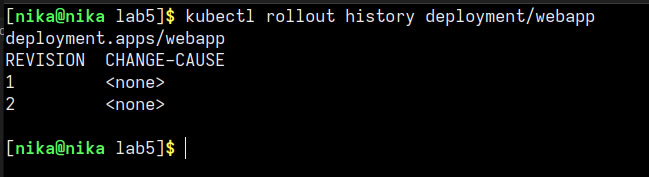
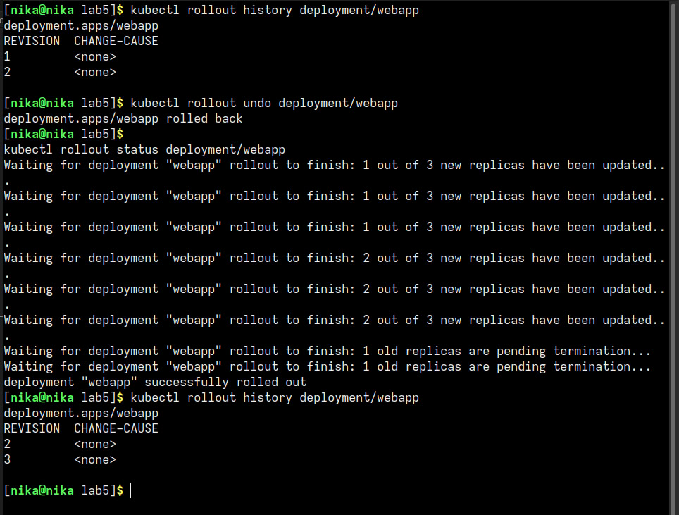
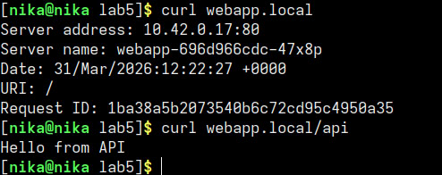

# отчет по лр "kub_deploy"

## 1. Навыки и знания

В ходе выполнения работы я научилась:

- создавать Deployment с несколькими репликами
- делать rolling update без даунтайма
- откатываться на предыдущую версию через `rollout undo`
- создавать Service типов ClusterIP и NodePort
- настраивать Ingress с правилами маршрутизации по пути
- проверять распределение трафика между подами
- просматривать историю деплойментов и ReplicaSet

- **Deployment** — управляет ReplicaSet и подами, обеспечивает декларативные обновления и откаты
- **RollingUpdate** — стратегия обновления, при которой старые поды заменяются новыми постепенно
- **Ingress** — проксирует внешний трафик внутрь кластера по правилам маршрутизации
- **ReplicaSet** — контроллер, поддерживающий нужное количество реплик подов

## 2. проблемы и их решения

- из-за того, что я использовала **k3s** вместо minikube, в k3s используется **Traefik** в качестве Ingress Controller, а не nginx. в файле `ingress.yaml` стандартная строка `ingressClassName: nginx` не работала, ее необходимо поменять на `ingressClassName: traefik`
- команда echo "$(minikube ip) webapp.local" | sudo tee -a /etc/hosts из методички не подошла, так как она для minikube. Для k3s я использовала команду, которая автоматически получает IP ноды и добавляет запись в /etc/hosts:
echo "$(kubectl get nodes -o jsonpath='{.items[0].status.addresses[?(@.type=="InternalIP")].address}') webapp.local" | sudo tee -a /etc/hosts

что делает эта команда:
- kubectl get nodes -o jsonpath='{...}' - получает информацию о нодах кластера в формате jsonpath
- {.items[0].status.addresses[?(@.type=="InternalIP")].address} - извлекает внутренний IP адрес первой ноды (где type равен InternalIP)
- echo "$(...) webapp.local" - формирует строку вида 10.82.242.7 webapp.local
- sudo tee -a /etc/hosts - добавляет эту строку в конец файла /etc/hosts (с правами root)

## 3. ответы на вопросы

**в чём разница ClusterIP и NodePort**
clusterIP - это доступ к сервису внутри кластера. используется для внутренней коммуникации между подами
NodePort - открывает порт на каждой ноде кластера (30000-32767). доступ снаружи осуществляется через IP_ноды:порт

