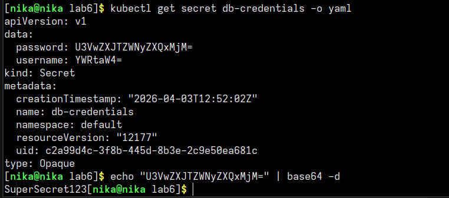
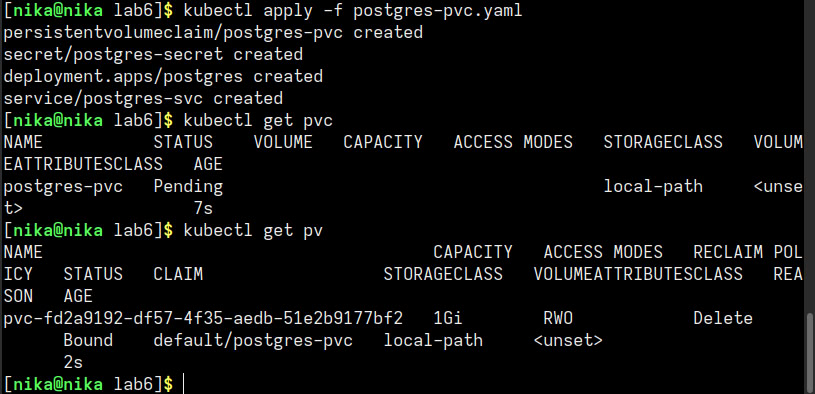
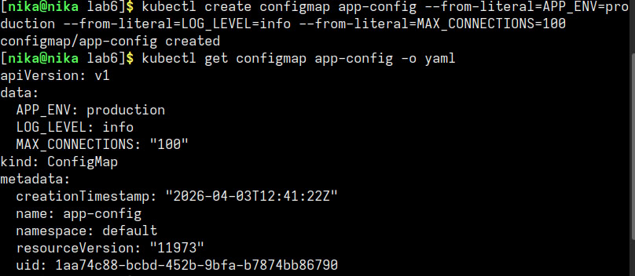
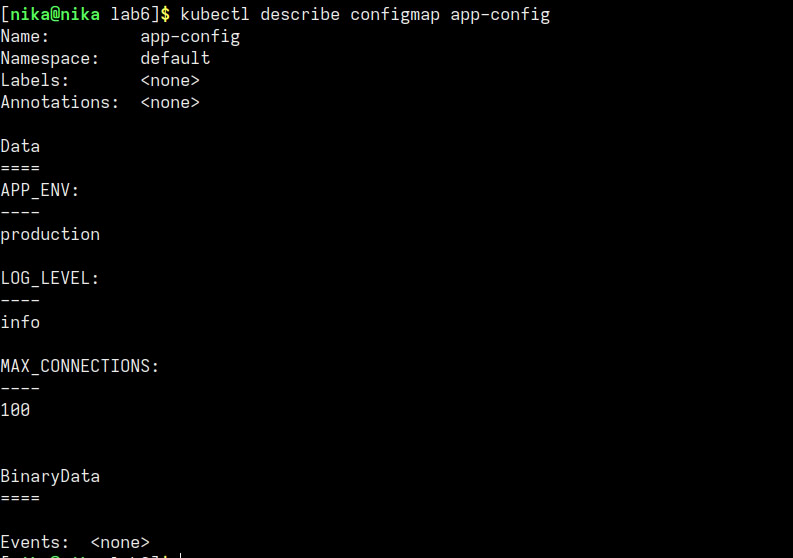
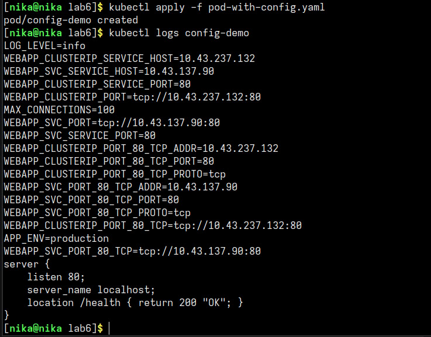

# отчет по лр "kub_config"

## 1. навыки и знания

в ходе выполнения работы я научилась:
- создавать ConfigMap
- передавать ConfigMap в под как переменные окружения (через `envFrom` и `env`)
- монтировать ConfigMap как файл в под
- создавать PersistentVolumeClaim для постоянного хранения данных
- поднимать PostgreSQL с PVC и проверять сохранность данных после удаления пода
---
- **ConfigMap** — объект Kubernetes для хранения несекретных конфигурационных данных в виде пар ключ-значение
- **Secret** — похож на ConfigMap, но предназначен для хранения чувствительных данных. по умолчанию данные только закодированы в base64 (НЕ зашифрованы)

## 2. проблемы и их решения

- в методичке указан storageClassName: standard, что используется для minikube. в k3s он называется local-path. При использовании standard PVC оставался в статусе Pending, потому что в k3s нет такого storage class. я заменила в манифесте storageClassName: standard на storageClassName: local-path

---

