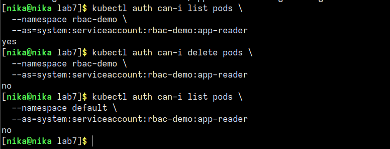
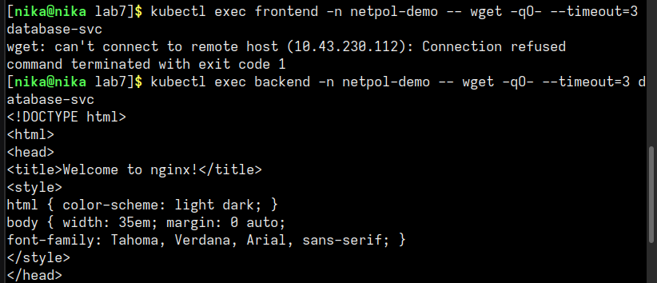
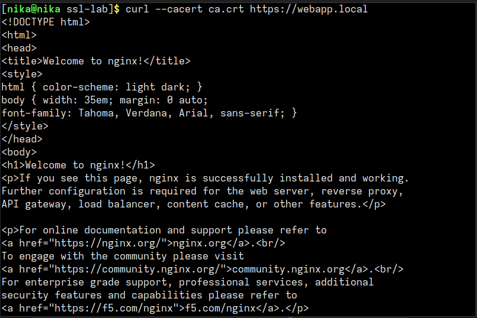
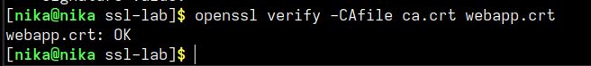

# отчет по лр "kub_security"

## 1. навыки и знания

в ходе выполнения работы я научилась:
- создавать ServiceAccount с ограниченными правами
- настраивать Role и RoleBinding для разграничения доступа
- проверять права через `kubectl auth can-i`
- создавать NetworkPolicy для изоляции трафика между подами
- реализовывать принцип минимальных привилегий в сети (frontend - backend - database)
- генерировать собственный CA и подписывать TLS сертификаты через OpenSSL
- создавать TLS Secret в Kubernetes для Ingress
- подключать самоподписанные сертификаты к Ingress

- **RBAC (Role-Based Access Control)** - система контроля доступа на основе ролей. определяет, кто (ServiceAccount) и что может делать (verbs) с какими ресурсами
- **Role** - набор правил внутри одного namespace
- **RoleBinding** - привязывает Role к ServiceAccount/User/Group
- **NetworkPolicy** - правила firewall на уровне pods, позволяет/запрещает входящий трафик
- **default-deny-ingress** - политика, запрещающая весь входящий трафик ко всем подам (принцип zero trust)
- **CA (Certificate Authority)** - корневой центр сертификации, выпускает и подписывает сертификаты
- **TLS Secret** - хранит сертификат и приватный ключ для HTTPS

## 2. проблемы и их решения

- в k3s по умолчанию используется Traefik, а не nginx в качестве Ingress Controller. в файле `ingress-tls.yaml` я изменила `ingressClassName: nginx` на `ingressClassName: traefik`

- команда `helm install falco falcosecurity/falco` выдала ошибку `repo falcosecurity not found`, так как репозиторий не был добавлен. я добавила репозиторий через `helm repo add falcosecurity https://falcosecurity.github.io/charts`, затем обновила и установила Falco

