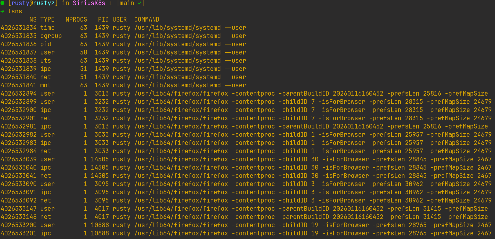
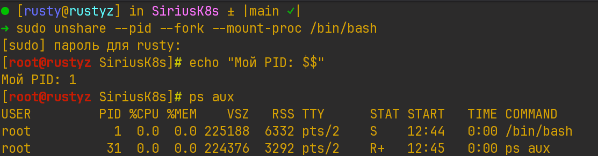
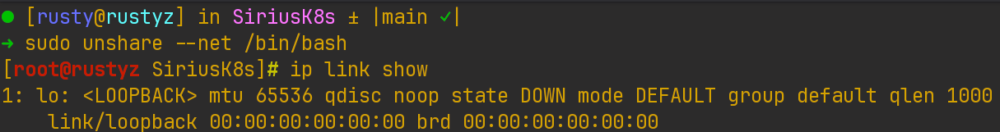
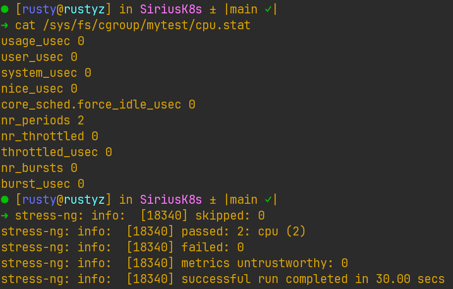
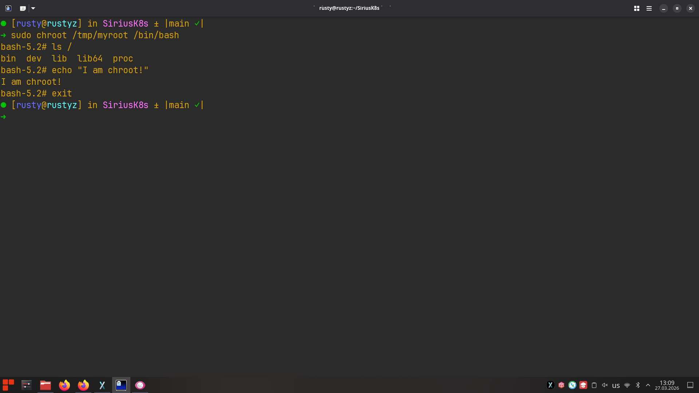

# Основы контейнеризации в Linux

## 1. Чему научился
- **Namespaces:** изолировать процессы через `unshare` (PID, NET). Убедился, что в новом PID namespace процесс становится PID 1, а в NET namespace виден только `lo`.
- **Cgroups:** ограничивать CPU через cgroup v2 (лимит 20%), применять ограничения к процессу `stress-ng`.
- **Файловая система:** понял принцип изоляции через `chroot`.

## 2. Проблемы и их решение
- **Отсутствие `stress-ng`:** установил через `sudo apt install stress-ng -y`.
- **`ps aux` показывал процессы хоста:** добавил флаг `--mount-proc` при создании PID namespace.
- **Проверка лимита CPU:** использовал `top` для мониторинга - утилизация процесса зафиксировалась на 20%.

## 3. Ответы на контрольные вопросы

**1. Почему после exit процессы хоста остались нетронутыми?**  
Процессы изолированы в разных namespaces. При `exit` завершается только процесс внутри созданного namespace, хостовые процессы остаются в родительском namespace и не затрагиваются.

**2. Что произойдёт если лимит памяти превысить?**  
OOM-killer автоматически сработает - ядро принудительно завершит процесс в cgroup, превысивший лимит, чтобы сохранить стабильность системы.

---

## Результаты выполнения команд

| Команда | Результат |
|---------|----------|
| `lsns` | Список всех namespace-ов системы | 

| `echo $$` внутри PID namespace | `1` |

| `ip link` внутри NET namespace | Только `lo` (loopback) |

| `cat /sys/fs/cgroup/mytest/cpu.max` | `20000 100000` (20% CPU) |

| `ls /` внутри chroot | Содержимое изолированного корня |

