# Отчет по практической работе №1: Linux

### 1. Чему научились
В ходе работы я изучила базовые инструменты изоляции ядра Linux: namespaces, cgroups и chroot. Я научилась разделять ресурсы системы и вручную ограничивать процессы, что позволило понять механику работы контейнеров на низком уровне. Сначала я настроила namespaces для изоляции идентификаторов процессов и сети, затем через cgroups установила лимит на использование процессора и в конце подготовила изолированную файловую систему через chroot.

### 2. Проблемы и их решение
При выполнении возникли проблемы с правами доступа при запуске unshare, что исправила использованием sudo. Также в chroot оболочка /bin/bash не запускалась из-за отсутствия библиотек. Я определила нужные файлы через ldd и скопировала их в соответствующие директории внутри своего rootfs, после чего среда заработала.

### 3. Контрольные вопросы и результаты
Контрольные вопросы: 
Про лимит памяти: Если процесс превысит лимит в cgroups, сработает OOM-killer и просто принудительно завершит его, чтобы спасти остальную систему.
Про exit: После выхода процессы хоста не меняются, потому что namespaces меняют только «область видимости» ресурсов для конкретного процесса, не затрагивая ядро и другие задачи.
Практическая работа показала, что технология контейнеризации базируется на совместной работе механизмов namespace, cgroup и chroot, а Docker выступает инструментом для автоматизации этого процесса. 
Результаты: Я на практике проверила изоляцию ресурсов. В новом пространстве имен процесс получил PID 1 и не видел сеть хоста. Лимиты cgroups удержали нагрузку CPU, а chroot ограничил видимость файлов только одной папкой.

### Скрины работы

#### Блок 1: Namespaces (Изоляция)
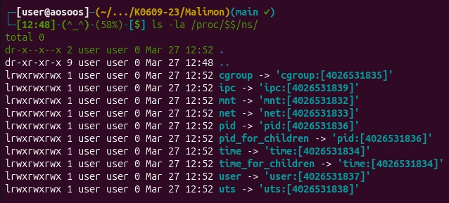

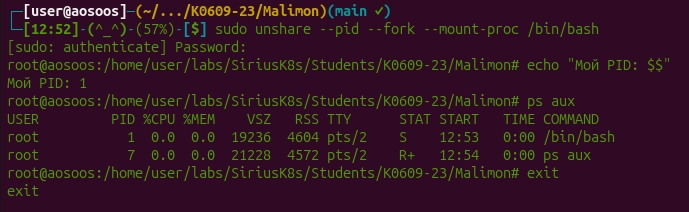

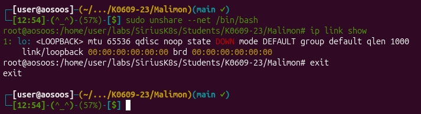

#### Блок 2: cgroups (Ограничение ресурсов)
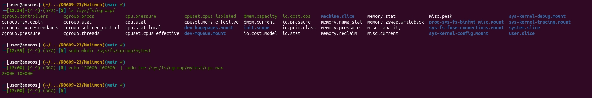

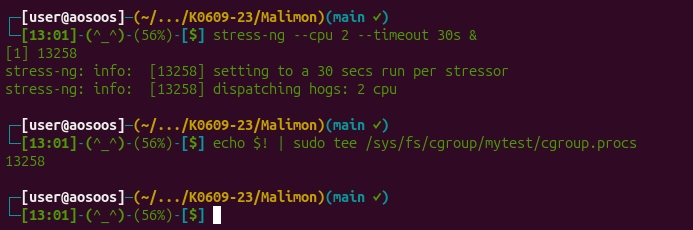

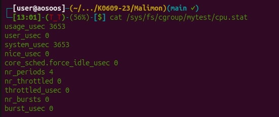

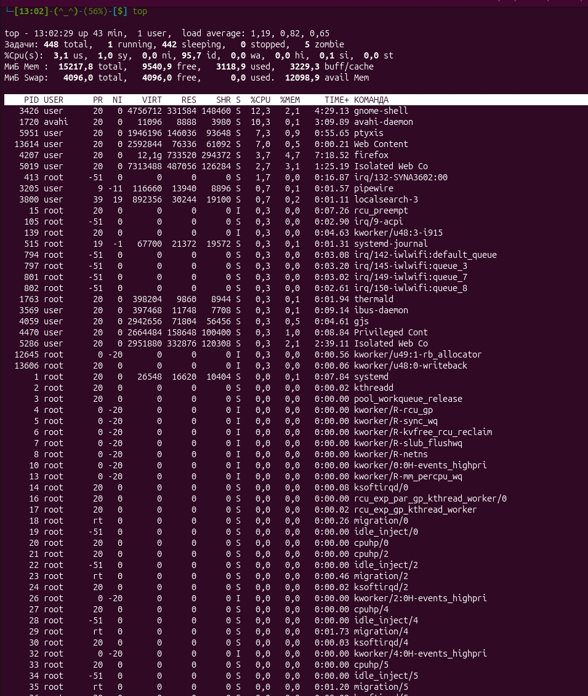

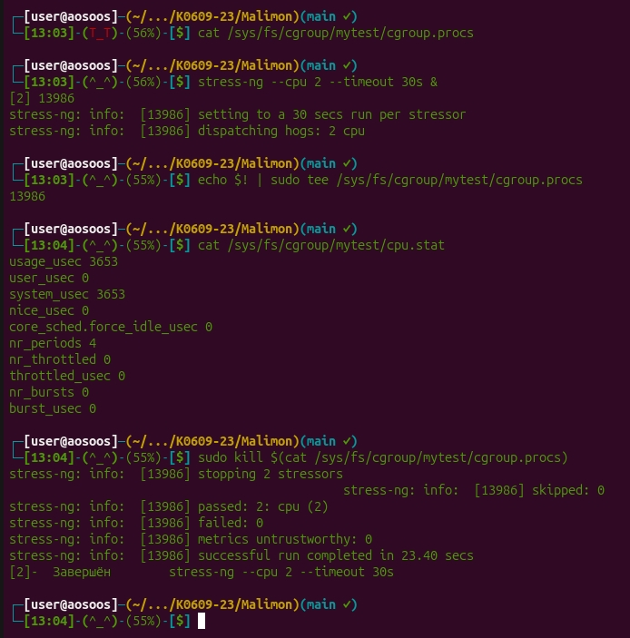

#### Блок 3: chroot (Изоляция файловой системы)
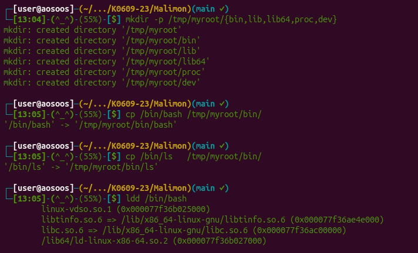

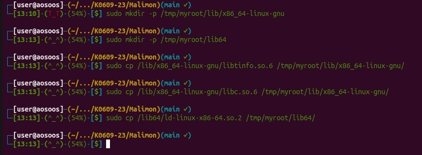

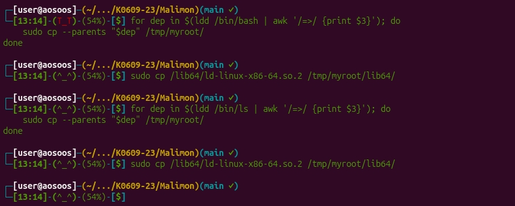

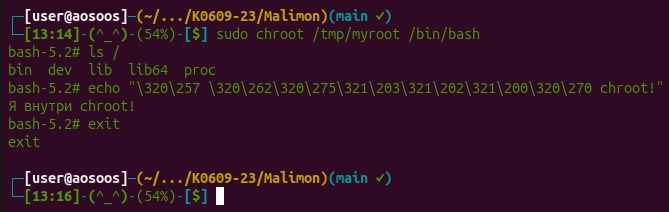