# Отчет по практической работе №2: Docker 

### Чему я научилась
Я научилась собирать Docker-образы и уменьшать их размер с помощью Multistage build, разделяя этапы сборки и запуска. Также я освоила настройку лимитов ресурсов (CPU и RAM), использование .dockerignore для очистки образа от лишних файлов и публикацию готовых контейнеров на Docker Hub. 

### 2. Проблемы и их решение
При сборке возникла ошибка «flask: command not found», которую я исправила через добавление пути к бинарным файлам в переменную PATH. Также столкнулась с занятым портом 5000 на хосте, поэтому перенастроила проброс на 5001. В процессе публикации образа на Docker Hub сначала получила ошибку доступа («denied»), которую решила через предварительную авторизацию командой docker login. 

### 3. Итог
В результате работы я создала оптимизированный Docker-образ Flask-приложения, вес которого удалось снизить с 1.6 ГБ до 81 МБ. Контейнер успешно запущен с жесткими лимитами ресурсов, а готовый образ опубликован в Docker Hub и проверен на работоспособность после скачивания из облака.

### 4. Ответы на контрольные вопросы
**Вопрос:** Почему первый (bad) образ получился таким большим?
**Ответ:** Основная причина в использовании полного базового образа `python:3.12`, который основан на полноценном дистрибутиве Debian. Он содержит лишние системные утилиты, компиляторы и кэши менеджеров пакетов, которые не требуются для работы приложения. Также отсутствие `.dockerignore` привело к копированию лишних файлов из локальной директории в контекст сборки.

#### Блок 1: Исходный код и первый Dockerfile
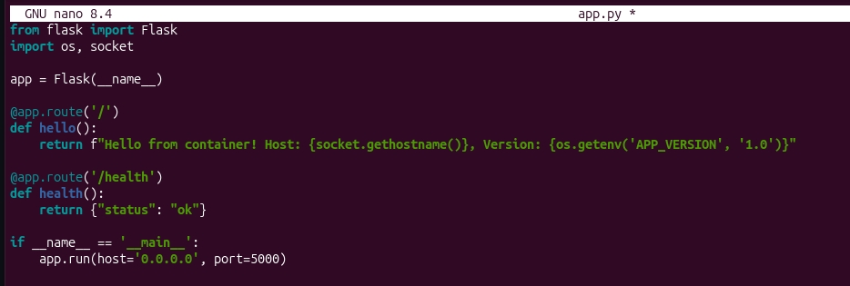

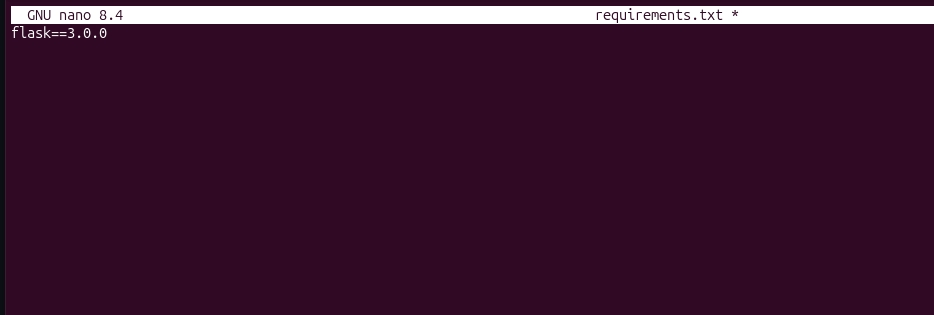

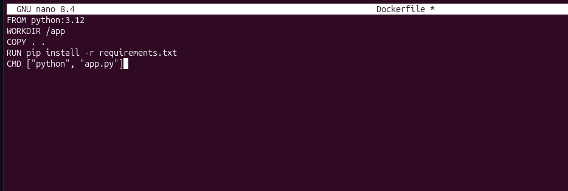

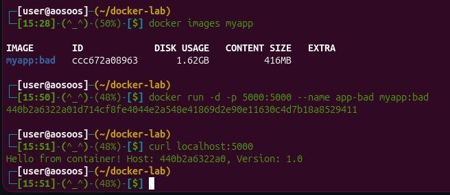

---

#### Блок 2: Оптимизация и Multistage Build
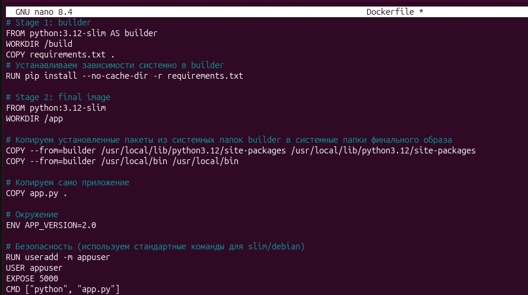

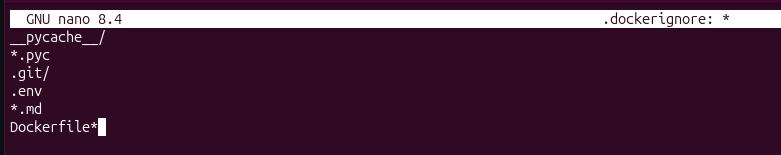

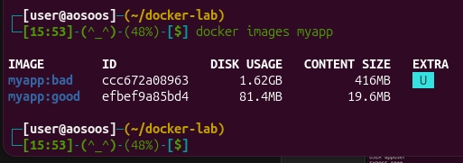

---

#### Блок 3: Лимиты ресурсов и мониторинг
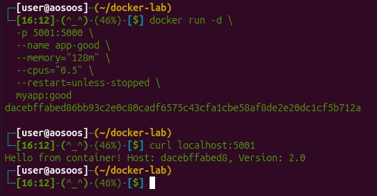

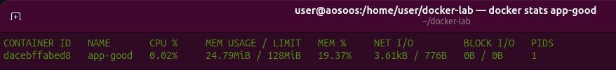

---

#### Блок 4: Исследование архитектуры (Union FS)
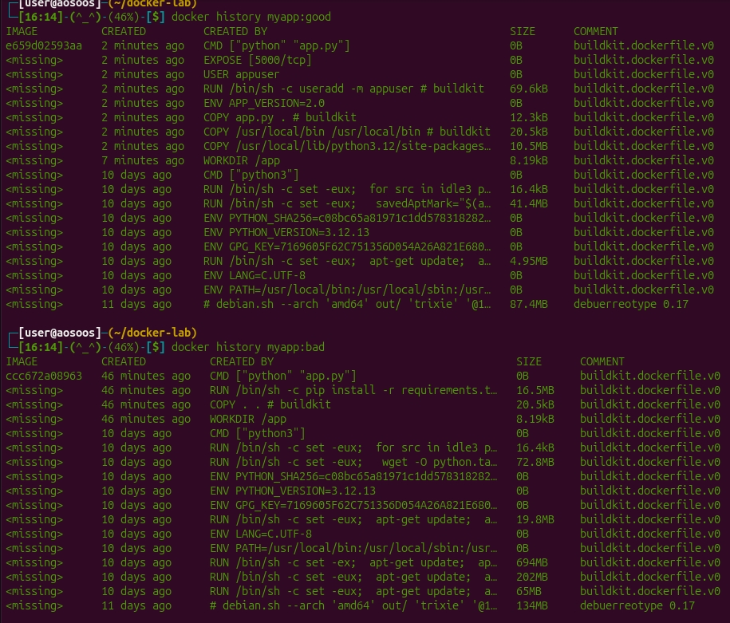

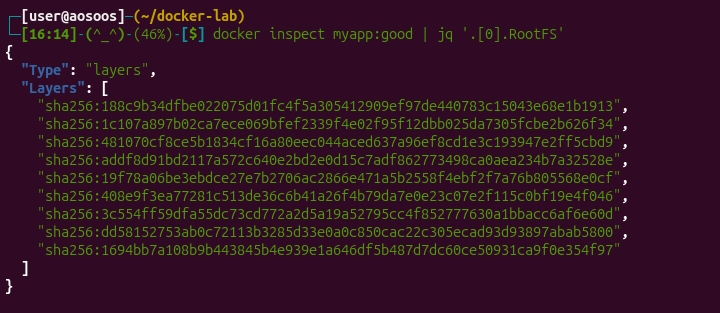

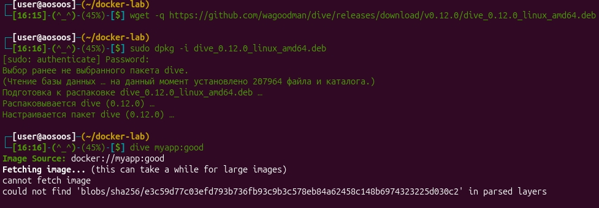

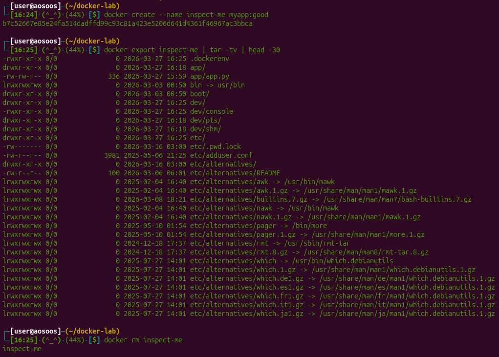

---

#### Блок 5: Публикация в Docker Hub
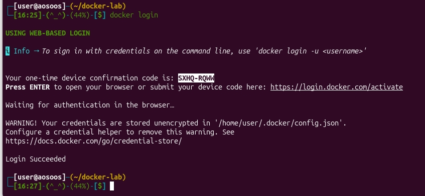

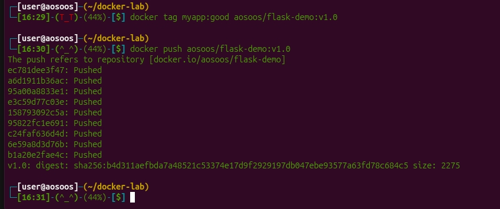

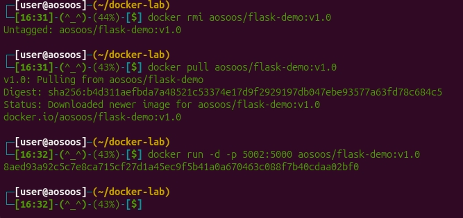