# Отчет по практической работе №3: Docker Compose

### 1. Чему я научилась
Я научилась развертывать стек из нескольких сервисов с помощью Docker Compose, используя одну общую сеть (bridge) для их взаимодействия по именам через внутренний DNS. Также я освоила работу с Volumes для постоянного хранения данных БД вне контейнеров. Дополнительно я отработала настройку зависимостей через depends_on с проверкой готовности (healthcheck) и научилась быстро масштабировать отдельные компоненты системы (backend) через флаг --scale. 

### 2. Проблемы и их решение

В процессе работы я столкнулась с ошибкой 502 Bad Gateway на стороне Nginx. Проблема была в том, что бэкенд не успевал запустить базу данных и падал до начала работы Nginx. Я решила это, добавив в `docker-compose.yml` проверку healthcheck для БД и условие depends_on: service_healthy для бэкенда. 

### Итог
Я успешно развернула стек из Nginx, Flask и PostgreSQL через Docker Compose. Все сервисы работают в единой сети, данные БД сохраняются в Volume, а система поддерживает быстрое масштабирование бэкенда.

#### Блок 1: Docker Networking (Изоляция и DNS)
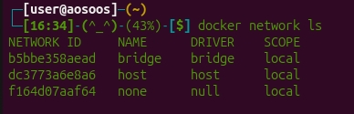

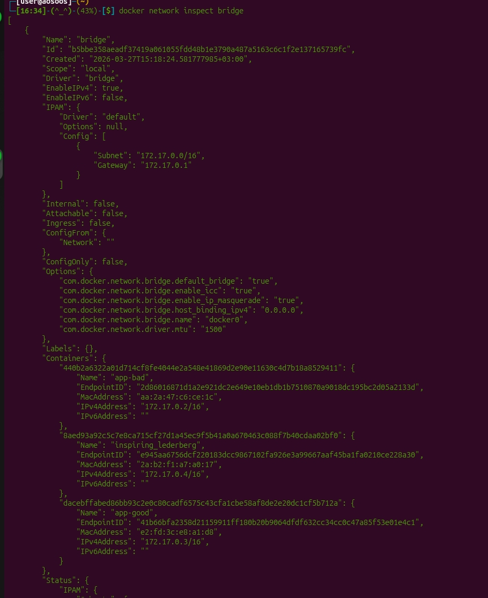

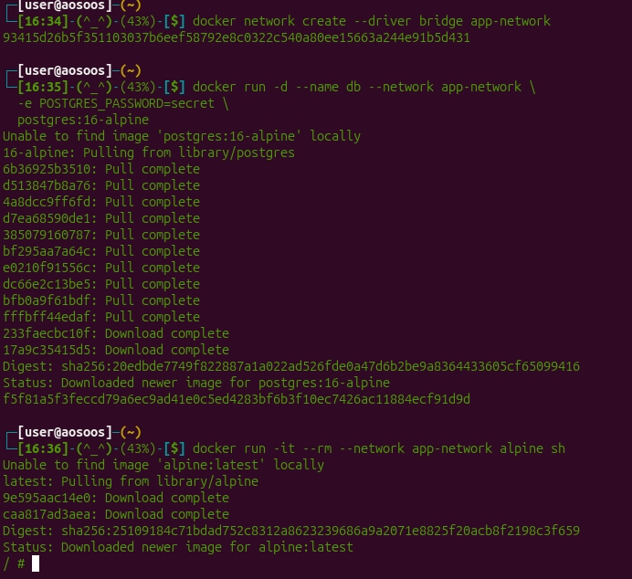

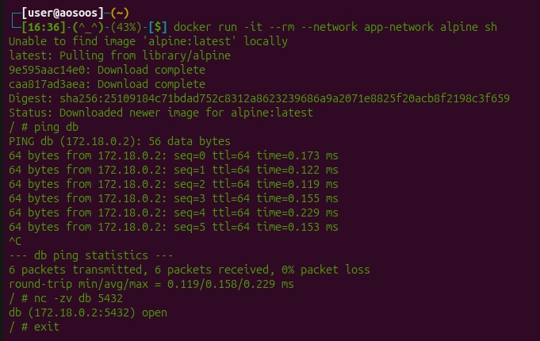

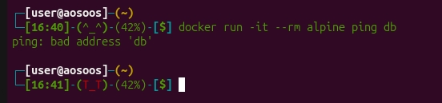

---

#### Блок 2: Volumes (Persistent Data)
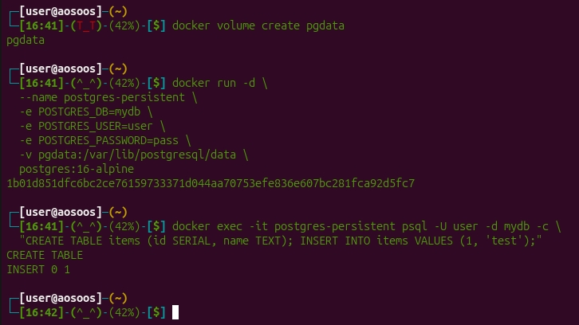

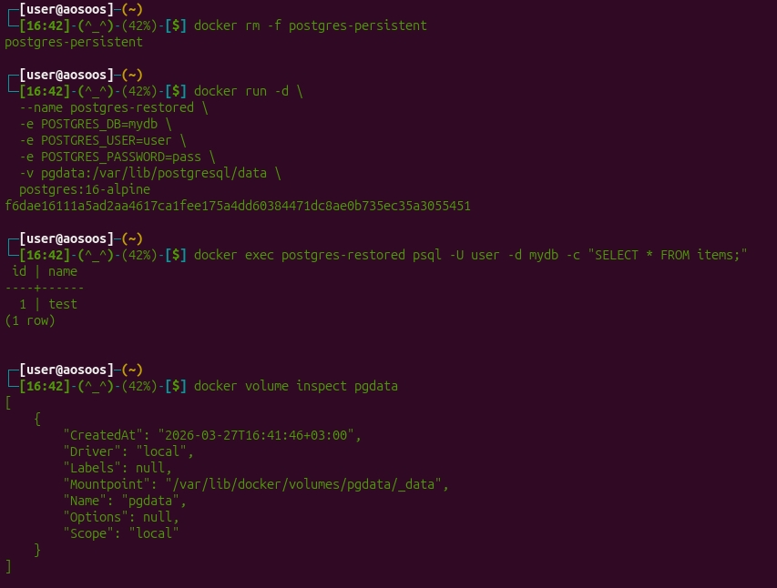

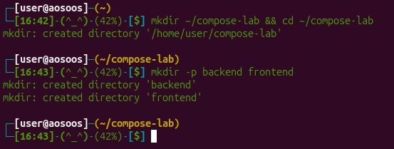

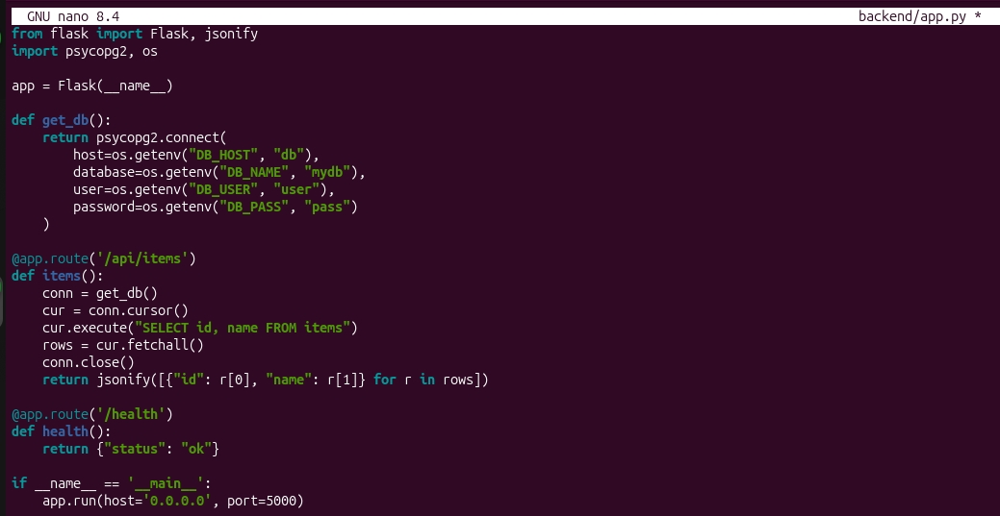

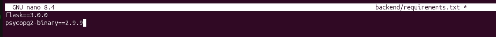

---

#### Блок 3: Разработка многоконтейнерного стека
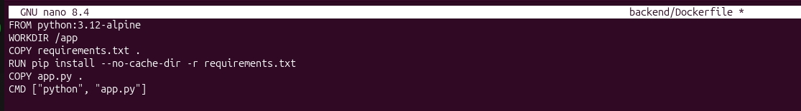

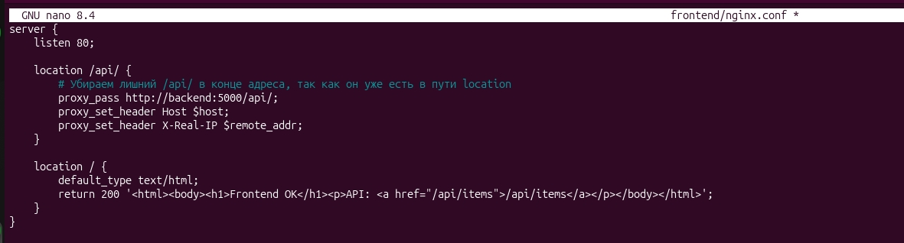

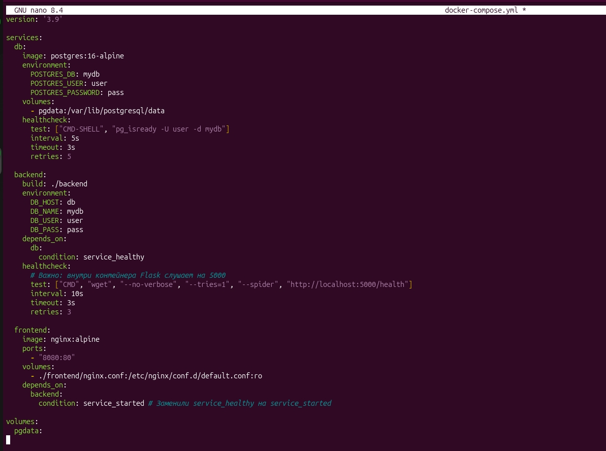

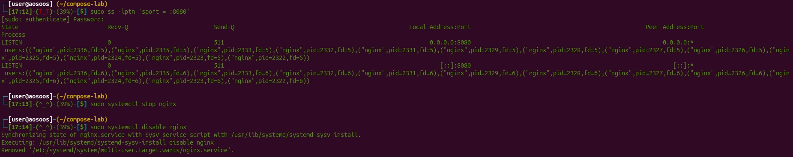

---

#### Блок 4: Запуск и проверка стека
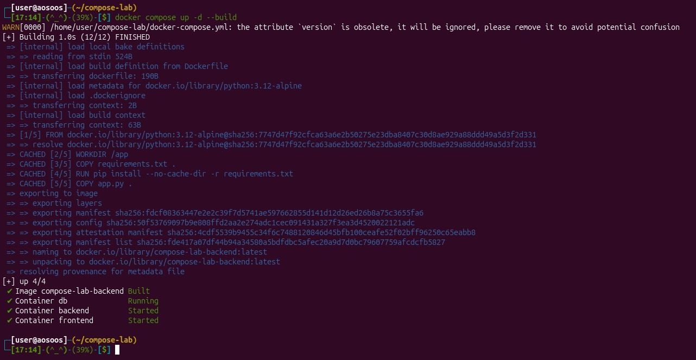

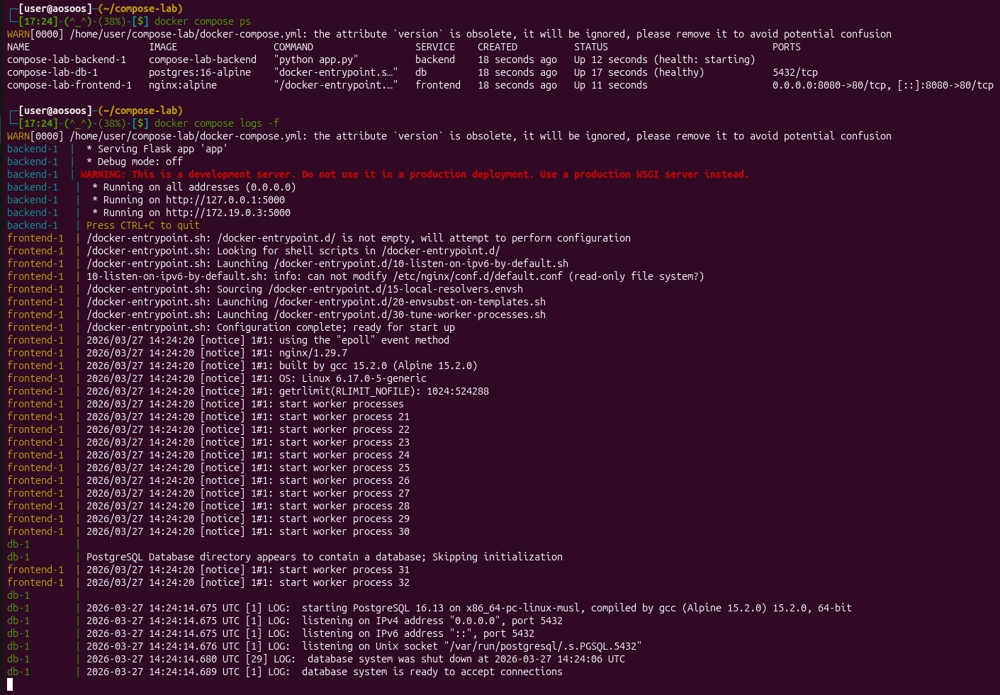

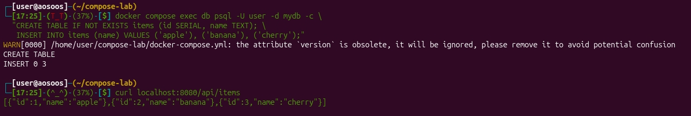

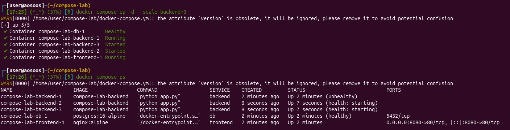

---

#### Блок 5: Масштабирование и очистка
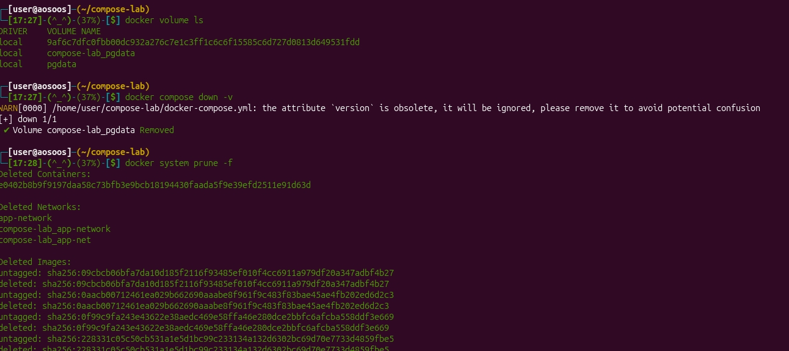

