# Отчет по практической работе №4: Kubernetes (Установка и поды)

### 1. Чему научились
Я развернула свой первый кластер на базе **k3s** и научилась управлять его состоянием. Освоила работу с подами на всех уровнях: от быстрого запуска одной командой до создания сложных **мультиконтейнерных подов** через YAML. Теперь я умею прокидывать общие диски между контейнерами (sidecar-паттерн), настраивать проверки здоровья (**Liveness/Readiness probes**) и пользоваться инструментами отладки: логами и прямым входом в контейнер через `exec`.

### 2. Проблемы и их решение
В начале были сложности с пониманием того, почему под не сразу переходит в `Running`. Оказалось, нужно просто закладывать время на скачивание образа и инициализацию. Также при тестировании самовосстановления важно было правильно «убить» процесс (PID 1), чтобы **kubelet** заметил сбой и инициировал рестарт контейнера.

### 3. Результаты
**Итог:** Кластер полностью настроен и все узлы в статусе Ready. Я подтвердила механику самовосстановления: после принудительной остановки процесса Kubernetes успешно перезапустил контейнер (счётчик RESTARTS увеличился). Все системные поды работают штатно, а кастомный веб-сервер успешно отдает логи.
**— Почему Pod не удалился, а перезапустился? Кто за это отвечает?**
Под не удалился, потому что в Kubernetes по умолчанию работает политика `restartPolicy: Always` — кластер до последнего пытается оживить упавшее приложение, а не удалять его насовсем. За этот процесс отвечает **kubelet** (агент на ноде): он видит, что процесс в контейнере упал, и тут же запускает его заново.

---

### Скрины работы

#### Блок 1: Состояние кластера
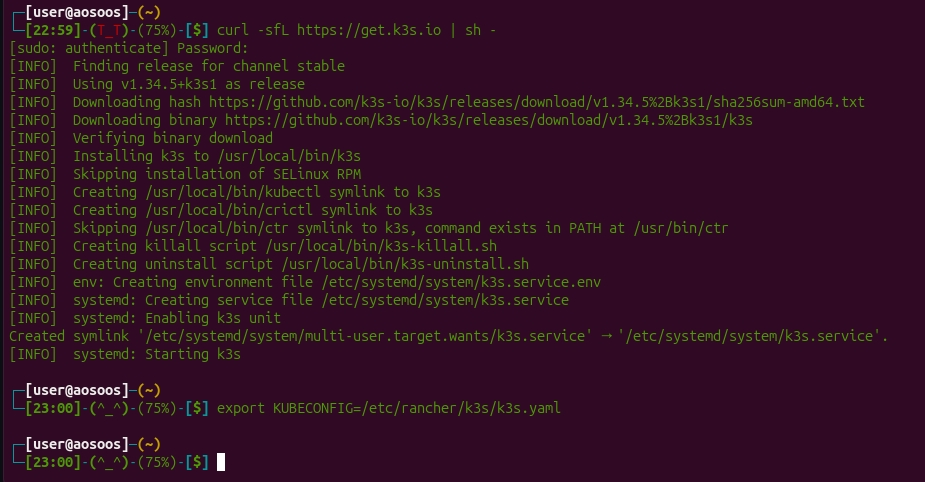
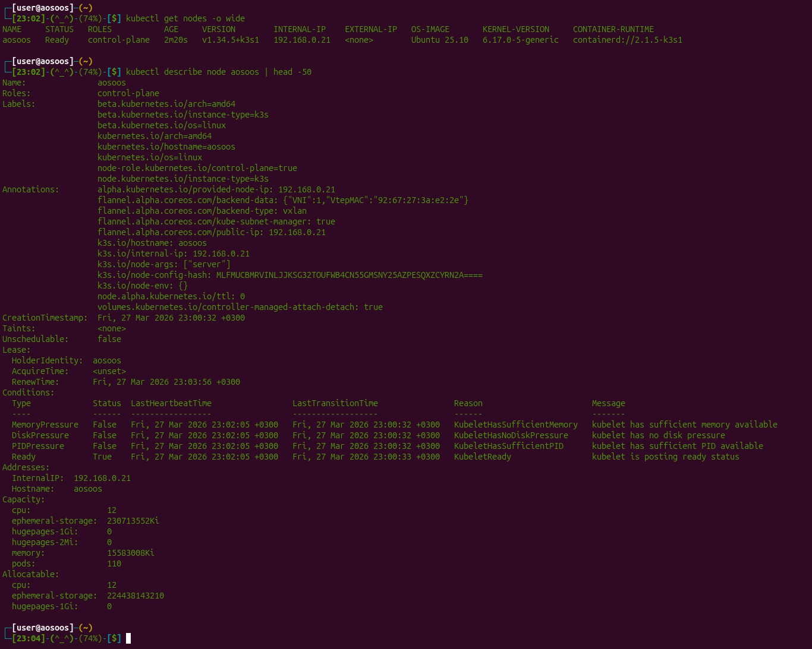
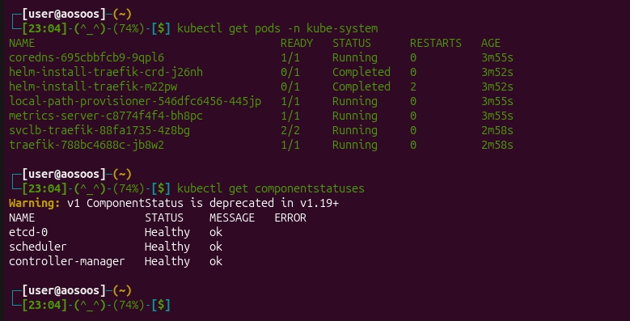
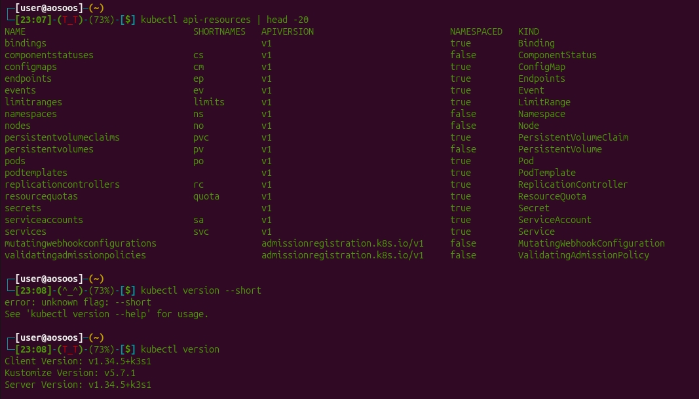

#### Блок 2: Работа с подами
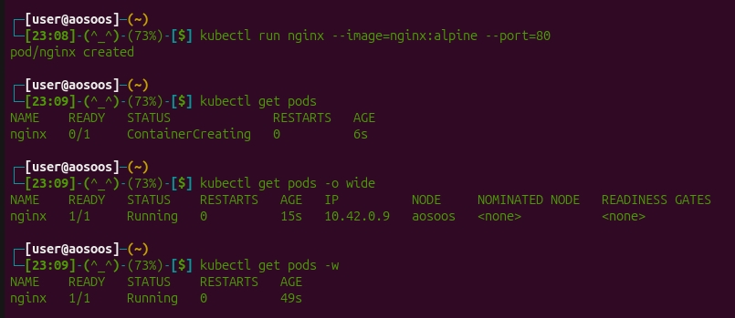
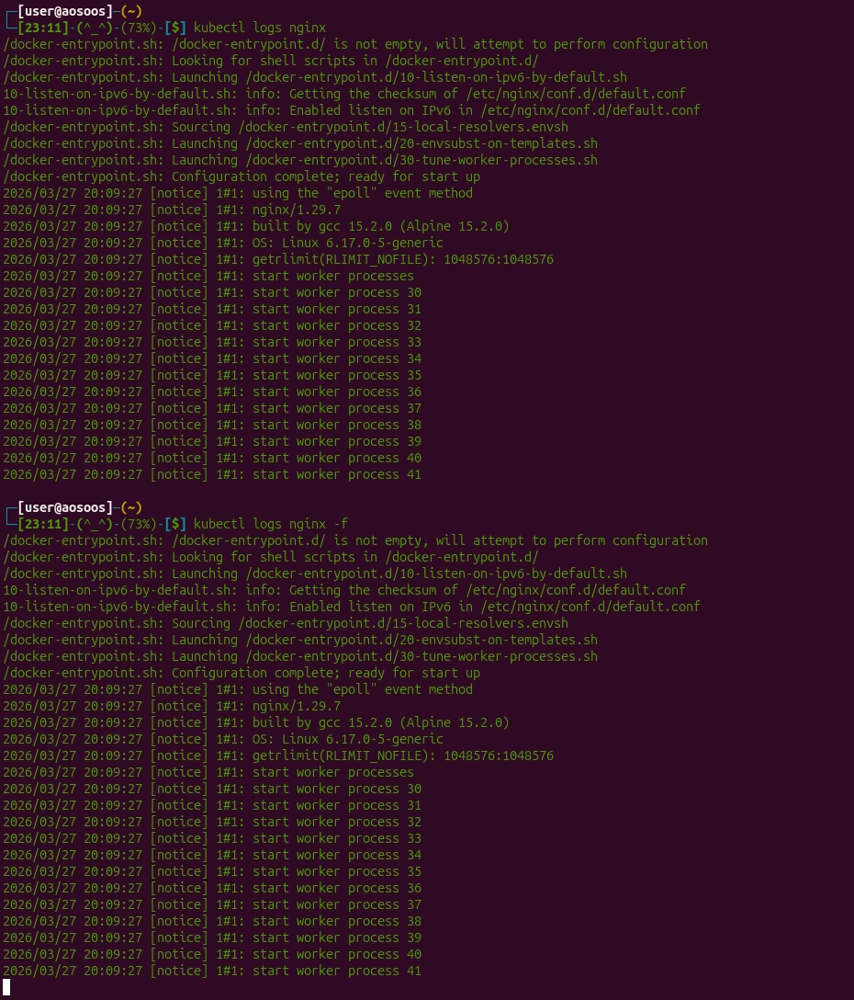
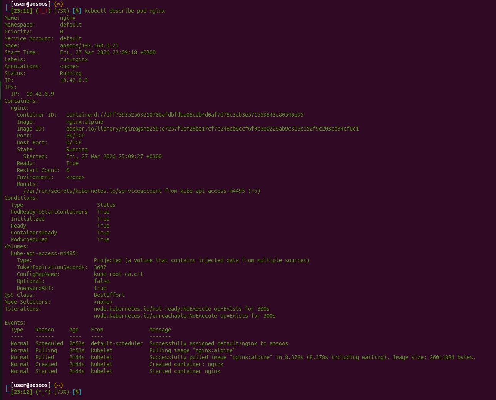

#### Блок 3: Под через YAML (Multicontainer)
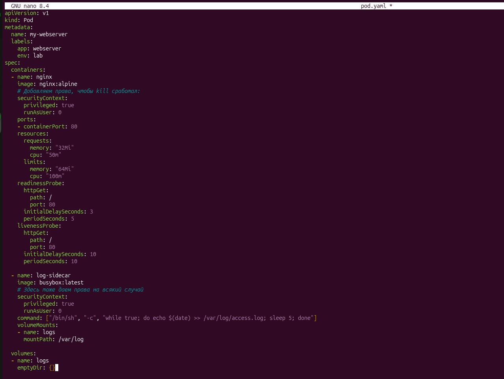
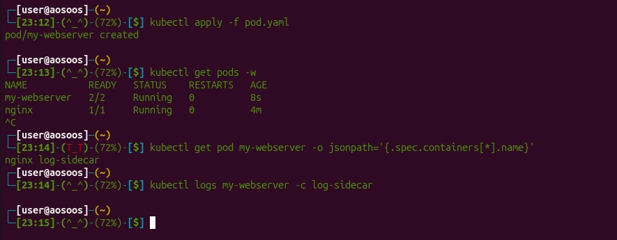
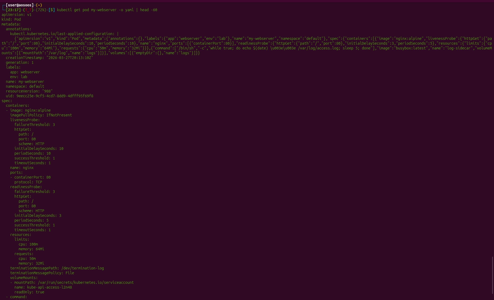

#### Блок 4: Самовосстановление
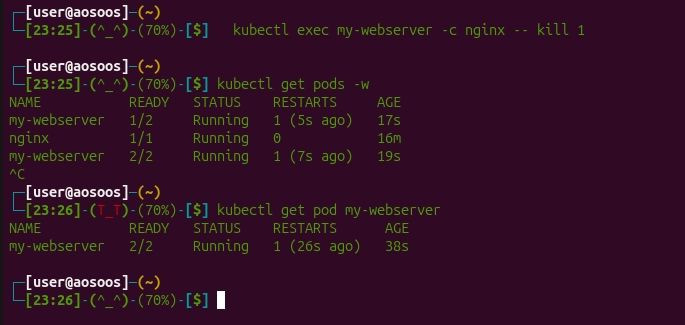