# Отчет по практической работе №5: Kubernetes (Deployment, Service, Ingress)

### 1. Чему научились
В этой работе я научилась управлять жизненным циклом приложений. Сначала я создала Deployment и настроила плавное обновление (Rolling Update), чтобы сервис не прерывался при смене версий. Еще я научилась откатывать изменения через `rollout undo`, если новая версия работает плохо. Разобралась в разнице между типами сервисов и настроила Ingress, чтобы трафик по разным URL-путям уходил на нужные приложения через один общий домен. 

### 2. Проблемы и их решение
Трудности были с запуском Minikube и настройкой контроллера, но в итоге всё заработало. Балансировка и маршрутизация проверены — поды отвечают по очереди, а пути `/` и `/api` ведут в разные места.

### 3. Контрольные вопросы и результаты
**— В чем разница между ClusterIP и NodePort?**
**ClusterIP** — сервис доступен только внутри кластера (для связи между подами). 
**NodePort** — пробрасывает порт наружу на каждой ноде, можно зайти по внешнему IP.
**— Зачем нужен Ingress, если есть NodePort?**
NodePort работает на высоких портах (30000+) и на каждый сервис нужен свой порт. **Ingress** позволяет использовать стандартные порты (80/443) и разруливать трафик по URL-путям или поддоменам через один вход.
**Результаты:** Все пункты выполнены. Приложение обновляется без обрыва связи (проверено циклом `curl`). Ingress успешно перенаправляет `/` на фронтенд, а `/api` — на бэкенд.

---

### Скрины работы

#### Блок 1: Deployment и Rolling Update
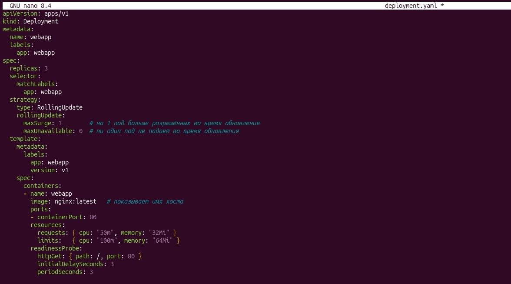
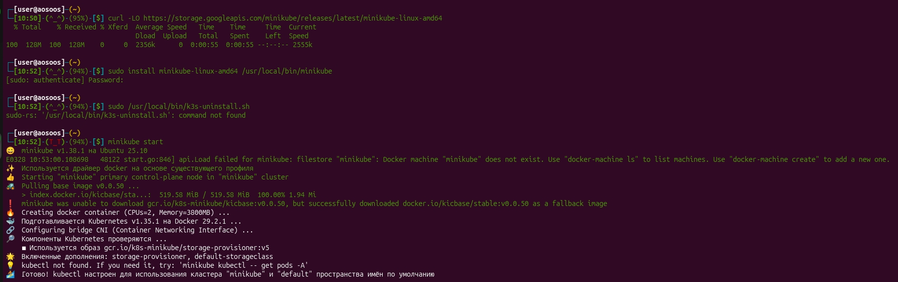
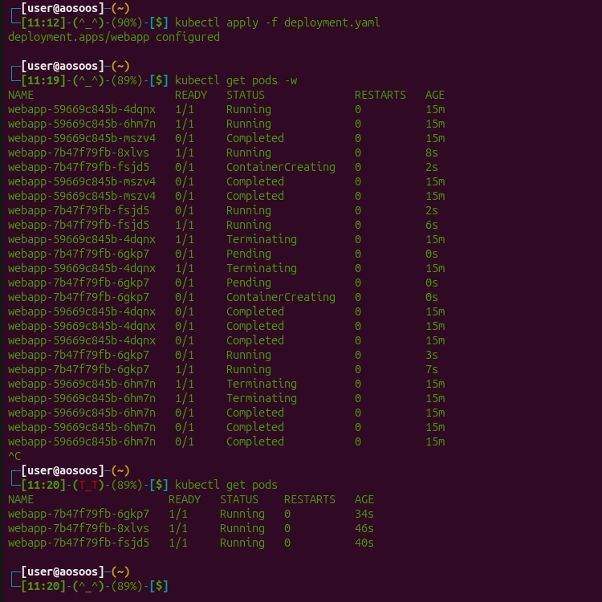
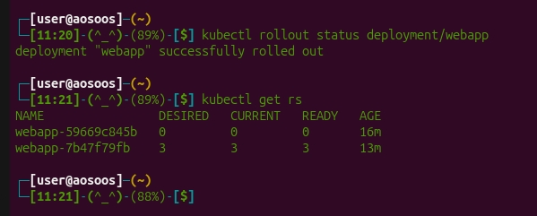
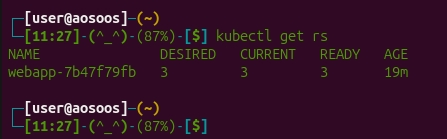

#### Блок 2: Service и балансировка
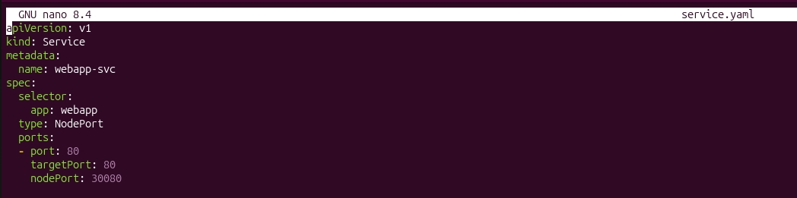
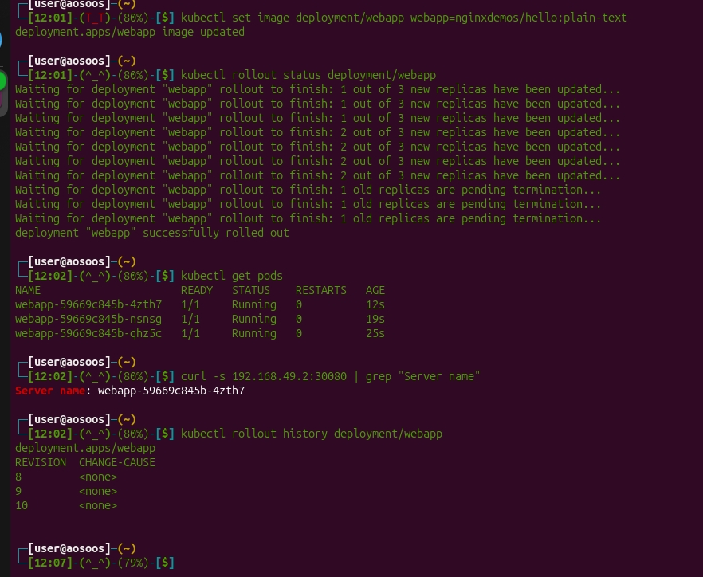
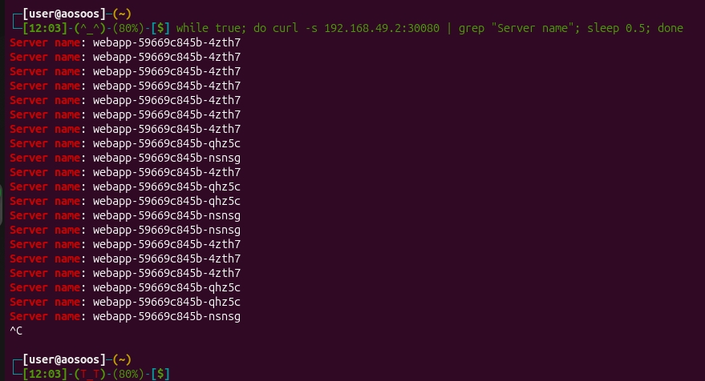
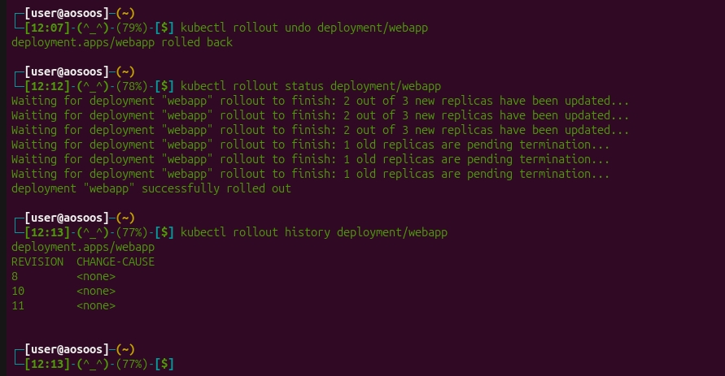

#### Блок 3: Ingress и маршрутизация
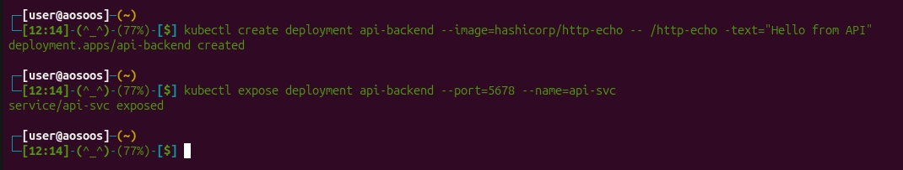
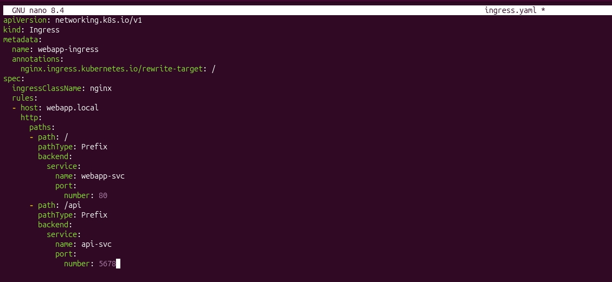
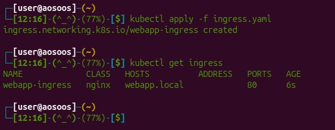
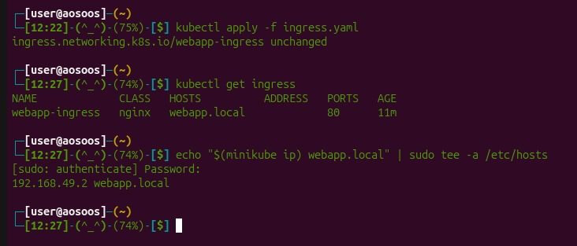
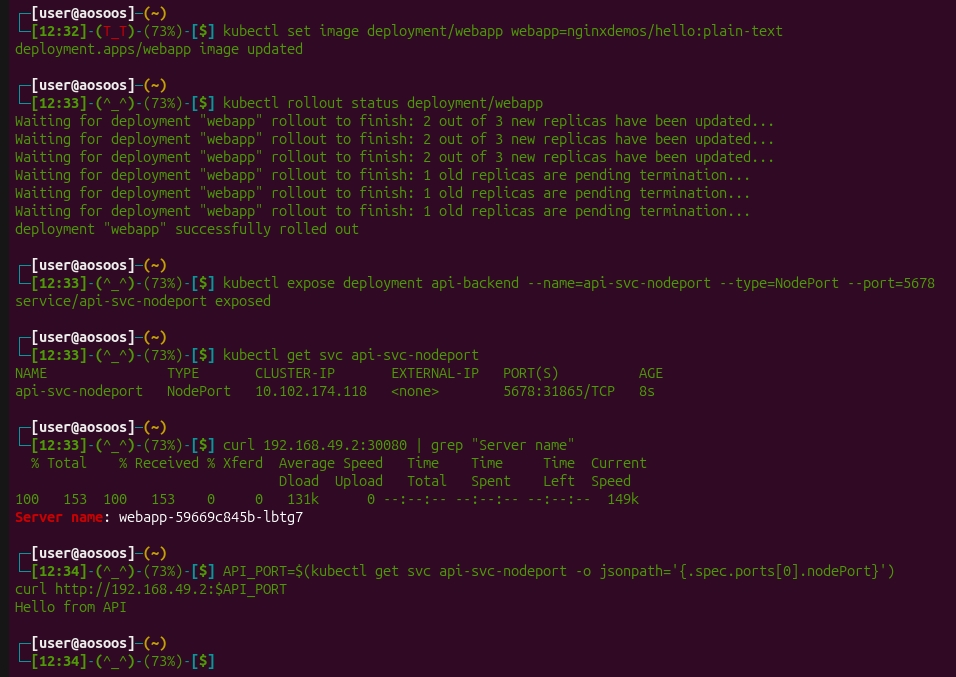
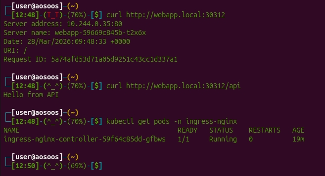

#### Блок 4: Типы Service
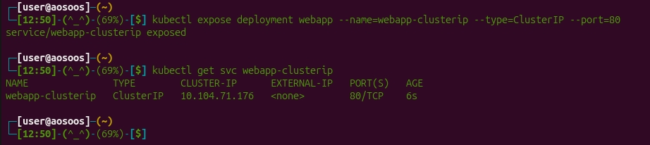
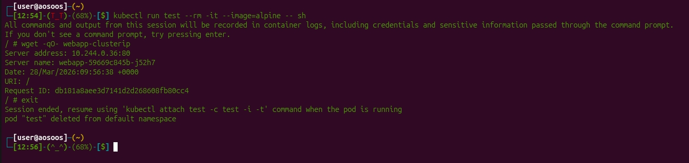