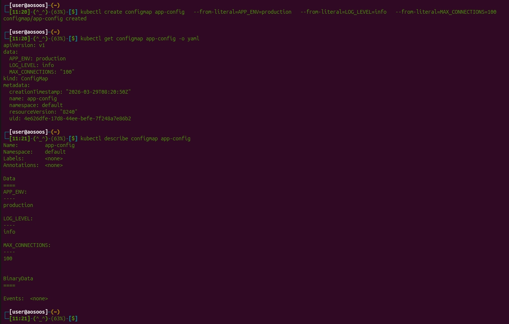
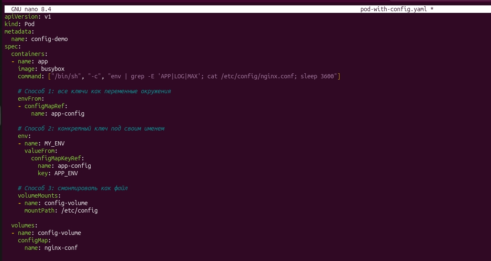
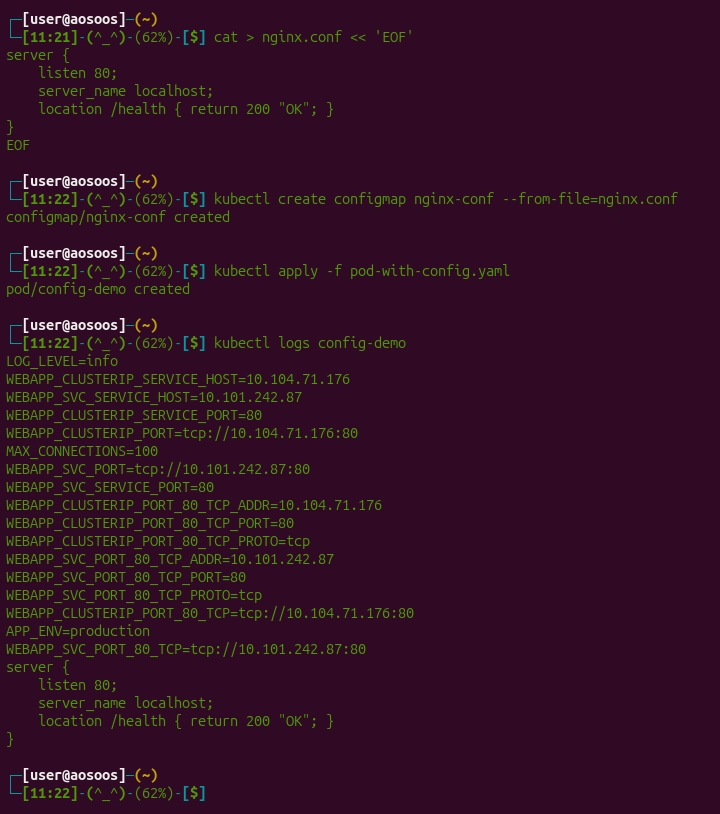
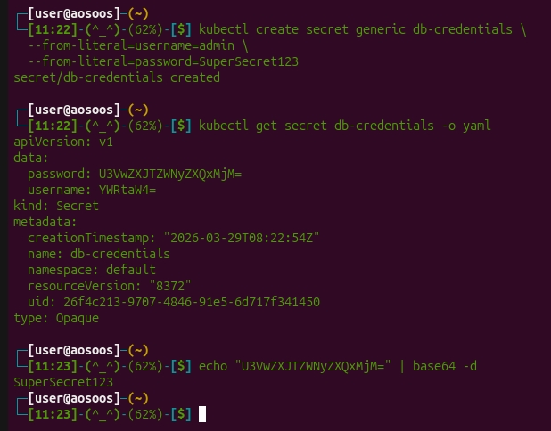
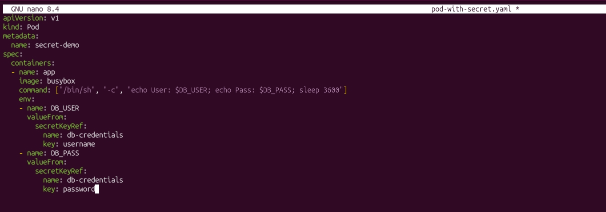
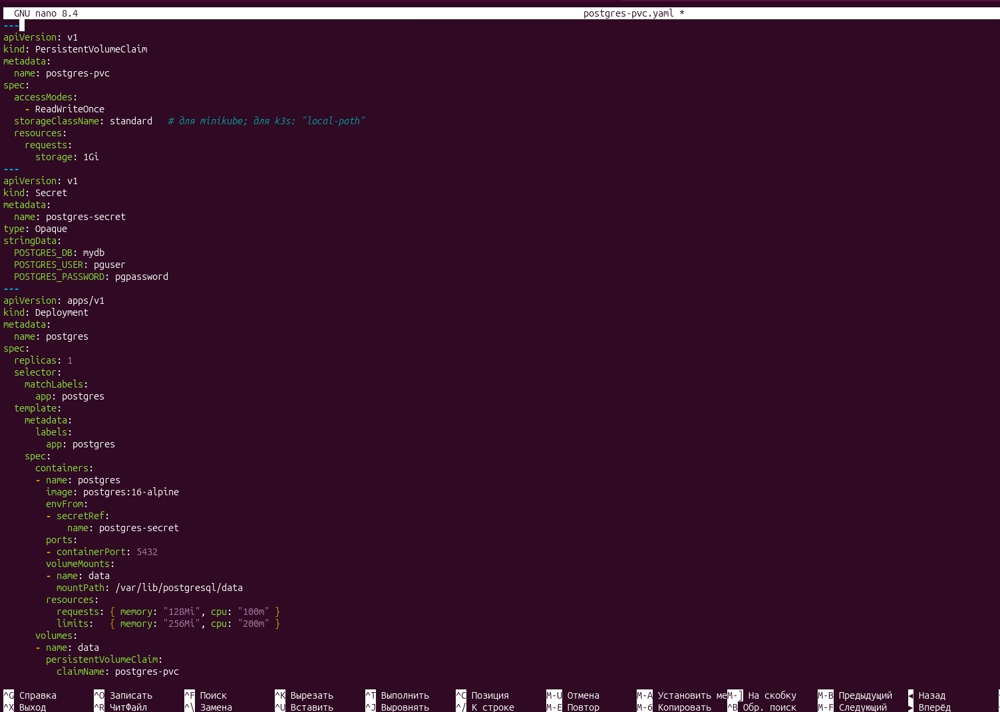
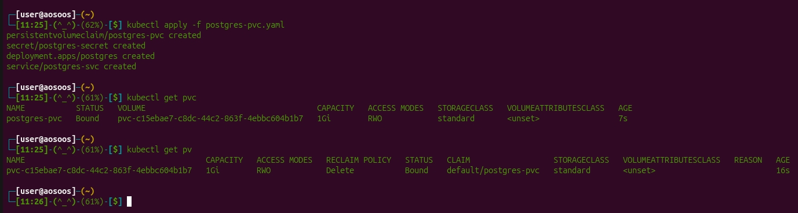
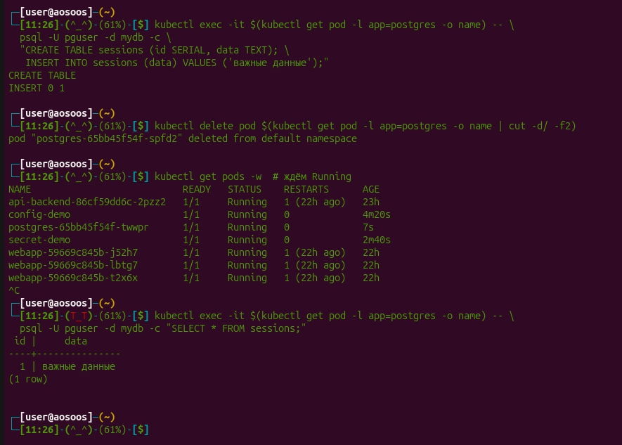

# Отчет по практической работе №6: Kubernetes (ConfigMap, Secret, Storage)

### 1. Чему научились
Разделили код и настройки по принципу 12-factor app. Я научилась пробрасывать конфиги через **ConfigMap** (переменными и файлами), прятать пароли в **Secrets** и подключать внешние диски через **PersistentVolumeClaim (PVC)**. Теперь база данных не теряет инфу при перезагрузке пода.

### 2. Проблемы и их решение
Проблем не было. 

### 3. Результаты
**Результаты:** Все способы передачи конфигов проверены (логи пода это подтвердили). База PostgreSQL успешно сохранила данные после удаления пода — SELECT выдал всё ту же запись.

---

### Скрины работы

#### Блок 1: ConfigMap (Конфигурация)

#### Блок 2: Secrets (Чувствительные данные)

#### Блок 3: PersistentVolume (Постоянное хранение)

