# Отчет по практической работе №7: Kubernetes: RBAC, NetworkPolicy 

### 1. Чему научились
В этой работе я настроила защиту кластера на трёх уровнях. Сначала ограничила права приложений через **RBAC**: теперь подопечные программы могут только смотреть список ресурсов, но не могут ничего удалять. Затем я закрыла сеть с помощью **NetworkPolicy**: теперь поды общаются только по делу (фронтенд видит бэкенд, но не имеет доступа к базе), а всё остальное заблокировано. В конце я сама создала сертификаты через **OpenSSL** и настроила безопасный вход в систему по HTTPS.

### 2. Проблемы и их решение
Из трудностей: пришлось пересоздавать Minikube с поддержкой Calico, иначе сетевые запреты не работали. Также вручную включала Ingress и ловила моменты, когда поды еще не успели запуститься.

### 3. Результаты
**Результаты:** Все способы передачи конфигов проверены (логи пода это подтвердили). База PostgreSQL успешно сохранила данные после удаления пода — SELECT выдал всё ту же запись.

---

### Скрины работы

#### Блок 1: RBAC
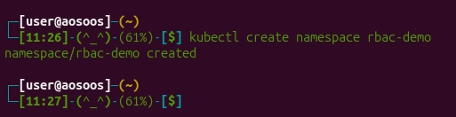
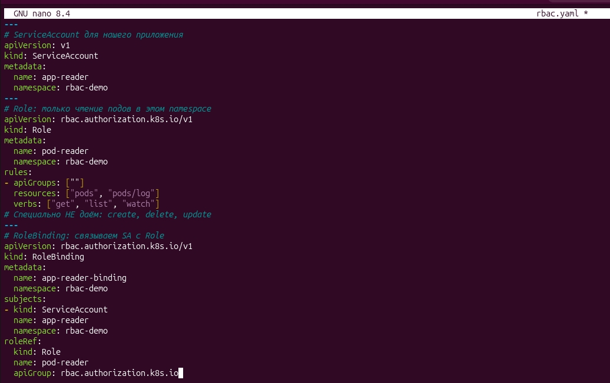
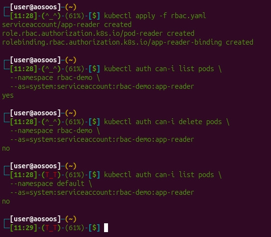
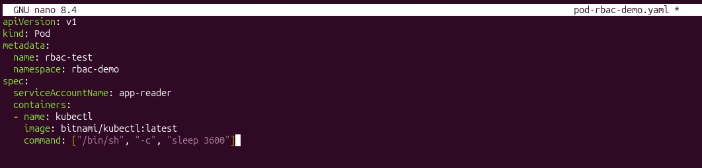
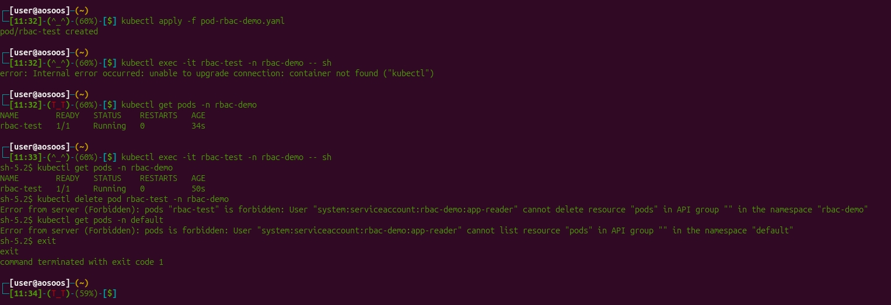
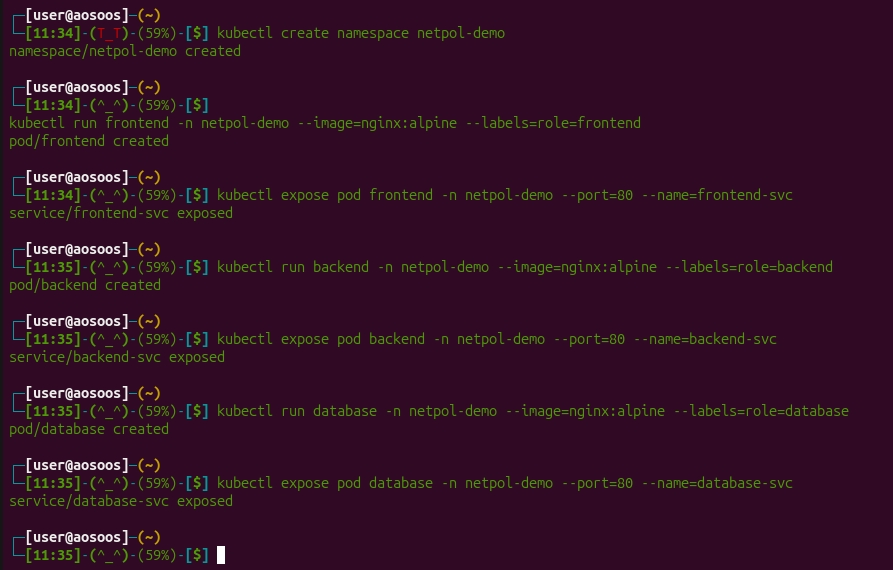

#### Блок 2: NetworkPolicy
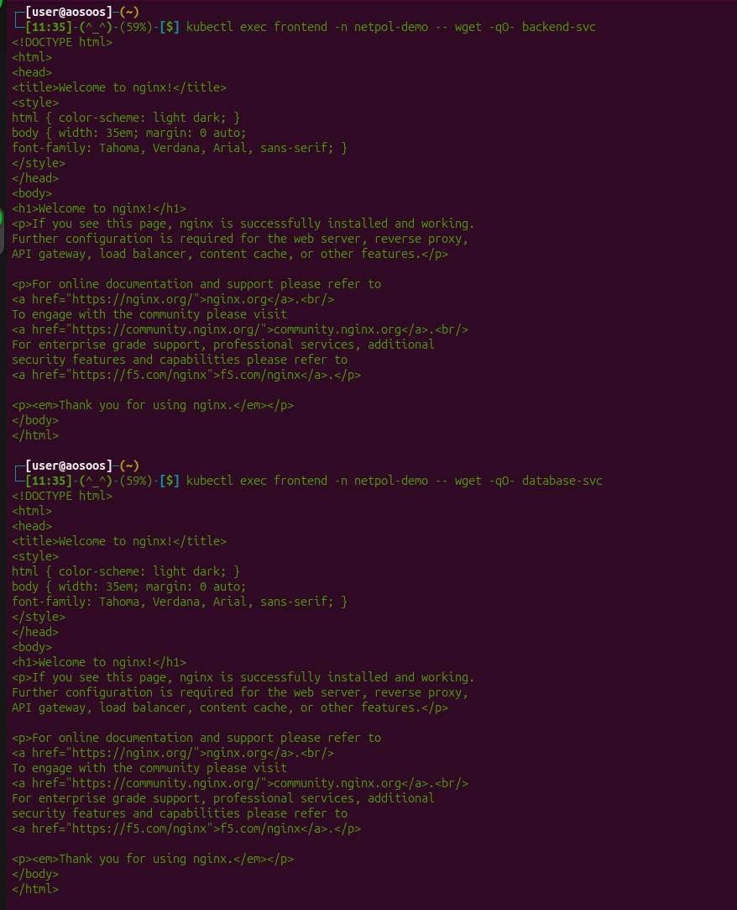
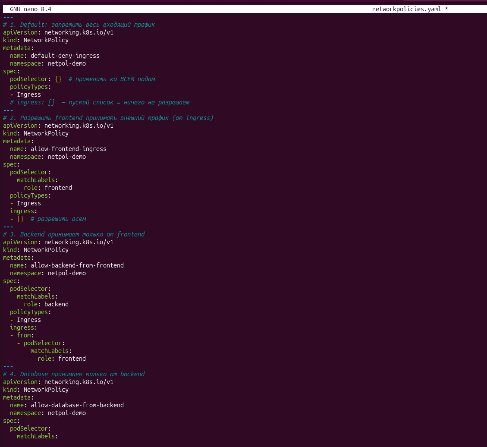
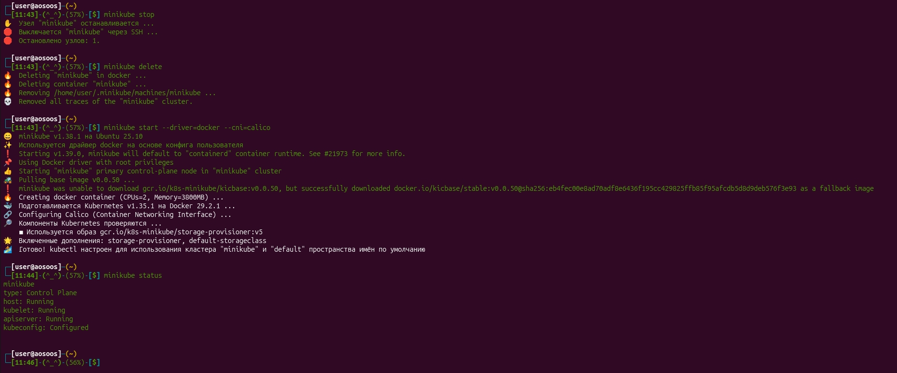
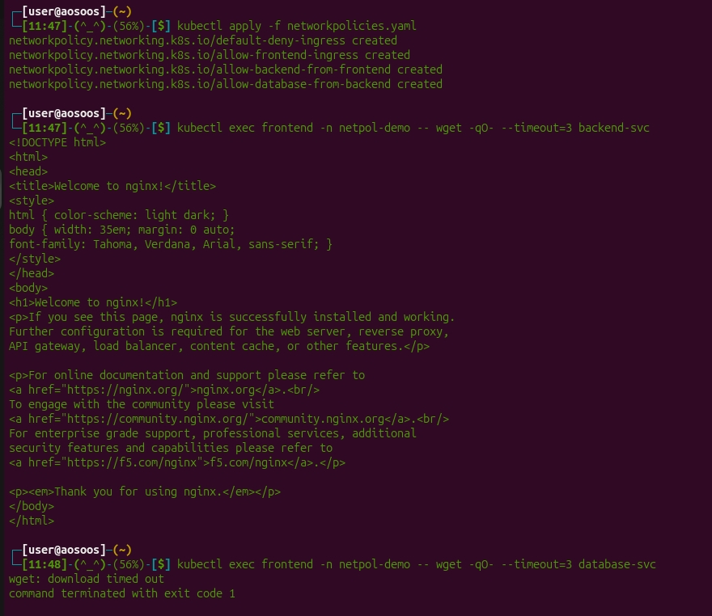
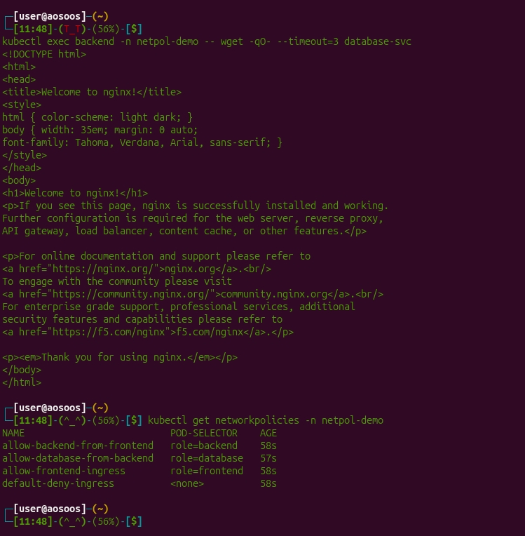

#### Блок 3: TLS и Ingress
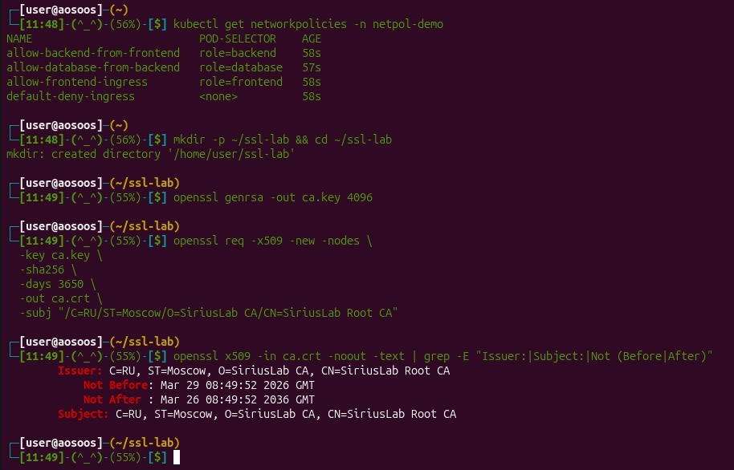
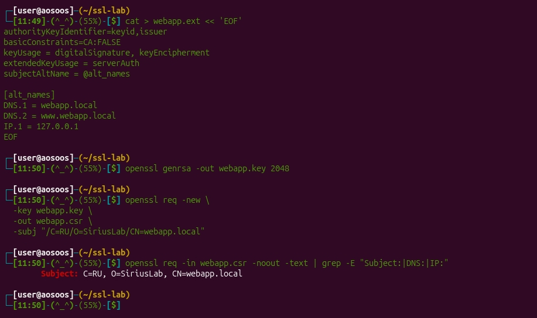
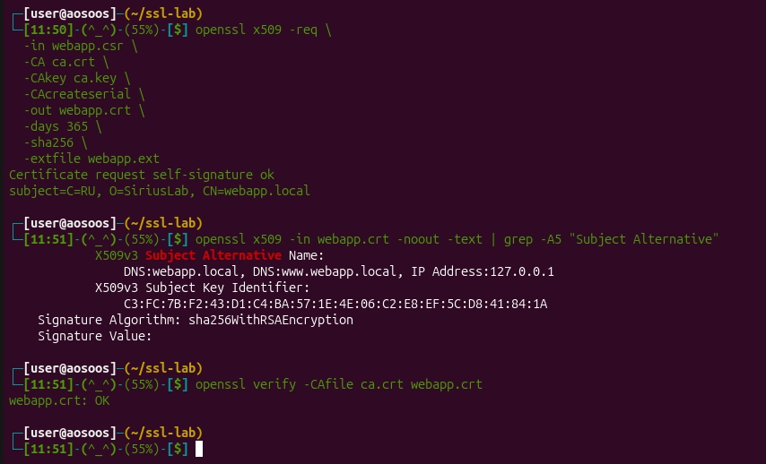
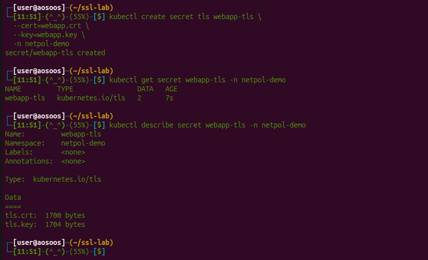
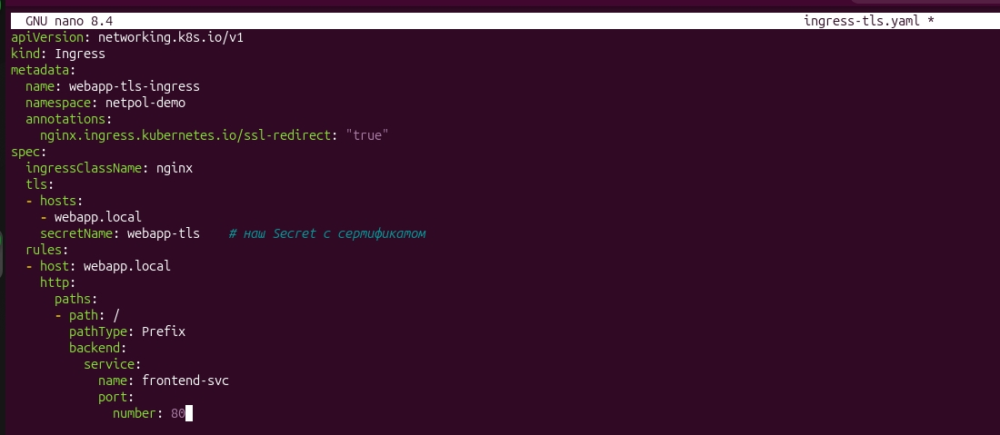
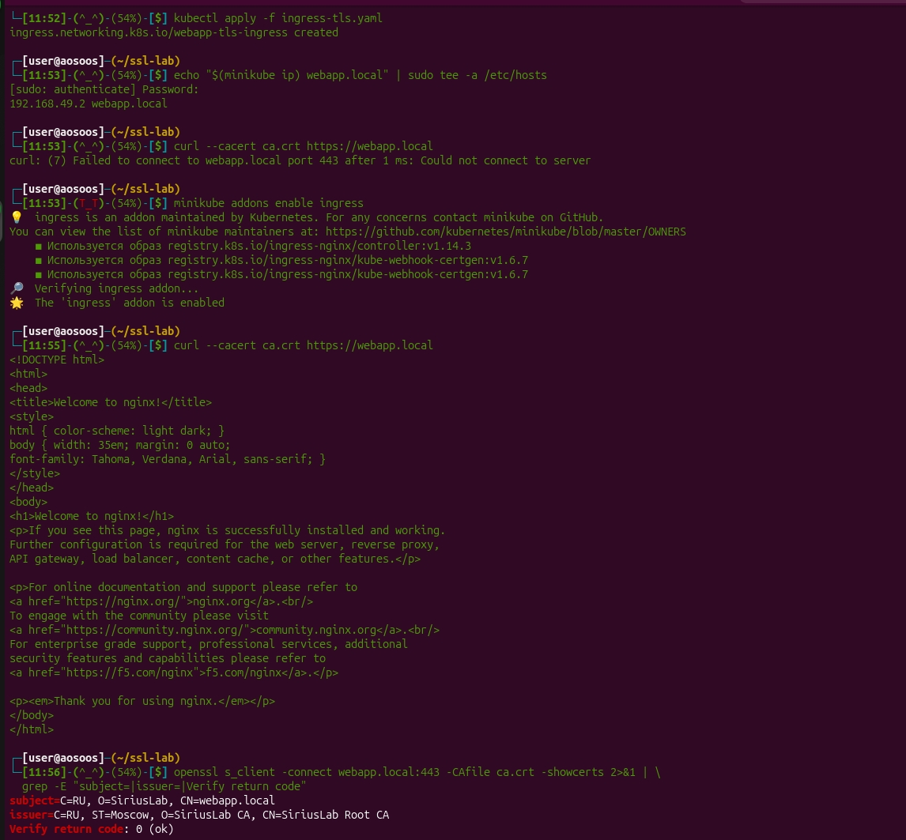
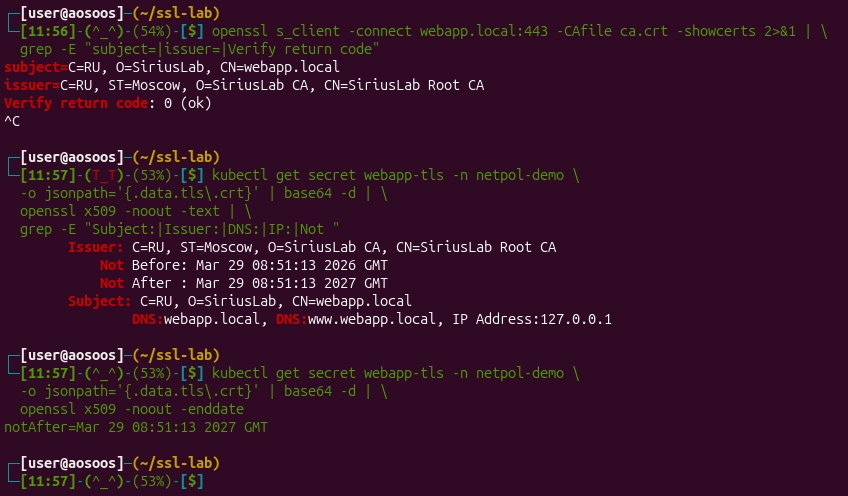