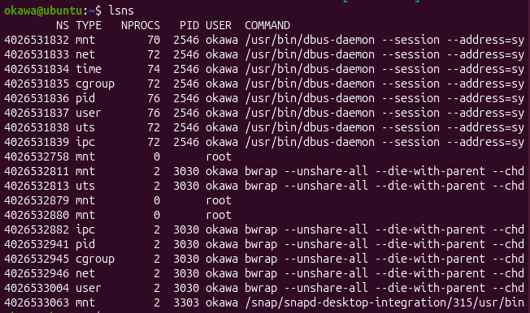
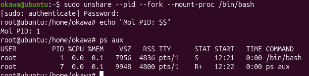
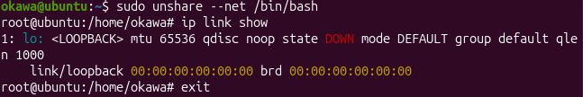
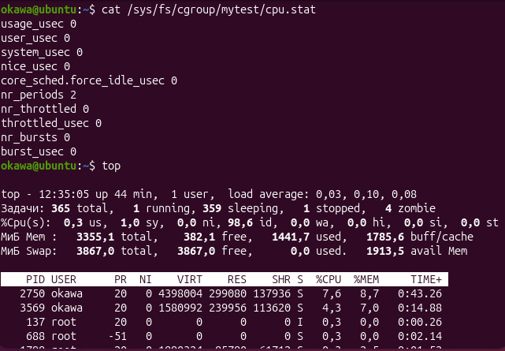
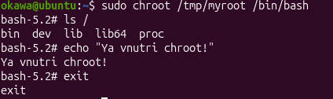

# laba1

В данной работе я разобралась, как в линуксе работает контейнеризация без докера.

Сначала посмотрела namespace-ы процессов и запустила новый процесс в отдельном PID namespace — там он был с PID 1, значит изоляция работает.

## namespaces

Также создала отдельный сетевой namespace, где был только loopback-интерфейс.

**Почему после exit процессы хоста остались нетронутыми?**  
Потому что процесс был изолирован через namespace.

## cgroups
Далее сделала cgroup и ограничила процесс по cpu. Запустила нагрузку и увидела, что лимит применяется.

**Что будет если превысить лимит памяти?**  
Процесс завершит OOM-killer.

## chroot
В конце сделала своё минимальное окружение через chroot и зашла внутрь него. Там были только мои файлы.

## вывод
Контейнер — это namespaces + cgroups + chroot. Докер просто упрощает работу с ними.