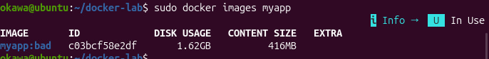
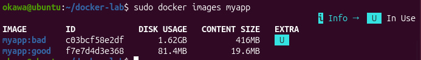
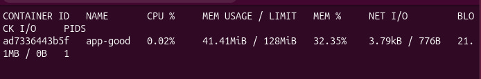
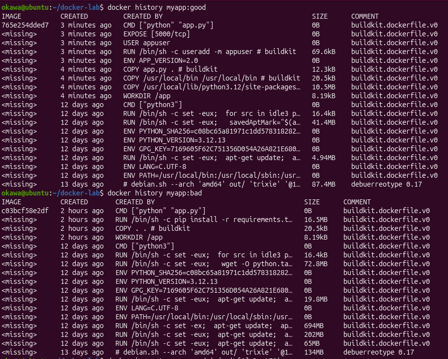
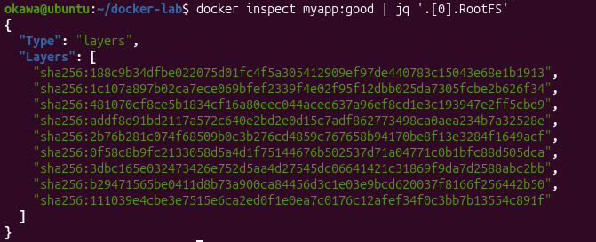
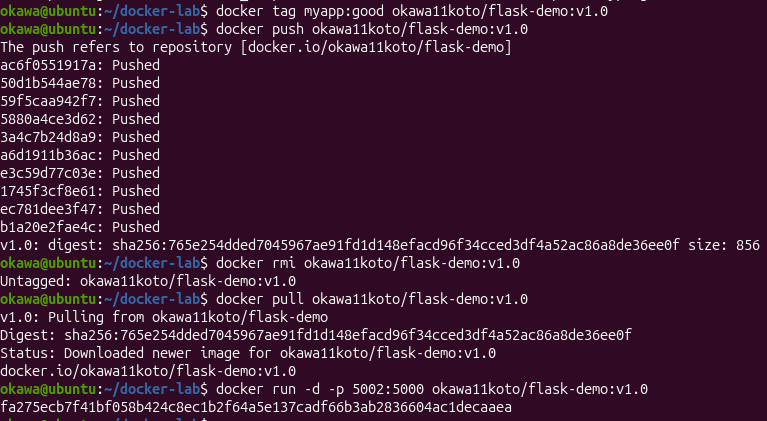

# лабораторная работа: docker (образы и контейнеры)

В этой лабораторной работе я разобралась, как создавать docker-образы и запускать контейнеры.

Сначала было создано простое flask-приложение и написан dockerfile. После сборки образа оказалось, что он очень большой.

## первый образ (bad)
Собрала образ и запустила контейнер.

**Почему образ такой большой?**  
Потому что используется полный образ python и копируются лишние файлы, + нет оптимизации слоёв.

## multistage build (good)
Далее переписала dockerfile с использованием multistage build. Образ стал значительно меньше.

Контейнер был запущен с ограничениями по cpu и памяти.

## слои образа
Посмотрела слои образа с помощью docker history и inspect.

## docker hub
Образ был загружен в docker hub и успешно скачан обратно.

Ссылка на образ: [text](https://hub.docker.com/repository/docker/okawa11koto/flask-demo/general)

## вывод
Повторила на практике как писать dockerfile, собирать образы, уменьшать их размер и запускать контейнеры с ограничениями ресурсов.