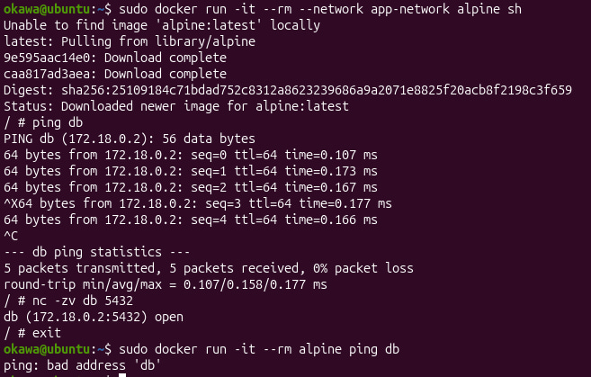
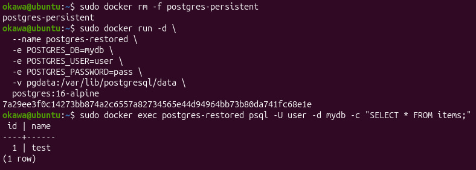
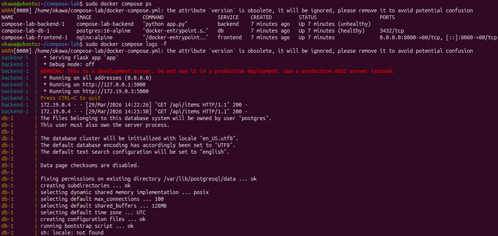
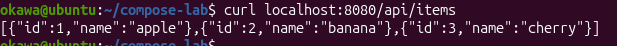
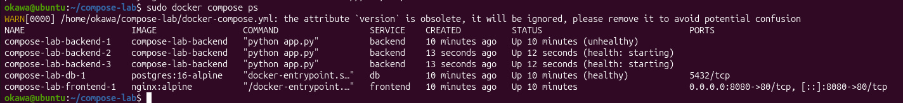

# лабораторная работа: docker (сети, volumes, compose)

В этой лабораторной работе я разобралась, как работают сети, тома и docker-compose в docker.

## docker сети
Сначала посмотрела доступные сети и создала bridge. Запустила контейнеры в одной сети и проверила, что они могут общаться друг с другом по имени.

Контейнер вне этой сети уже не видел другие контейнеры.

## volumes
Далее подключила volume к PostgreSQL и создала тестовые данные. После удаления контейнера данные сохранились, значит volume работает правильно.

## docker compose
После этого собрала проект из трёх сервисов: frontend (nginx), backend (flask) и база данных (PostgreSQL).

Проверила, что frontend обращается к backend, а backend к базе данных.

## масштабирование
Увеличила количество backend-контейнеров до 3.

## вывод
Повторила на практике как использовать volumes для сохранения данных и поднимать многоконтейнерные приложения через docker-compose.