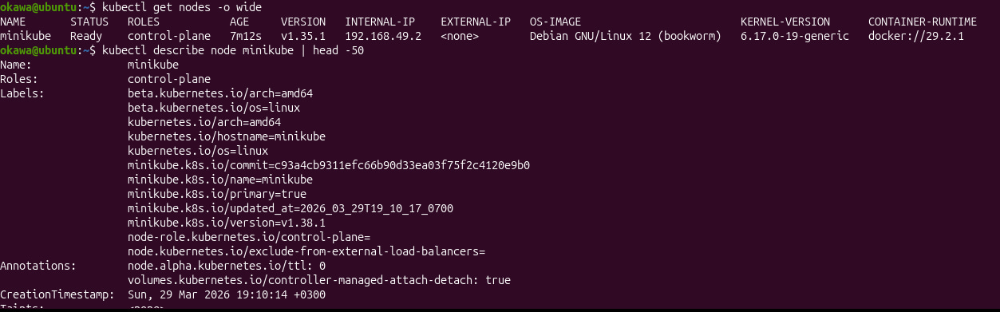
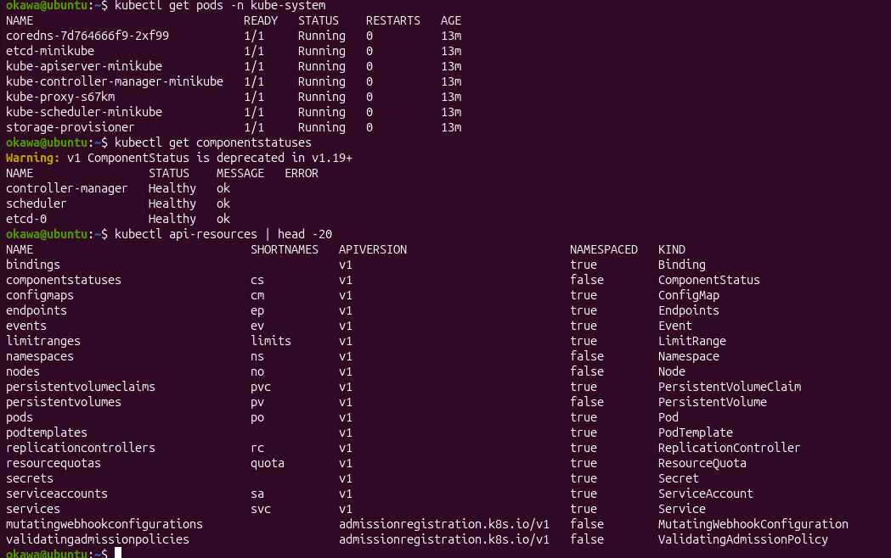
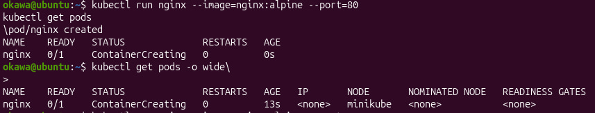
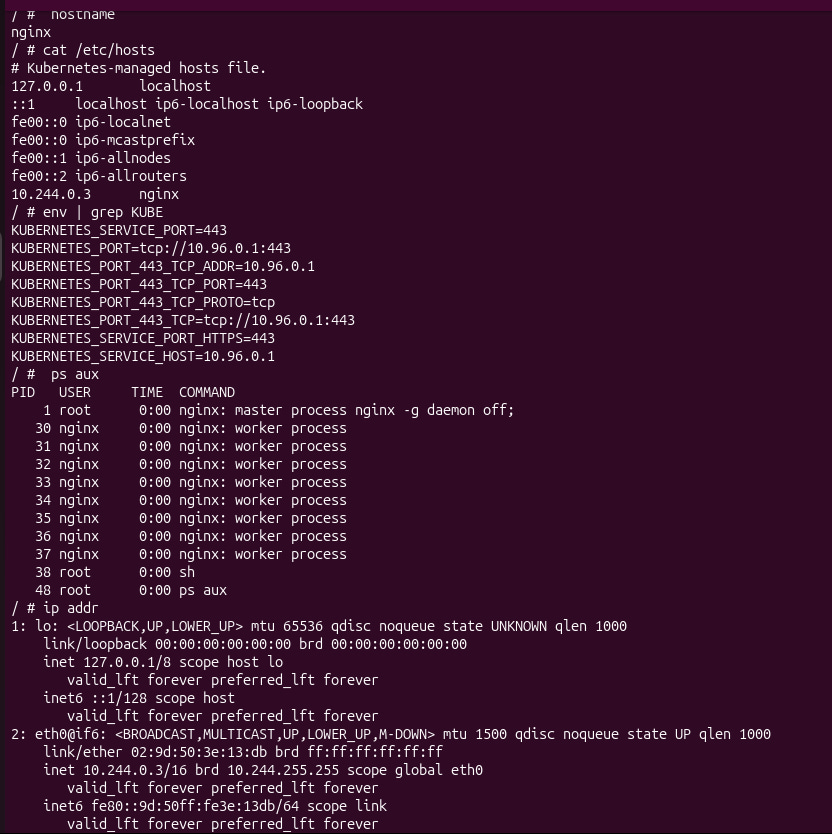
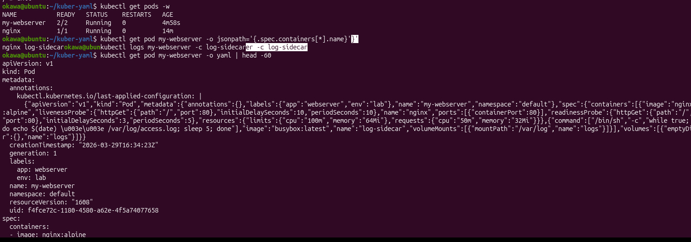
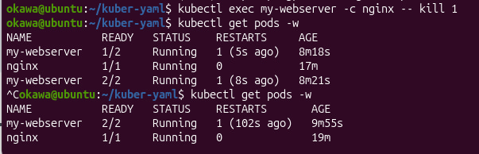

# лабораторная работа: kubernetes (поды и кластер)

В этой лабораторной работе я разобралась, как работает kubernetes и как запускать поды.

## состояние кластера
Сначала проверила состояние кластера и нод. Все ноды были в статусе ready, системные поды работали нормально.

**Какие поды в kube-system должны быть Running?**  
Основные системные поды: kube-apiserver, kube-scheduler, kube-controller-manager, etcd и dns.

## первый pod
Запустила первый pod с nginx и проверила его состояние. Зашла внутрь контейнера и посмотрела hostname, процессы и сеть.

## pod через yaml
Создала pod через yaml файл с двумя контейнерами (nginx и sidecar). Проверила, что оба контейнера работают.

## самовосстановление
Убила основной процесс внутри контейнера, после чего kubernetes автоматически его перезапустил.

**Почему Pod перезапустился, а не удалился?**  
Потому что kubelet следит за контейнерами и перезапускает их при сбое.

## вывод
Повторила как запускать pod, работать с kubectl и поняла, что kubernetes сам следит за состоянием контейнеров и перезапускает их при сбое.