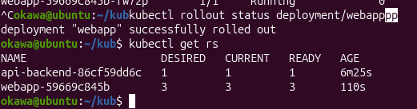
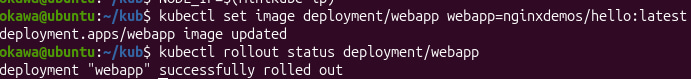
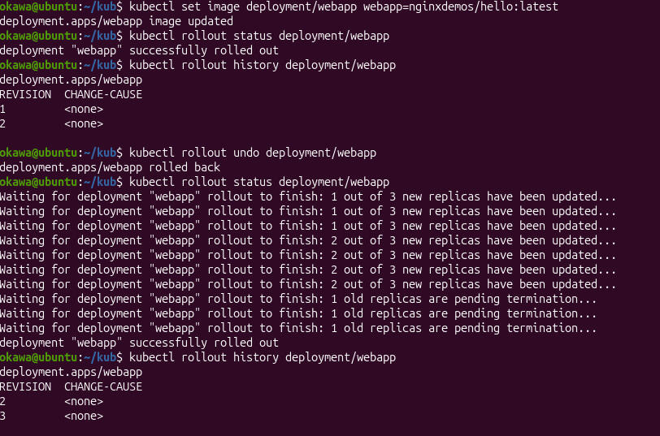
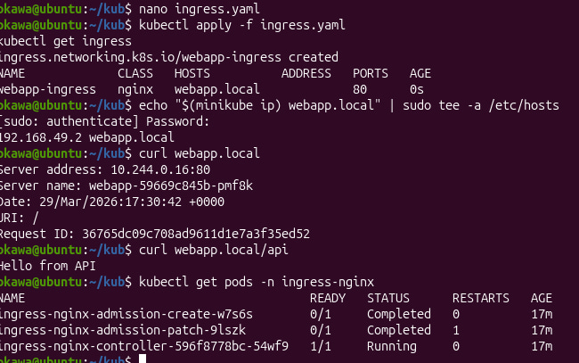
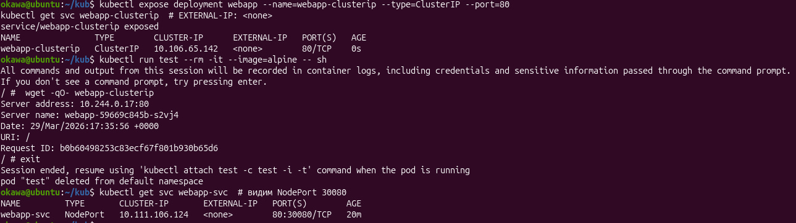

# Лабораторная работа: Kubernetes (Deployment, Service, Ingress)

В данной работе я разобралась, как разворачивать приложение в kubernetes и делать обновления без остановки.

## deployment
Создала deployment с 3 репликами. Все поды успешно запустились и работали.

## rolling update
Обновила версию контейнера без остановки приложения. Трафик продолжал идти без сбоев.

Также посмотрела историю и откатилась на предыдущую версию.

## service
Создала service типа nodePort и проверила, что запросы распределяются между подами.

## ingress
Настроила ingress, чтобы маршрутизировать трафик:
- / → frontend
- /api → backend

Проверила, что разные пути дают разные ответы.

**Разница между ClusterIP / NodePort / LoadBalancer?**  
ClusterIP — доступ только внутри кластера 
NodePort — доступ через порт на ноде
LoadBalancer — внешний доступ через облачный балансировщик

## вывод
Повторила как работать с deployment, делать обновления без даунтайма, откатывать версии и настраивать доступ к приложению через service и ingress.