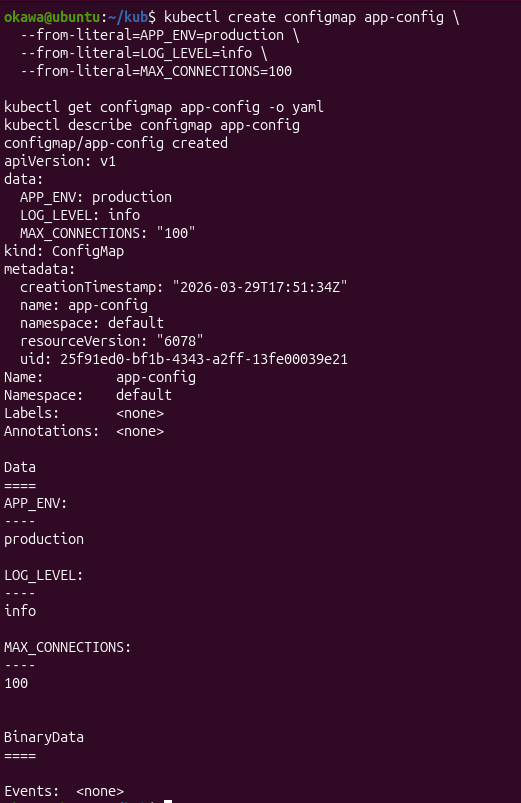
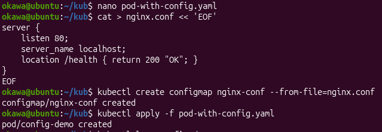
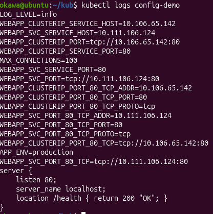
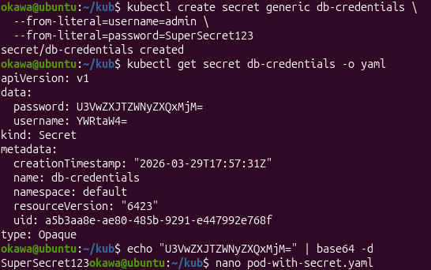
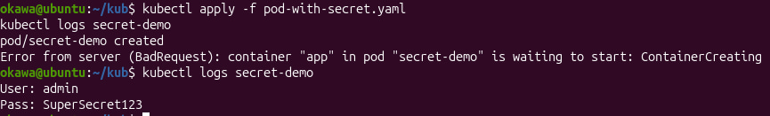
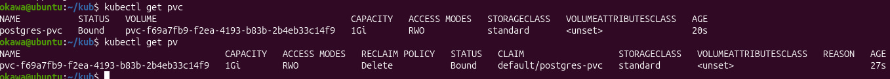
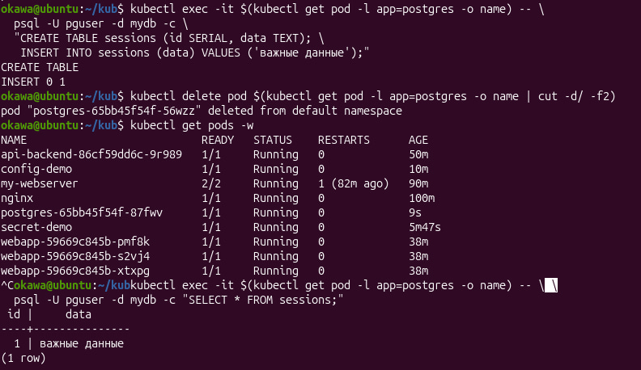

# Лабораторная работа: Kubernetes (ConfigMap, Secret, PersistentVolume)

На практике было разобрано, как работать с конфигурацией и хранением данных.

## ConfigMap
Создала configmap и передала данные в pod разными способами: через переменные окружения и как файл.

Проверила через логи, что значения передаются правильно.

## secret
Создала secret с логином и паролем. Посмотрела, что данные хранятся в base64 и могут быть легко декодированы, так как никак не зашифрованы.

Подключила secret к pod через переменные окружения.

## PersistentVolume
Создала persistentvolumeclaim и запустила PostgreSQL с постоянным хранилищем. PersistentVolume необходимо для того, чтобы данные не удалялись при перезапуске пода.

Создала данные в базе, затем удалила под. После того, как deployment автоматически пересоздаст под, можно было увидеть то, что данные сохранились.

## вывод
В результате были повторно освоены следующие действия: выносить конфигурацию в configmap и secret, а также использовать постоянное хранилище для сохранения данных. Поняла, что данные и настройки не должны храниться внутри контейнера.