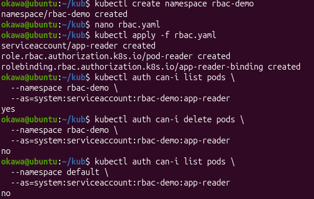
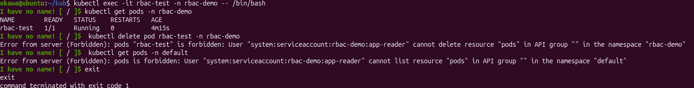
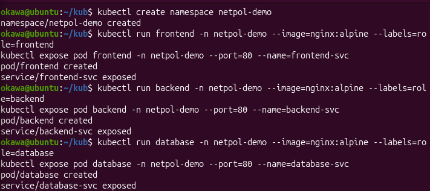
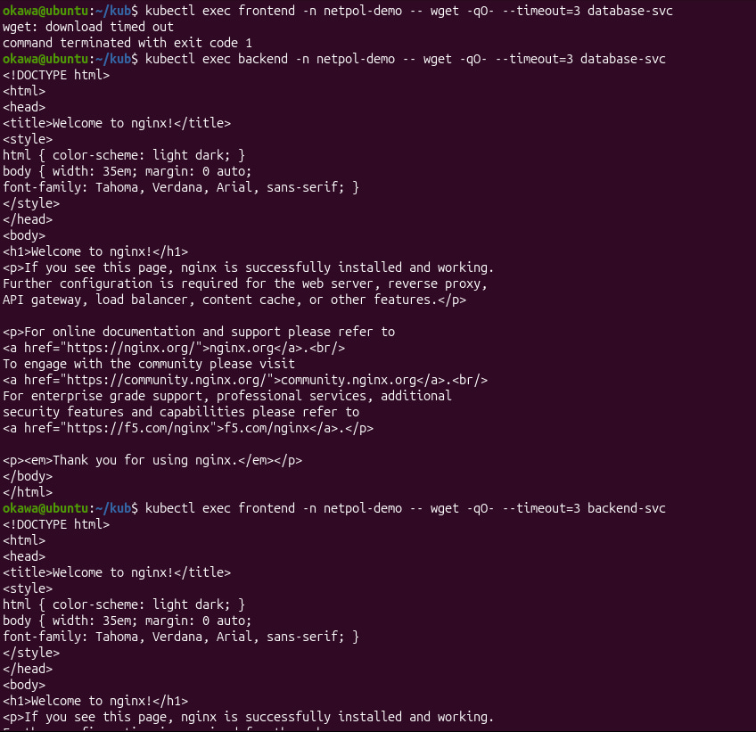
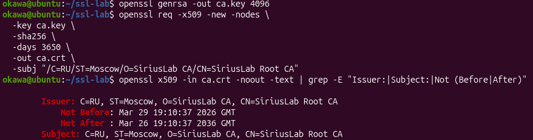
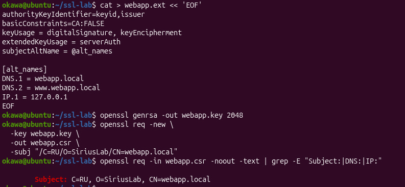
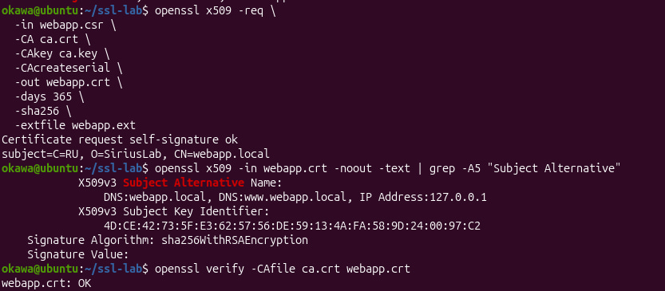
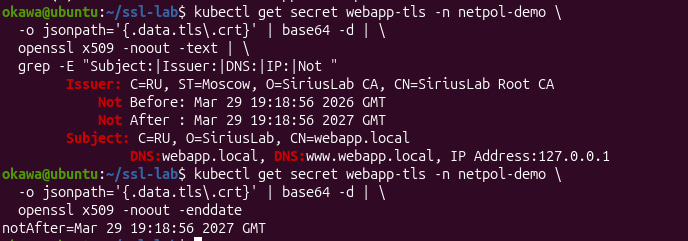

# лабораторная работа: Kubernetes (безопасность: RBAC, NetworkPolicy, TLS)

В данной работе я разобралась, как настраивать безопасность в Kubernetes.

## RBAC
Сначала я создала отдельный namespace и ServiceAccount с ограниченными правами. Затем настроила Role и RoleBinding так, чтобы у приложения был доступ только на чтение pod.
Проверила права и убедилась, что ServiceAccount может просматривать pod'ы, но не может их удалять или работать с другими namespace.

## NetworkPolicy
Далее я создала несколько pod'ов (frontend, backend и database) и сначала проверила, что они все могут свободно общаться между собой.

После этого добавила политику с правилом default deny, которое запрещает весь входящий трафик, потом разрешила только нужные соединения.

Проверила, что фронт не может обращаться к базе, а бек может.

## TLS сертификаты
Создала свой CA, сгенерировала сертификат и подключила его к ingress через secret.

Проверила, что https работает с моим сертификатом и работу через curl и openssl. Соединение установилось корректно и сертификат был валиден.

## вывод
Я научилась ограничивать доступ через RBAC, настраивать сетевую изоляцию и работать с TLS.